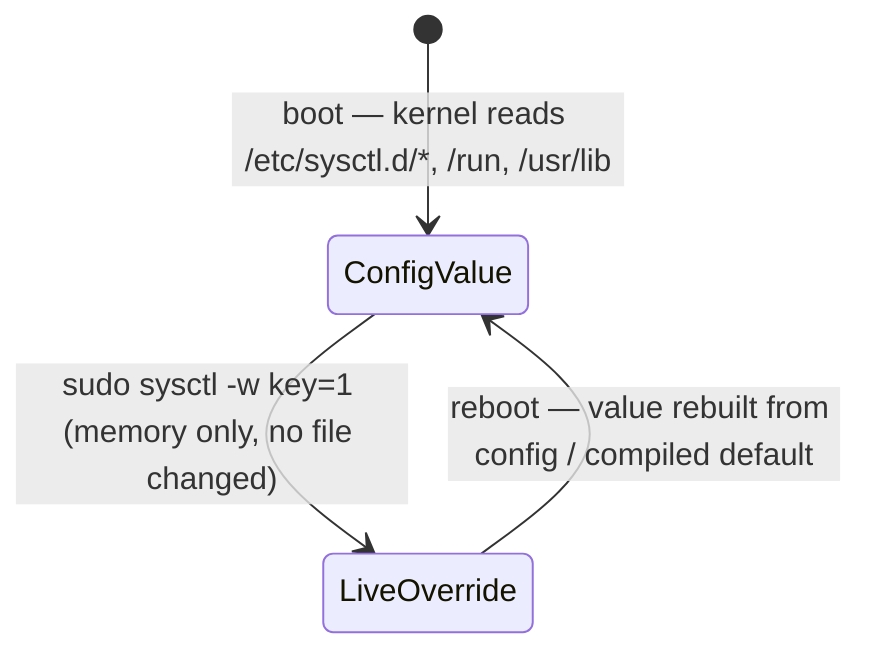

# Part 3 — Runtime vs. persistent changes

> Prerequisite: [Part 2 — /proc/sys and the live value](./course-02-proc-sys-and-the-live-value.md). Next: [Section 010 quiz](../quiz.md).

The exam objective is written as "persistent and non-persistent kernel parameters", and this is the distinction it means: a write that pokes the running kernel and nothing else, versus a write that also lands in a file the boot process re-reads. Getting this right is one command more than getting it half-right — and half-right is an incident that comes back after the next reboot.

## `sysctl -w` writes memory only

Concrete: make the box forward packets now.

```bash
# shell: any host, root
sudo sysctl -w net.ipv4.ip_forward=1
```

```text
net.ipv4.ip_forward = 1
```

`sysctl -w` opens the matching `/proc/sys` file and `write()`s the new value. That is the entire operation: the kernel's in-memory variable changes, the effect is immediate, and **no file on disk is touched**. `echo 1 > /proc/sys/net/ipv4/ip_forward` (as root) is exactly the same operation without the `sysctl` wrapper.

The lifecycle of a `-w`-only change:



As an analogy (flagged): `sysctl -w` is writing on a whiteboard — fully real and readable now, but nobody photographed it and the board is wiped at reboot. Where it breaks down: a whiteboard keeps your writing until someone erases it; the kernel value is reconstructed from scratch on every boot, so "nobody changed it back" is not why it reverts — it is rebuilt from the config files regardless.

> [!TIP]
> **Try it — a `-w` change leaves no trace on disk.** On the host:
>
> ```bash
> sudo sysctl -w vm.swappiness=10
> sysctl -n vm.swappiness
> sudo grep -rs swappiness /etc/sysctl.d/ /etc/sysctl.conf || echo '(nothing persisted)'
> ```
>
> Expect something like:
>
> ```text
> vm.swappiness = 10
> 10
> (nothing persisted)
> ```
>
> The live value changed; no file recorded it. A reboot would restore whatever the config (or the compiled default, `60`) says. This is the "non-persistent" half of the exam objective.

## Persistence: a file the boot process re-reads

To survive a reboot the setting must live in a `*.conf` file that the boot-time sysctl step reads. Drop it in `/etc/sysctl.d/`:

```bash
# shell: any host, root
echo 'net.ipv4.ip_forward = 1' | sudo tee /etc/sysctl.d/99-ip-forward.conf
sudo sysctl --system
```

`sysctl --system` reads every `*.conf` from all the sysctl directories, in a defined precedence, and applies them to the running kernel in one pass. So those two commands together give you **both halves at once**: the value takes effect immediately (second command applies it now) *and* every future boot re-applies it (the same logic runs early in boot, before your services start).

`sysctl -p <file>` applies just one named file — useful to test a single drop-in without re-running the whole set.

## The directory precedence

`--system` reads these locations; when the same key appears in more than one file, **the file that sorts last wins**, and directories earlier in this list are considered lower priority:

```
  /etc/sysctl.d/*.conf        ← local admin (highest-priority directory)
  /run/sysctl.d/*.conf        ← runtime-generated
  /usr/lib/sysctl.d/*.conf    ← distro/package defaults
  /etc/sysctl.conf            ← legacy single file, still read
```

Within the merged set, files are ordered by filename lexically across all directories, and a later name overrides an earlier one for any key it sets. That is why the convention is a numeric prefix: `99-ip-forward.conf` sorts after `10-network.conf`, so `99-` wins a conflict. `20-` beats `10-`; `99-` beats everything normal.

> [!TIP]
> **Try it — make it stick, and see which file won.** On the host:
>
> ```bash
> echo 'vm.swappiness = 10' | sudo tee /etc/sysctl.d/99-swappiness.conf
> echo 'vm.swappiness = 42' | sudo tee /etc/sysctl.d/10-swappiness.conf
> sudo sysctl --system 2>&1 | grep swappiness
> sysctl -n vm.swappiness
> ```
>
> Expect something like:
>
> ```text
> * Applying /etc/sysctl.d/10-swappiness.conf ...
> vm.swappiness = 42
> * Applying /etc/sysctl.d/99-swappiness.conf ...
> vm.swappiness = 10
> 10
> ```
>
> Both files were read, in lexical order; `99-` was applied last, so `10` is the live value — not `42` from the numerically-lower, alphabetically-earlier file. `sysctl --system` also made it reboot-proof. Clean up: `sudo rm /etc/sysctl.d/{10,99}-swappiness.conf`.

```bash
sysctl --system 2>&1 | grep ip_forward      # shows which file set the final value
sysctl -n net.ipv4.ip_forward               # confirm the live value is what you intended
```

## Same pattern, every tunable

This is the model the rest of the section reuses. Process limits, kernel module parameters, and udev names all have the same shape: a **live action** that changes the running system now, and a **persistent config file** under `/etc` that a boot-time service replays. Learn the pair once and each later topic is "which file, which apply command".

> [!WARNING]
> - **Stopping after `sysctl -w`.** The value is correct until the next reboot, then silently reverts to whatever the config says. A task that says "persistent" is not satisfied by `-w` alone.
> - **Writing the drop-in but not applying it.** The file alone does nothing until `sysctl --system` (or a reboot). Run `--system` so the change is live *and* persistent in one step.
> - **Name collisions across drop-ins.** If two files set the same key, the lexically later filename wins — not the one you edited most recently. Check with `sysctl --system 2>&1 | grep <key>`.
> - **Editing `/etc/sysctl.conf` on a system that also has `/etc/sysctl.d/` drop-ins.** A `99-` drop-in will override your `sysctl.conf` line. Prefer a drop-in with a deliberate prefix.

> *`sysctl -w` changes memory only and is gone at reboot; a `*.conf` under `/etc/sysctl.d/` plus `sysctl --system` makes the change both immediate and reboot-proof, with the lexically-last filename winning any key collision.*

## Reference

- `man 5 sysctl.d` — the drop-in directories, lexical ordering, and last-wins precedence rule.
- `man 8 sysctl` — `-w`, `-p`, `--system`, `-a`; what each write path does.
- `man 8 sysctl.d` / `systemd-sysctl.service` — the boot-time service that replays the config on every start.
