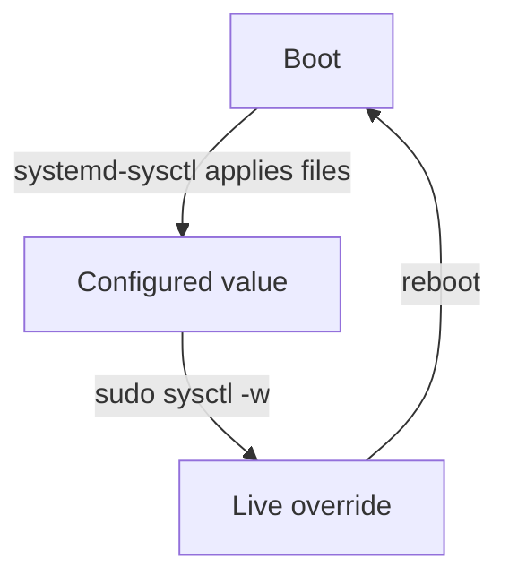

# Runtime Changes Live In Memory

Astronaut, the exam objective says "persistent and non-persistent kernel parameters". This part is the non-persistent half. A **runtime change** turns a dial on the running reactor and does nothing else. It works at once, and it is gone the next time the reactor starts cold.

Knowing exactly what a runtime change does, and what it does not do, is what keeps a fix from quietly disappearing after the next reboot.

## `sysctl -w` writes memory only

A task says: make this machine forward packets now. The option `-w` (write) sets a kernel parameter on the running kernel.

<!-- astrona:playground:renew -->

This needs the captain's authority, so it runs with `sudo`:

```bash
# shell: any host, root
sudo sysctl -w net.ipv4.ip_forward=1
```

```text
net.ipv4.ip_forward = 1
```

### What the kernel actually does

`sysctl -w` opens the matching `/proc/sys` file and writes the new value into it. That is the whole job. The kernel changes the value in its memory, the effect starts at once, and **no file on disk is touched**.

Writing to the file yourself does exactly the same thing, without the `sysctl` wrapper. Run it as `root`:

```bash
echo 1 > /proc/sys/net/ipv4/ip_forward
```

Think of `sysctl -w` as turning a dial by hand. The dial stays where you put it until the reactor restarts. At a **reboot**, the reactor shuts down and starts cold, and every dial is set again from scratch.

## The life of a runtime change

A runtime change has a short and predictable life. The diagram shows what happens to the value from one start of the machine to the next.



At boot, the `systemd-sysctl` service reads the files under `/etc/sysctl.d/`, `/run/sysctl.d/` and `/usr/lib/sysctl.d/` and sets each dial; a dial no file mentions keeps the default built into the kernel. `sysctl -w` then overrides the value in memory only, and the next reboot builds the value again from the files.

So the value does not go back because "someone changed it back". It goes back because the kernel rebuilds it from the files on every start, whatever happened before.

### Try it: a `-w` change leaves no trace on disk

On your playground, change `vm.swappiness` live, read it back, and then search the configuration files for it. `vm.swappiness` tells the kernel how eagerly to move memory out to swap space on disk.

```bash
sudo sysctl -w vm.swappiness=10
sysctl -n vm.swappiness
sudo grep -rs swappiness /etc/sysctl.d/ /etc/sysctl.conf || echo '(nothing persisted)'
```

Expect something like:

```text
vm.swappiness = 10
10
(nothing persisted)
```

The live value changed, but no file recorded it. A reboot would bring back whatever the files say, or the kernel's built-in default of `60`. This is the "non-persistent" half of the exam objective.

## Common pitfalls

> [!WARNING]
> - **Stopping after `sysctl -w`.** The value is right until the next reboot, then it silently goes back to what the files say. A task that says "persistent" is not done with `-w` alone.
> - **Searching the disk to prove a `-w` change happened.** There is nothing to find. Read the live value with `sysctl -n` instead.
> - **Writing to `/proc/sys` without `root`.** Both `sysctl -w` and `echo ... > /proc/sys/...` need `root`. With `echo`, `sudo echo 1 > file` still fails, because your own shell, not `sudo`, opens the file.
