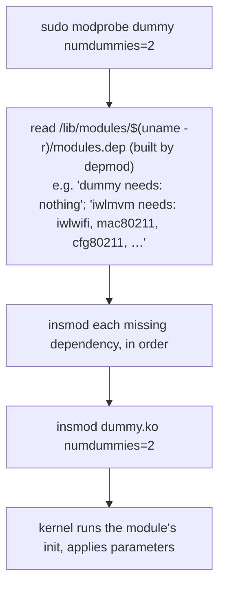

# Part 2 — Loading: modprobe, depmod, and the dependency graph

> Prerequisite: [Part 1 — Inspecting modules and their parameters](./course-01-inspecting-modules-and-parameters.md). Next: [Part 3 — Persistence and blacklisting](./course-03-persistence-and-blacklisting.md).

There are two commands that load a module and they are not interchangeable. This part is why `modprobe` is almost always the right one: the dependency database it consults, how it differs from `insmod`, how to pass a parameter at load time, and how to verify the load took.

## Concrete: load `dummy` with two interfaces

```bash
# shell: host, root
sudo modprobe dummy numdummies=2
lsmod | grep dummy
cat /sys/module/dummy/parameters/numdummies      # -> 2
```

`dummy` is a virtual network-device module; `numdummies=2` (name confirmed with `modinfo -p` in Part 1) asks it to create two `dummy0`/`dummy1` interfaces instead of the default zero.

## `modprobe` vs `insmod`



- **`insmod <file>.ko`** loads exactly the one file you name and **fails if a dependency is not already loaded** (`Unknown symbol` errors). It does no path resolution — you give it a full path.
- **`modprobe <name>`** takes a module *name*, looks it up in **`modules.dep`** (the dependency map that `depmod` generates from every `.ko` under `/lib/modules/$(uname -r)/`), loads every prerequisite first, then loads the target. It also honours the config in Part 3.

Same "friendly wrapper over the raw mechanism" pattern as `sysctl` over `/proc/sys`: `modprobe` is the default; `insmod`/`rmmod` are for deliberate single-file, low-level work.

`depmod` is normally run automatically when a kernel package is installed. If you drop a `.ko` in by hand, run `sudo depmod -a` so `modprobe` can find it.

## Unloading

```bash
sudo modprobe -r dummy      # remove dummy AND now-unused dependencies it pulled in
sudo rmmod dummy            # remove exactly dummy, nothing else
```

`modprobe -r` refuses if the refcount (Part 1) is non-zero — something is still using it. `rmmod -f` (force) exists and is dangerous; avoid it.

## Passing and verifying a parameter

A parameter given on the `modprobe` command line applies **only to that load**. It is not remembered anywhere. Verify it landed:

```bash
lsmod | grep dummy
cat /sys/module/dummy/parameters/numdummies
ip link show type dummy          # dummy0, dummy1 now exist
```

To prove that a *persistent config* (Part 3) — not your command line — is driving the value, reload without typing the parameter:

```bash
sudo modprobe -r dummy
sudo modprobe dummy               # no numdummies= here
cat /sys/module/dummy/parameters/numdummies
```

If it still comes out as `2`, a config file is doing the work.

> [!TIP]
> **Try it — load with a parameter, live.** On the host:
>
> ```bash
> sudo modprobe dummy numdummies=2
> lsmod | grep dummy
> cat /sys/module/dummy/parameters/numdummies
> ip -br link show type dummy
> ```
>
> Expect something like:
>
> ```text
> dummy                  16384  0
> 2
> dummy0           DOWN           ...
> dummy1           DOWN           ...
> ```
>
> The module is loaded, `/sys/module/dummy/parameters/numdummies` confirms the value took, and two `dummyN` interfaces now exist. `sudo modprobe -r dummy` removes it again — this parameter was for this load only; nothing on disk remembers it.

> [!WARNING]
> - **`insmod` for anything with dependencies.** It will fail with `Unknown symbol in module`. Use `modprobe`, which resolves `modules.dep`.
> - **Expecting a command-line `key=value` to persist.** It applies to that one load only. Persistence is a `/etc/modprobe.d/` `options` line (Part 3).
> - **Hand-copying a `.ko` and `modprobe` not finding it.** Run `sudo depmod -a` to regenerate `modules.dep` first.

> *`modprobe <name>` resolves `modules.dep` (built by `depmod`), loads dependencies then the target, and applies any `key=value` for that load only; `insmod` loads one `.ko` and fails on missing dependencies.*

## Reference

- `man modprobe` — name resolution, `-r`, config-file handling, `--show-depends`.
- `man depmod` — how `modules.dep` is generated; when you must run it by hand.
- `man insmod` / `man rmmod` — the single-file primitives and when they are the right tool.
