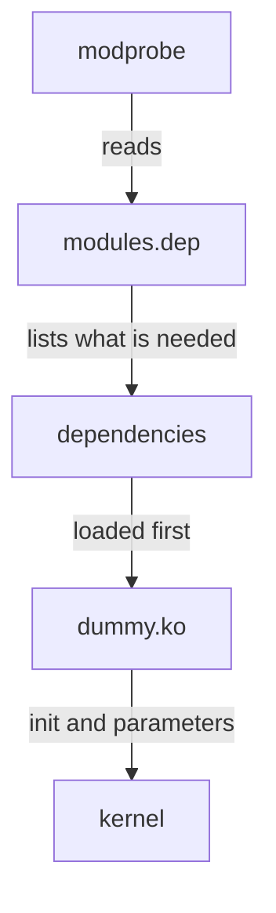

# Loading Modules With Modprobe

Astronaut, two commands can fit a part into the reactor, and they are not the same. `modprobe` is the engineer who fits a part together with every part it depends on. `depmod` builds the parts catalogue that the engineer reads. `insmod` fits exactly one file and checks nothing.

This part shows why `modprobe` is almost always the right choice, how to pass a parameter for one load, and how to check that the load worked.

## A real load: `dummy` with two interfaces

Start with one real example. The `dummy` module is a virtual network driver: it creates fake network interfaces that are handy for testing. By default it creates none.

### Load it with a parameter

<!-- astrona:playground:renew -->

Load `dummy` and ask for two interfaces:

```bash
# shell: host, root
sudo modprobe dummy numdummies=2
lsmod | grep dummy
cat /sys/module/dummy/parameters/numdummies      # -> 2
```

The parameter name `numdummies` comes from `modinfo -p dummy`. With `numdummies=2`, the module creates two interfaces, `dummy0` and `dummy1`, instead of the default zero.

## `modprobe` versus `insmod`

Both commands end with the kernel running a module's start-up code. The difference is what happens before that, and it decides whether the load works at all.

### What `modprobe` does underneath


```mermaid
flowchart TB
    M["modprobe"] -->|"reads"| DEP["modules.dep"]
    DEP -->|"lists what is needed"| D["dependencies"]
    D -->|"loaded first"| T["dummy.ko"]
    T -->|"init and parameters"| K["kernel"]
```

The diagram shows `modprobe` reading `/lib/modules/$(uname -r)/modules.dep`, loading every missing dependency in order, then loading `dummy.ko numdummies=2`, after which the kernel runs the module's start-up code and applies the parameter. For `dummy`, the dependency list is empty. For a Wi-Fi driver such as `iwlmvm`, it lists `iwlwifi`, `mac80211` and `cfg80211`.

### The two commands side by side

- **`insmod <file>.ko`** loads exactly the one file you name. It does not look up paths, so you must give the full path. It **fails if a dependency is not already loaded**, with `Unknown symbol` errors.
- **`modprobe <name>`** takes a module *name*. It looks the name up in **`modules.dep`**, the dependency map that `depmod` builds from every `.ko` file under `/lib/modules/$(uname -r)/`. It loads every dependency first, then the module you asked for. It also reads the module configuration files under `/etc/modprobe.d/`.

`modprobe` is a friendly front end over the low-level tools, in the same way that `sysctl` is a friendly front end over `/proc/sys`. Use `modprobe` by default. Keep `insmod` and `rmmod` for deliberate, low-level work on one single file.

### When to run `depmod` yourself

The package manager runs `depmod` for you when it installs a kernel package. If you copy a `.ko` file in by hand, `modprobe` cannot find it yet. Run `sudo depmod -a` to rebuild `modules.dep` first.

## Unloading a module

Removing a part works the same way in reverse. Again there is a careful tool and a blunt one.

```bash
sudo modprobe -r dummy      # remove dummy AND now-unused dependencies it pulled in
sudo rmmod dummy            # remove exactly dummy, nothing else
```

The two lines are two choices, so run only one of them. If you unload `dummy` now, load it again with `numdummies=2` before the next step.

`modprobe -r` refuses when the module's reference count is above zero, because something is still using it. `rmmod -f` (force) exists, but it is dangerous. Avoid it.

## Passing and checking a parameter

A parameter on the `modprobe` command line applies **only to that one load**. The kernel does not store it anywhere for next time.

### Check that it landed

```bash
lsmod | grep dummy
cat /sys/module/dummy/parameters/numdummies
ip link show type dummy          # dummy0, dummy1 now exist
```

### Find out what is really setting the value

Later you will write the value into a configuration file. To prove that the file, and not your command line, sets the value, reload the module without typing the parameter:

```bash
sudo modprobe -r dummy
sudo modprobe dummy               # no numdummies= here
cat /sys/module/dummy/parameters/numdummies
```

If the value still comes out as `2`, a configuration file is doing the work. With no file in place, it goes back to the default.

## Try it: load with a parameter, live

Run the full load and check it in one go:

```bash
sudo modprobe dummy numdummies=2
lsmod | grep dummy
cat /sys/module/dummy/parameters/numdummies
ip -br link show type dummy
```

Expect something like:

```text
dummy                  16384  0
2
dummy0           DOWN           ...
dummy1           DOWN           ...
```

The module is loaded, `/sys/module/dummy/parameters/numdummies` confirms the value took, and two `dummyN` interfaces now exist. Run `sudo modprobe -r dummy` to remove it again. This parameter was for this load only, and nothing on disk remembers it.

To read more on the machine itself, see `man modprobe` (including `--show-depends`), `man depmod`, `man insmod` and `man rmmod`.

> *`modprobe <name>` reads `modules.dep` (built by `depmod`), loads the dependencies and then the module, and applies any `key=value` for that load only. `insmod` loads one `.ko` file and fails when a dependency is missing.*

## Common pitfalls

> [!WARNING]
> - **Using `insmod` for a module with dependencies.** It fails with `Unknown symbol in module`. Use `modprobe`, which reads `modules.dep`.
> - **Expecting a command-line `key=value` to persist.** It applies to that one load only. To keep it, write an `options` line in a file under `/etc/modprobe.d/`.
> - **Copying a `.ko` by hand and `modprobe` not finding it.** Run `sudo depmod -a` to rebuild `modules.dep` first.
