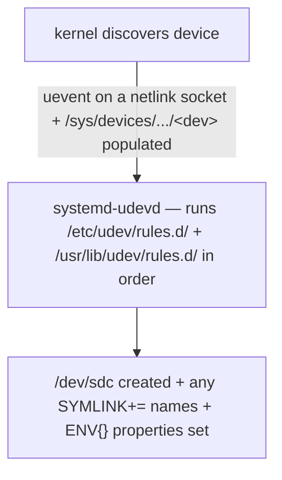

# Part 1 — Device events, sysfs, and finding a stable identity

> Prerequisite: [module landing page](./course.md). Next: [Part 2 — Writing the rule: match keys vs. assignment keys](./course-02-writing-the-rule.md).

`/dev/sdb` is a race result — the letter is assigned in the order the kernel discovered devices, not tied to any drive. Before you can pin a stable name to one physical device you need to understand where udev gets its information (kernel uevents and the sysfs tree) and how to extract an attribute the hardware actually carries. This part is that groundwork.

## Where a device node comes from

When the kernel discovers a device, it emits a **uevent** — a small message on a netlink socket — and populates the device's directory under **`/sys`** (sysfs) with its attributes. `udevd` (systemd's `systemd-udevd`) listens for those uevents, runs its **rules** against the device, and creates the node under `/dev` plus any symlinks the rules ask for.



The kernel name (`sdc`) reflects enumeration order and nothing else. Plug in an unrelated USB stick that gets probed first and your intended disk can shift from `sdc` to `sdd` with no message anywhere. A script with `/dev/sdc1` hardcoded then operates on the wrong disk, silently.

## The sysfs tree is a hierarchy — and identity lives up the tree

A block device is not a flat object. It sits at the bottom of a chain: the disk, its parent SCSI/ATA/NVMe target, that target's host controller, the PCI/USB bus. Attributes are attached at whichever level owns them — and a hardware **serial number** frequently lives on a *parent* node, not the leaf.

Start by confirming the current node:

```bash
# shell: any host, unprivileged
lsblk
```

Then two `udevadm info` modes, which read different things:

```bash
udevadm info --query=all --name=/dev/sdc
```

A **flat dump** of the properties udev already recorded for that one node — often `ID_SERIAL`, `ID_VENDOR`, `ID_MODEL`, `ID_FS_TYPE`, `DEVLINKS`, all derived by udev's built-in rules. Sometimes enough on its own.

```bash
udevadm info --attribute-walk --name=/dev/sdc
```

`man udevadm`: `--attribute-walk` climbs the device's **entire ancestry** in sysfs — the device, then its parent, then that parent's parent — printing every `ATTRS{...}` and `KERNELS`/`SUBSYSTEMS` value at each level. This is the mode for hunting a serial, because a flat query at the leaf often does not expose it.

```text
  looking at device '/devices/.../block/sdc':
    KERNEL=="sdc"
    SUBSYSTEM=="block"

  looking at parent device '/devices/.../2:0:0:0':
    KERNELS=="2:0:0:0"
    SUBSYSTEMS=="scsi"
    ATTRS{serial}=="WD-WXA1E23456789"      ← the stable identifier, one level up
    ATTRS{model}=="WDC WD40EFRX-68N"
```

The two values that matter for Part 2: **`ATTRS{serial}`** (baked into the hardware) and **`SUBSYSTEM=="block"`** (scopes a rule to block devices, so the same ancestry chain does not also match unrelated subsystem nodes).

> [!TIP]
> **Try it — flat dump vs. ancestry walk.** The playground attached a spare disk `/dev/vdc` with serial `BACKUPWD42`. On the host (`astrona ssh astro-udev-stable-naming`):
>
> ```bash
> lsblk -o NAME,SIZE,SERIAL
> udevadm info --query=all --name=/dev/vdc | grep -E 'ID_SERIAL|DEVLINKS'
> udevadm info --attribute-walk --name=/dev/vdc | grep -E 'KERNEL==|SUBSYSTEM==|ATTR\{serial\}|ATTRS\{serial\}'
> ```
>
> Expect something like:
>
> ```text
> vda   15G
> vdb  366K
> vdc    1G BACKUPWD42
> E: ID_SERIAL=BACKUPWD42
> E: DEVLINKS=/dev/disk/by-id/virtio-BACKUPWD42 ...
>     KERNEL=="vdc"
>     SUBSYSTEM=="block"
>     ATTR{serial}=="BACKUPWD42"
> ```
>
> For this virtio disk the serial sits on the device's own node (`ATTR{serial}`, and as the `ID_SERIAL` property). On real SCSI/SATA hardware `--attribute-walk` is where you would find it one level up as `ATTRS{serial}` — the walk is the mode that reaches parent nodes.

> [!WARNING]
> - **Matching on `/dev/sdX` or `KERNEL=="sdc"`.** That is the enumeration-order name — the exact thing you are trying to stop depending on.
> - **Looking for the serial only at the leaf.** Use `--attribute-walk`; `ATTRS{}` on a parent is where serials usually are. A flat `--query=all` can miss it entirely.
> - **`ATTR{}` vs `ATTRS{}`.** `ATTR{}` (no S) matches the device's *own* sysfs attributes; `ATTRS{}` (with S) walks up to parents. Part 2 depends on the difference.

> *udev builds `/dev` nodes by running rules against kernel uevents and sysfs attributes; a stable identifier like `ATTRS{serial}` usually lives on a parent node, found with `udevadm info --attribute-walk`.*

## Reference

- `man udevadm` — `info --query=all` vs `--attribute-walk`, `monitor`, `trigger`, `test`.
- `man 7 udev` — the rule language and the `ATTR{}` / `ATTRS{}` / `ENV{}` / `SUBSYSTEM` key vocabulary.
- `man 5 sysfs` — the `/sys/devices` hierarchy the attribute walk climbs.
