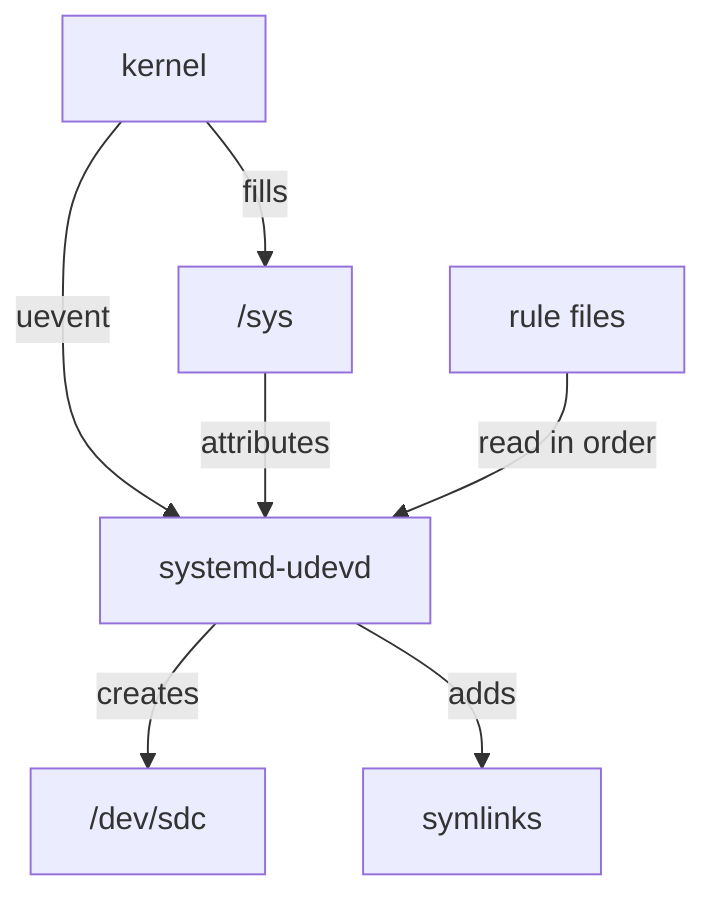

# Device Events And A Stable Identity

Astronaut, `/dev/sdb` is not a promise. It is the bay number the ship hands out in arrival order: the kernel gives out letters in the order it discovered the disks this boot, and the letter has nothing to do with the drive itself. Before you can give one physical disk a name it keeps, you need to know where udev, the dock master who names each arriving bay, gets its information. Then you need to find something the hardware itself carries, such as its hull serial number.

This part is that groundwork. It only reads; it changes nothing.

## Where a device node comes from

A file such as `/dev/sdc` is a **device node**: the door through which programs talk to a device. Three components work together to create it.

### From the kernel to `/dev`

When the kernel discovers a device, it does two things. It sends a **uevent**, a short "device added" message, to programs that listen for it. And it fills the device's folder under **`/sys`** (sysfs, the kernel's live view of all hardware) with the device's attributes.

`systemd-udevd`, the udev service, listens for those uevents. It runs its **rules** against the device, then creates the node under `/dev`, plus any extra names (symbolic links) the rules ask for.


```mermaid
flowchart TB
    K["kernel"] -->|"fills"| S["/sys"]
    K -->|"uevent"| U["systemd-udevd"]
    S -->|"attributes"| U
    R["rule files"] -->|"read in order"| U
    U -->|"creates"| N["/dev/sdc"]
    U -->|"adds"| L["symlinks"]
```

The diagram shows `systemd-udevd` combining the kernel's uevent with the attributes in `/sys/devices/.../<dev>`, running the rule files from `/etc/udev/rules.d/` and `/usr/lib/udev/rules.d/` in order, and then creating `/dev/sdc` together with any `SYMLINK+=` names and `ENV{}` properties the rules set.

### Why the letter means nothing

The kernel name (`sdc`) only shows the order of discovery. Plug in an unrelated USB stick that the kernel finds first, and your disk can move from `sdc` to `sdd` with no message anywhere. A script with `/dev/sdc1` written into it then works on the wrong disk, and nothing warns you.

## Identity lives up the sysfs tree

A disk is not one flat object in sysfs. It sits at the bottom of a chain: the disk, its parent SCSI, ATA or NVMe target, that target's host controller, and then the PCI or USB bus. Each attribute belongs to one level of that chain. A hardware **serial number** often sits on a *parent* level, not on the disk itself.

### Two ways to ask udev

<!-- astrona:playground:renew -->

Start by looking at the current disks:

```bash
# shell: any host, unprivileged
lsblk
```

Then use the two modes of `udevadm info`. They read different things. The examples use `/dev/sdc`, a disk on a physical server. In your playground the spare disk is `/dev/vdc`, so use that name instead. The first one is a **flat dump**:

```bash
udevadm info --query=all --name=/dev/sdc
```

It lists the properties udev already recorded for that one node. These often include `ID_SERIAL`, `ID_VENDOR`, `ID_MODEL`, `ID_FS_TYPE` and `DEVLINKS`, all set by udev's built-in rules. Sometimes that is enough on its own.

The second one is an **attribute walk**:

```bash
udevadm info --attribute-walk --name=/dev/sdc
```

### Reading the attribute walk

`--attribute-walk` climbs the device's **whole family tree** in sysfs: the device, then its parent, then that parent's parent. At each level it prints every `ATTRS{...}`, `KERNELS` and `SUBSYSTEMS` value. Use this mode to hunt for a serial, because a flat query on the disk often does not show it.

```text
  looking at device '/devices/.../block/sdc':
    KERNEL=="sdc"
    SUBSYSTEM=="block"

  looking at parent device '/devices/.../2:0:0:0':
    KERNELS=="2:0:0:0"
    SUBSYSTEMS=="scsi"
    ATTRS{serial}=="WD-WXA1E23456789"      ← the stable identifier, one level up
    ATTRS{model}=="WDC WD40EFRX-68N"
```

Two values matter when you write a rule. **`ATTRS{serial}`** is the hull serial number: it is built into the hardware and never changes. **`SUBSYSTEM=="block"`** limits a rule to block devices (disks and partitions), so the same family tree does not also match unrelated devices.

## Try it: flat dump versus attribute walk

Your playground has a spare 1 GiB disk with the serial `BACKUPWD42`, usually `/dev/vdc`. Its letter is not guaranteed, so if `lsblk` shows it under another name, use that name below. Look at it both ways:

```bash
lsblk -o NAME,SIZE,SERIAL
udevadm info --query=all --name=/dev/vdc | grep -E 'ID_SERIAL|DEVLINKS'
udevadm info --attribute-walk --name=/dev/vdc | grep -E 'KERNEL==|SUBSYSTEM==|ATTR\{serial\}|ATTRS\{serial\}'
```

Expect something like:

```text
vda   15G
vdb  366K
vdc    1G BACKUPWD42
E: ID_SERIAL=BACKUPWD42
E: DEVLINKS=/dev/disk/by-id/virtio-BACKUPWD42 ...
    KERNEL=="vdc"
    SUBSYSTEM=="block"
    ATTR{serial}=="BACKUPWD42"
```

On this virtio disk (a virtual disk type used by virtual machines), the serial sits on the device's own node, as `ATTR{serial}`, and udev also records it as the `ID_SERIAL` property. On real SCSI or SATA hardware, the attribute walk is where you would find it one level up, as `ATTRS{serial}`. Only the walk reaches parent levels.

The manual pages on the machine cover this in full: `man udevadm`, `man 7 udev` and `man 5 sysfs`.

> *udev builds `/dev` nodes by running rules against kernel uevents and sysfs attributes. A stable identifier such as `ATTRS{serial}` often lives on a parent level, and `udevadm info --attribute-walk` finds it.*

## Common pitfalls

> [!WARNING]
> - **Matching on `/dev/sdX` or `KERNEL=="sdc"`.** That is the arrival-order name, exactly the thing you are trying to stop depending on.
> - **Looking for the serial only on the disk itself.** Use `--attribute-walk`. Serials often sit on a parent level as `ATTRS{}`, and a flat `--query=all` can miss them.
> - **Mixing up `ATTR{}` and `ATTRS{}`.** `ATTR{}` (no S) matches only the device's *own* attributes. `ATTRS{}` (with S) also searches the parent levels. Rules depend on this difference.
