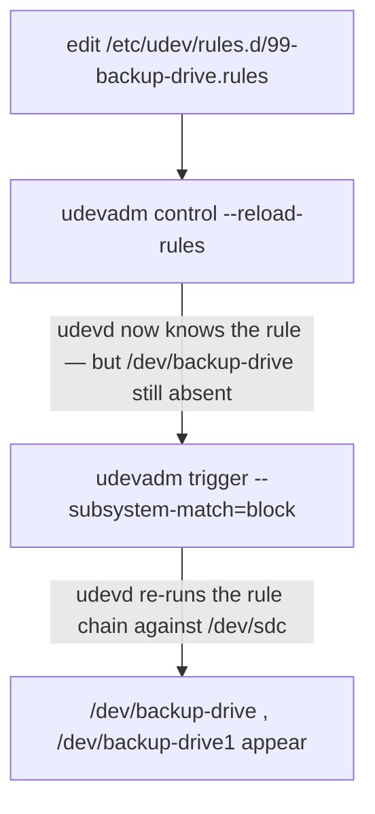

# Part 3 — Applying, verifying, and using the rule

> Prerequisite: [Part 2 — Writing the rule: match keys vs. assignment keys](./course-02-writing-the-rule.md). Next: [Section 010 quiz](../quiz.md).

A rule file on disk does nothing until udev is told to re-read it — and re-reading a rule and re-applying it to a device that is already connected are two separate steps. Skipping the second is the most common udev trap. This part is the apply sequence, the dry-run and live-monitor tools, and the reason the rule exists at all.

## Two steps, not one

```bash
# shell: host, root
sudo udevadm control --reload-rules
```

This tells the running `systemd-udevd` to **re-read every rule file from disk, now**. It does **not** re-evaluate any device that is already attached — those were processed when they appeared, against the old rules.

```bash
sudo udevadm trigger --subsystem-match=block
```

`trigger` synthesises fresh `add`/`change` uevents for devices that are already present, forcing udev to run the **full rule chain — including your new rule — against them**. `--subsystem-match=block` scopes it so you are not re-triggering every settled device on the box.



`--reload-rules` alone runs cleanly, prints nothing, and looks like it worked — while doing nothing to the device you care about. Always follow it with `trigger` (or `udevadm trigger --action=add --name-match=sdc` for just the one device).

> [!TIP]
> **Try it — the two steps, and what each one does.** With `99-backup.rules` from Part 2 in place, on the host:
>
> ```bash
> ls -l /dev/backup-drive 2>&1                       # not there yet
> sudo udevadm control --reload-rules
> ls -l /dev/backup-drive 2>&1                       # STILL not there — rule loaded, device not re-evaluated
> sudo udevadm trigger --subsystem-match=block
> ls -l /dev/backup-drive
> ```
>
> Expect something like:
>
> ```text
> ls: cannot access '/dev/backup-drive': No such file or directory
> ls: cannot access '/dev/backup-drive': No such file or directory
> lrwxrwxrwx 1 root root 3 ... /dev/backup-drive -> vdc
> ```
>
> The symlink appears only after `trigger` — `--reload-rules` by itself changed nothing observable. That gap is the trap.

## Dry-run a rule before trusting it

```bash
udevadm test "$(udevadm info -q path -n /dev/sdc)" 2>&1 | grep -E 'SYMLINK|backup'
```

`udevadm test` runs the full rule processing for one device **without changing `/dev`**, printing every rule that matched and every property/symlink it would set. This is how you confirm a rule matches *before* `trigger` makes it real — invaluable when a rule silently does not fire.

> [!TIP]
> **Try it — dry-run the rule.** On the host:
>
> ```bash
> udevadm test "$(udevadm info -q path -n /dev/vdc)" 2>&1 | grep -Ei '99-backup|SYMLINK|backup-drive'
> ```
>
> Expect something like:
>
> ```text
> Reading rules file: /etc/udev/rules.d/99-backup.rules
> ... LINK 'backup-drive' /etc/udev/rules.d/99-backup.rules:1
> ID_SERIAL=BACKUPWD42
> DEVLINKS=/dev/disk/by-id/virtio-BACKUPWD42 /dev/backup-drive
> ```
>
> The line naming your rule file and `LINK 'backup-drive'` confirms the rule matched and which line did it — no change to `/dev` was made. Use this to debug a rule that is not firing before reaching for `trigger`.

## Watch it live

```bash
# second terminal
sudo udevadm monitor --udev --subsystem-match=block
```

Streams each udev event as it is processed (`--udev` = after rule processing, vs `--kernel` = the raw uevent). Run this, then `trigger` in the first terminal, and watch the `add` event and the resulting `DEVLINKS` fly past — direct confirmation, not an inference from a later `ls`.

## Verify the result

```bash
ls -l /dev/backup-drive /dev/backup-drive1
```

```text
lrwxrwxrwx 1 root root ... /dev/backup-drive  -> sdc
lrwxrwxrwx 1 root root ... /dev/backup-drive1 -> sdc1
```

Symlinks pointing at the current kernel letter. The target may differ after the next reconnect; the symlink *name* never does. `udevadm info -q symlink -n /dev/sdc` lists them from udev's own database.

## The point: stop hardcoding kernel letters

The rule is only worth writing because of what it lets you change:

```bash
# before (fragile — sdb1 is an enumeration accident):
#   mount /dev/sdb1 /mnt/backup
# after (stable):
mount /dev/backup-drive1 /mnt/backup
```

Update every script, `/etc/fstab` line, and backup config that hardcoded a raw `/dev/sdX`. That edit is the actual fix; the rule is the mechanism that makes it safe.

Often you do not need a custom rule at all: `/dev/disk/by-id/`, `/dev/disk/by-uuid/`, and `/dev/disk/by-path/` are built from this same stable-attribute matching and exist out of the box. Check them first — a hand-written `SYMLINK+=` rule earns its place when you need a specific human-chosen name (`backup-drive`) rather than a `by-id` string.

> [!WARNING]
> - **`udevadm control --reload-rules` and stopping there.** It reloads the rules but does not re-apply them to connected devices. Follow with `udevadm trigger`.
> - **Testing with a real reconnect only.** `udevadm test` dry-runs the rule with no risk; use it to confirm a match before `trigger`.
> - **Assuming the rule fired because `ls /dev` shows the link.** A stale link from an earlier attempt can persist. `udevadm monitor` or `udevadm test` shows whether *this* rule is matching.
> - **Writing the rule and never updating the consumers.** `/dev/backup-drive` only helps once `fstab` and the scripts stop naming `/dev/sdb1`.

> *`udevadm control --reload-rules` makes udevd read the new rule; `udevadm trigger` re-applies it to already-attached devices — both are required — then `udevadm test` / `monitor` confirm it fired before you repoint scripts and `fstab` at the stable name.*

## Reference

- `man udevadm` — `control --reload-rules`, `trigger`, `test`, `monitor`, `info -q`.
- `man 7 udev` — rule processing order and how `SYMLINK` entries become `/dev/disk/by-*` and custom links.
- `/dev/disk/by-id/`, `/dev/disk/by-uuid/` on the host — the built-in stable names to check before writing a rule.
