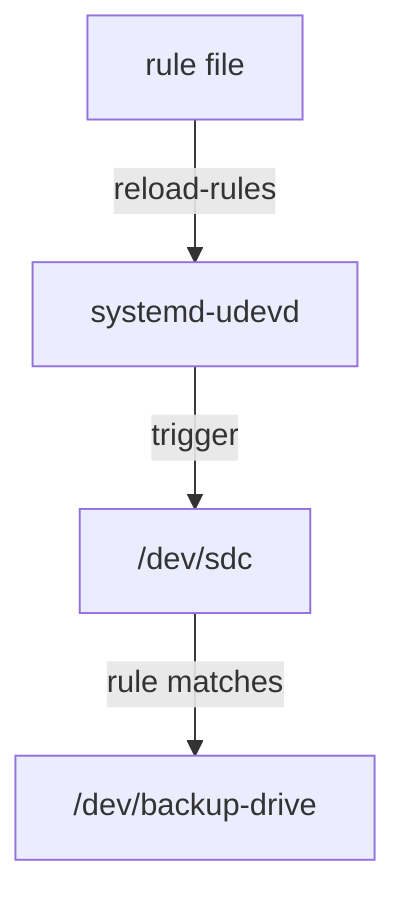

# Applying And Using The Rule

Astronaut, a new rule card does nothing while it sits in the drawer. The dock master must read it, and then look again at the bays that have already docked. Those are two separate steps, and skipping the second one is the most common udev trap.

This part shows the two apply steps, two tools that show whether a rule fires, and the reason the rule exists at all: to stop scripts and `/etc/fstab` from naming raw device letters.

## Two steps, not one

`systemd-udevd` reads its rules once and keeps them in memory. It also handles each device only once, when the device arrives. So a new rule needs one command for each of those facts.

### Step one: read the rules again

<!-- astrona:playground:renew -->

```bash
# shell: host, root
sudo udevadm control --reload-rules
```

This tells the running `systemd-udevd` to **read every rule file from disk again, now**. It does **not** look again at any device that is already attached. Those devices were handled when they arrived, against the old rules.

### Step two: replay the device events

```bash
sudo udevadm trigger --subsystem-match=block
```

`trigger` asks the kernel to send fresh `add` and `change` uevents for devices that are already present. That makes `systemd-udevd` run the **whole rule chain again, including your new rule**, against them. `--subsystem-match=block` limits it to block devices, so you do not replay every device on the machine.


```mermaid
flowchart TB
    E["rule file"] -->|"reload-rules"| D["systemd-udevd"]
    D -->|"trigger"| V["/dev/sdc"]
    V -->|"rule matches"| L["/dev/backup-drive"]
```

The diagram shows the order: after `udevadm control --reload-rules`, `systemd-udevd` knows the rule in `/etc/udev/rules.d/99-backup-drive.rules`, but `/dev/backup-drive` is still missing. Only `udevadm trigger --subsystem-match=block` makes it run the rule chain against `/dev/sdc`, and then `/dev/backup-drive` and `/dev/backup-drive1` appear.

`--reload-rules` on its own runs cleanly, prints nothing and looks as if it worked, while it does nothing to the device you care about. Always follow it with `trigger`, or with `udevadm trigger --action=add --name-match=sdc` for just that one device.

## Try it: the two steps, and what each one does

With `/etc/udev/rules.d/99-backup.rules` in place (the one-line rule that matches `ENV{ID_SERIAL}=="BACKUPWD42"` and adds `SYMLINK+="backup-drive"`), check the link before and after each step:

```bash
ls -l /dev/backup-drive 2>&1                       # not there yet
sudo udevadm control --reload-rules
ls -l /dev/backup-drive 2>&1                       # STILL not there — rule loaded, device not re-evaluated
sudo udevadm trigger --subsystem-match=block
ls -l /dev/backup-drive
```

Expect something like:

```text
ls: cannot access '/dev/backup-drive': No such file or directory
ls: cannot access '/dev/backup-drive': No such file or directory
lrwxrwxrwx 1 root root 3 ... /dev/backup-drive -> vdc
```

The link appears only after `trigger`. `--reload-rules` alone changed nothing you can see. That gap is the trap.

## Check a rule before you trust it

Two `udevadm` tools show what a rule does, so you do not have to guess from a later `ls`. One tests without changing anything; the other watches events live.

### Dry-run a rule with `udevadm test`

```bash
udevadm test "$(udevadm info -q path -n /dev/sdc)" 2>&1 | grep -E 'SYMLINK|backup'
```

`udevadm test` runs the full rule processing for one device **without changing `/dev`**. It prints every rule that matched and every property and link it would set. Use it to confirm that a rule matches *before* `trigger` makes it real, especially when a rule seems to do nothing.

### Try it: dry-run the rule

In your playground the disk is `/dev/vdc`:

```bash
udevadm test "$(udevadm info -q path -n /dev/vdc)" 2>&1 | grep -Ei '99-backup|SYMLINK|backup-drive'
```

Expect something like:

```text
Reading rules file: /etc/udev/rules.d/99-backup.rules
... LINK 'backup-drive' /etc/udev/rules.d/99-backup.rules:1
ID_SERIAL=BACKUPWD42
DEVLINKS=/dev/disk/by-id/virtio-BACKUPWD42 /dev/backup-drive
```

The line that names your rule file, and `LINK 'backup-drive'`, confirm that the rule matched and show which line did it. Nothing in `/dev` changed. Use this to debug a rule that does not fire, before you reach for `trigger`.

### Watch events live with `udevadm monitor`

Open a second terminal and run:

```bash
# second terminal
sudo udevadm monitor --udev --subsystem-match=block
```

This prints each udev event as `systemd-udevd` handles it. `--udev` shows events after rule processing, and `--kernel` would show the raw uevent instead. Run `trigger` in the first terminal and watch the `add` event and the resulting `DEVLINKS` go past. That is direct proof, not a guess from a later `ls`.

## Check the result

List both links:

```bash
ls -l /dev/backup-drive /dev/backup-drive1
```

```text
lrwxrwxrwx 1 root root ... /dev/backup-drive  -> sdc
lrwxrwxrwx 1 root root ... /dev/backup-drive1 -> sdc1
```

The links point at the current kernel letter. The target may change after the next reconnect, but the link *name* never does. `udevadm info -q symlink -n /dev/sdc` lists the links from udev's own database.

## The point: stop writing kernel letters into files

The rule is only worth writing because of what it lets you change next.

### Use the stable name

```bash
# before (fragile — sdb1 is an enumeration accident):
#   mount /dev/sdb1 /mnt/backup
# after (stable):
mount /dev/backup-drive1 /mnt/backup
```

Update every script, `/etc/fstab` line and backup configuration that names a raw `/dev/sdX`. That edit is the real fix. The rule only makes it safe.

### Check the built-in stable names first

Often you do not need your own rule at all. `/dev/disk/by-id/`, `/dev/disk/by-uuid/` and `/dev/disk/by-path/` come from the same kind of stable-attribute matching, and Ubuntu creates them for you. Check them first. A hand-written `SYMLINK+=` rule earns its place when you need a specific, human-chosen name such as `backup-drive` instead of a long `by-id` string.

The manual pages `man udevadm` and `man 7 udev` describe every option used here.

> *`udevadm control --reload-rules` makes `systemd-udevd` read the new rule, and `udevadm trigger` applies it to devices that are already attached. You need both. Then `udevadm test` and `udevadm monitor` confirm the rule fired, before you point scripts and `/etc/fstab` at the stable name.*

## Common pitfalls

> [!WARNING]
> - **Running `udevadm control --reload-rules` and stopping there.** It reloads the rules but does not apply them to attached devices. Follow it with `udevadm trigger`.
> - **Testing only with a real reconnect.** `udevadm test` dry-runs the rule with no risk. Use it to confirm a match before `trigger`.
> - **Thinking the rule fired because `ls /dev` shows the link.** A stale link from an earlier attempt can stay behind. `udevadm monitor` or `udevadm test` shows whether *this* rule matches.
> - **Writing the rule and never updating the users of the disk.** `/dev/backup-drive` only helps once `/etc/fstab` and the scripts stop naming `/dev/sdb1`.

## Your mission: Stable Device Naming with udev Lab

You can now find a disk's serial, write a rule that gives the disk and its partition stable names, and apply the rule without a reboot. The mission asks you to do this for a backup disk with one ext4 partition, so that both the disk and the partition get a fixed name.

The mission runs on its own training ship. Your playground cannot be paused, so remove it first. It always starts clean, so you lose nothing you need:

```sh
astrona destroy udev-stable-naming
```

Then start the mission and open a terminal on it:

```sh
astrona run --git git@github.com:astrona-io/ATS002.git -c sections/section-010/module-04/labs/lab-01
astrona ssh ats-002-lab-014
```

Read the task in [`question.md`](./labs/lab-01/question.md) and solve it on your own first. When you think you are done, send it for grading:

```sh
astrona submit -c sections/section-010/module-04/labs/lab-01
```

When the mission is done, remove it and start your playground again:

```sh
astrona destroy ats-002-lab-014
astrona run --git git@github.com:astrona-io/ATS002.git -c sections/section-010/module-04/playground
```
