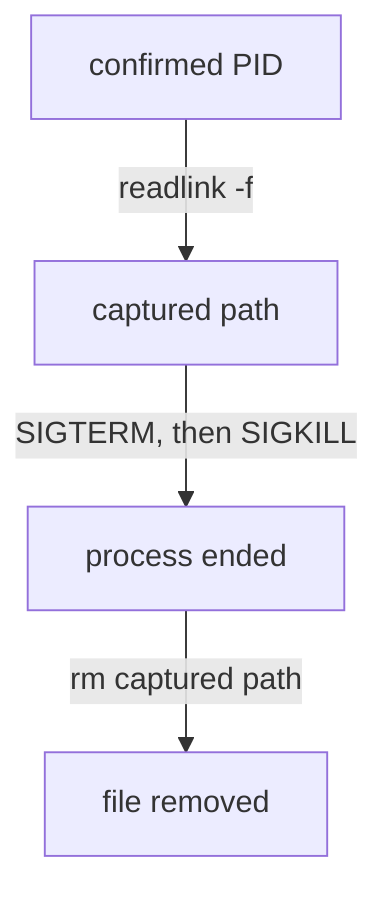

# From Confirmed Process To Safe Cleanup

Astronaut, you have a confirmed PID: the flight recorder caught that crew member making the forbidden request. The rest of the job has a strict order. First record which program file the crew member really runs, because that fact disappears the moment the process dies. Then remove the crew member. Then remove the file, using the path you recorded and never a guess.

This part shows why each step sits where it does.

## Resolve the executable before you kill

The kernel knows exactly which program file every process is running. You can ask it, but only while the process is still alive.

### Ask the kernel

<!-- astrona:playground:renew -->

```bash
# shell: host, root
sudo readlink -f /proc/1235/exe
```

```text
/usr/local/bin/collector2
```

PID 1235 is an example. In your playground, use a PID that `pgrep -a -f collector` printed.

### Why `/proc/PID/exe` is the one to trust

`/proc/PID/exe` is a special symbolic link that **the kernel maintains**. It points at the exact file the process is running as its program. No displayed name is as reliable:

- `comm` and `argv[0]` can be anything that `exec` was given.
- The program file could be a renamed copy of something else, or a symbolic link.
- The file on disk may already be **deleted**. `readlink` then shows `/usr/local/bin/collector2 (deleted)`. That is a strong warning sign in itself, because a normal service rarely runs from a deleted file.

`readlink -f` follows every symbolic link in the chain and returns the final, real path. That path is safe to act on.

### Why it must happen before the kill

`/proc/PID/` is a live window into a running process, not a record. The moment the process ends, the kernel removes `/proc/1235/` completely, and `readlink /proc/1235/exe` returns `No such file or directory`. Kill first, and the path you needed is gone. Graders and real incident reviews check this order on purpose.

## Try it: resolve first, then watch `/proc` vanish

Use `collector3` in your playground. It only sleeps, so it is safe to stop. Save its PID in a variable, read its program file, stop the service, and read again:

```bash
COLLECTOR_PID=$(pgrep -f collector3)
sudo readlink -f /proc/$COLLECTOR_PID/exe
sudo systemctl stop collector3.service
sudo readlink -f /proc/$COLLECTOR_PID/exe 2>&1
```

Expect something like:

```text
/bin/bash
readlink: /proc/733/exe: No such file or directory
```

The real program file is `/bin/bash`, not "collector3", because these are shell scripts. And the moment systemd stopped the service, `/proc/$COLLECTOR_PID/` was gone, so the resolve had to happen first. Run `sudo systemctl start collector3.service` to bring it back.

## The cleanup order

The whole cleanup follows one order, and each step depends on the one before it:



The diagram shows the order for PID 1235: capture `/usr/local/bin/collector2` with `readlink -f /proc/1235/exe`, end the process with `kill 1235` and, only if it is still alive, `kill -9 1235`, then remove exactly the captured path.

### Terminate: the escalation ladder

A **signal** is an order shouted to a crew member. `SIGTERM` means "finish up and leave". `SIGKILL` means "out of the airlock now".

```bash
sudo kill 1235          # SIGTERM — a request; the process can catch it and clean up
sleep 2
ps -p 1235              # still listed?
sudo kill -9 1235       # SIGKILL — the kernel enforces it; no handler can block or delay it
```

Start with `SIGTERM`, so a well-behaved process can save its work and exit cleanly. Move to `SIGKILL` only if it is still alive after a short wait. The kernel carries out `kill -9` itself, so the process cannot catch, block or ignore it. But it also gives the process no chance to tidy up, so it is the second choice, never the first.

### Remove: the captured path only

```bash
sudo rm /usr/local/bin/collector2
```

Use the exact string that `readlink -f` gave you, not one you built from the process name. A disguised or self-replacing program can run from a different path than its name suggests. If you remove the guessed path, the real file stays on disk while the incident looks closed. Capturing `/proc/PID/exe` first closes that gap.

## Act only on what you confirmed

If `collector1` and `collector3` recorded nothing across a long enough watch, they stay running, untouched. An order to "end the guilty process" is not permission to kill everything nearby "to be safe". That destroys evidence, takes down services that were never involved, and counts as a real mistake, not as caution.

The manual pages `man 5 proc`, `man 1 kill`, `man 7 signal` and `man 1 readlink` cover these details in full.

> *Run `readlink -f /proc/PID/exe` before you kill, because the `/proc` entry disappears with the process. Escalate from `SIGTERM` to `SIGKILL`, then `rm` the captured path, and leave every process you did not confirm alone.*

## Common pitfalls

> [!WARNING]
> - **Killing before resolving `/proc/PID/exe`.** `/proc/PID/` disappears with the process, and the path is then lost.
> - **Removing a path guessed from the process name.** The name is not the program file. Remove the `readlink -f` result.
> - **Starting with `kill -9`.** There is no clean shutdown, and data can be damaged. Send `SIGTERM`, wait, then `SIGKILL`.
> - **Sweeping up unconfirmed neighbours.** Only processes with recorded evidence get terminated.

## Your mission: Process Forensics with strace Lab

You can now find a process by name, catch it making one system call with `strace`, record its real program file and clean it up in the safe order. The mission asks you to find which of three running processes calls `kill()`, then end only that one and remove only its program file.

The mission runs on its own training ship. Your playground cannot be paused, so remove it first. It always starts clean, so you lose nothing you need:

```sh
astrona destroy strace-process-forensics
```

Then start the mission and open a terminal on it:

```sh
astrona run --git git@github.com:astrona-io/ATS002.git -c sections/section-010/module-05/labs/lab-01
astrona ssh ats-002-lab-015
```

Read the task in [`question.md`](./labs/lab-01/question.md) and solve it on your own first. When you think you are done, send it for grading:

```sh
astrona submit -c sections/section-010/module-05/labs/lab-01
```

When the mission is done, remove it and start your playground again:

```sh
astrona destroy ats-002-lab-015
astrona run --git git@github.com:astrona-io/ATS002.git -c sections/section-010/module-05/playground
```
