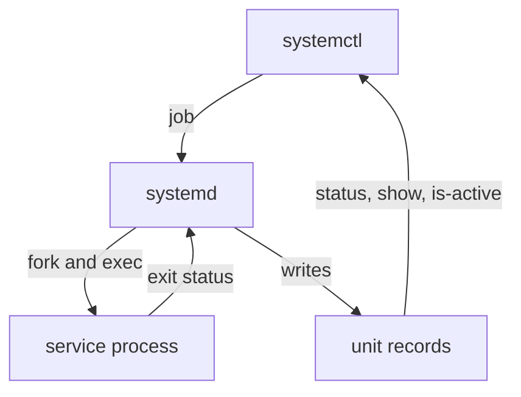
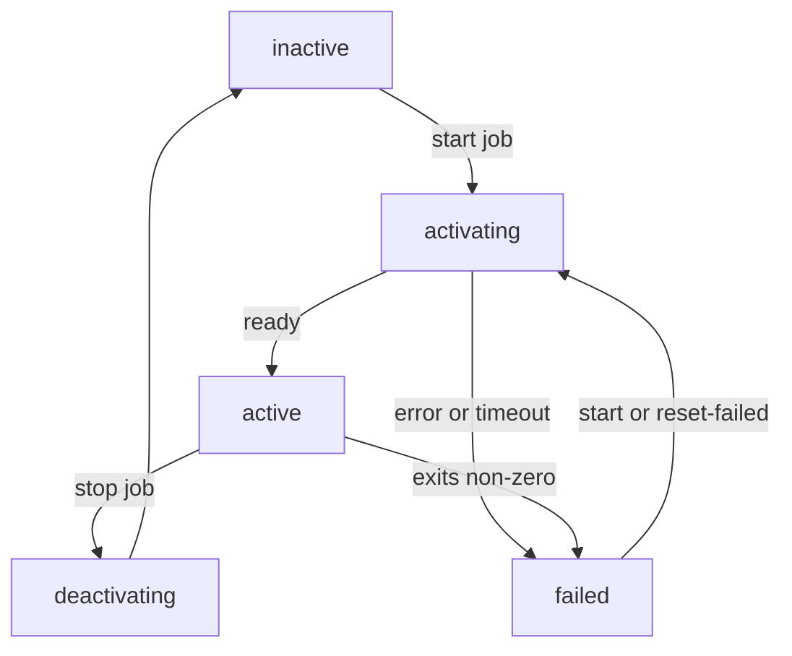

# The Service Manager And Unit State

Astronaut, before you can read a failure, you need to know who you are talking to and what the words in the answer mean. This part settles both. `systemctl` is only a messenger. The real work is done by `systemd`, the ship's duty officer, and every station it runs is always in one of a small, fixed set of states. Once you can name the state a service is stuck in, and why, the rest of this module is about closing that gap.

## `systemctl` is a client; PID 1 is the manager

Start with a real case. You run `systemctl restart apache2` and get the prompt back almost at once, sometimes with the line `Job for apache2.service failed`.

Here is what happened underneath. `systemctl` opened a private channel to **`systemd`**, which runs as **PID 1**: the first process the kernel starts at boot, the one that starts everything else. Think of `systemd` as the ship's duty officer: it starts every station, watches it and restarts it. `systemctl` handed the duty officer a **job**: "bring `apache2.service` to `active`". A **service** (also called a **unit**) is one station that must always be staffed.

`systemd` did all the work. It ran the `ExecStart=` command (the command written on the station's duty card), watched it, timed it and wrote down the outcome. `systemctl` then printed a summary of that written outcome. `systemctl` itself started nothing and watched nothing.



The diagram shows the round trip: `systemctl` sends a job to `systemd` (PID 1), `systemd` starts the service process and records how it ended, and every `systemctl` report reads those records back.

The practical result: **everything `systemctl status` shows you is a record that PID 1 already wrote.** The service does not have to be running for the diagnosis to be there. A unit that failed 40 seconds ago still has its full outcome in the manager's memory, and in the journal (the ship's log).

## The unit lifecycle

A service unit is always in exactly one **`ActiveState`**. This section names the states and the moves between them, because every report you read uses these words.

### The states and the moves between them

The duty officer moves a station from one state to the next as jobs start and processes end:



The diagram shows the normal path from `inactive` through `activating` to `active`, and the two ways into `failed`: during the start, or later when a running process exits with an error.

- **`inactive`**: not running, nothing wrong. The resting state.
- **`activating`**: a start job is running. `ExecStartPre=` and then `ExecStart=` are running. For `Type=notify` and `Type=forking` services, the manager is *waiting for a readiness signal*. What "ready" means depends on `Type=` (`simple`, `exec`, `forking` or `notify`).
- **`active`**: the start job finished successfully. What "successfully" means also depends on `Type=`.
- **`deactivating`**: a stop job is running.
- **`failed`**: a start job did not finish. `ExecStart=` exited with a non-zero code, or the readiness deadline (`TimeoutStartSec=`) passed, or the process was killed. **A unit stays in `failed` until something starts it again or you clear it with `reset-failed`.**

### The companion field `SubState`

`ActiveState` has a companion, **`SubState`**, that adds the detail for each type of unit. Common values are `running`, `exited` (for example a `Type=oneshot` unit with `RemainAfterExit=yes`, whose process finished while the unit still counts as active), `dead`, `failed`, `auto-restart` and `start-pre`. `systemctl --failed` shows both: the `ACTIVE` column is `ActiveState`, the `SUB` column is `SubState`.

## Why a unit reached `failed`: the `Result` tag

When `ActiveState=failed`, the manager also records a **`Result`**: the *kind* of failure. This is the most useful field for deciding what to look at next:

| `Result:` | What it means | Kind of fault |
|---|---|---|
| `exit-code` | `ExecStart=` ran and returned non-zero | bad configuration or bad `ExecStart` |
| `timeout` | never signalled readiness within `TimeoutStartSec=` | dependency or readiness |
| `signal` | killed by a signal (often `SIGSEGV`, or `SIGKILL` after a timeout) | crash or out of memory |
| `core-dump` | crashed and dumped core | crash |
| `oom-kill` | the kernel's out-of-memory (OOM) killer took it | resource pressure |
| `resources` | the manager could not get what it needed to set the unit up (for example, it could not create the process) | setup |
| `exec-condition` / `protocol` | `ExecCondition=` failed / the readiness protocol was broken | condition or wrong `Type=` |

## Reading `systemctl status`

`systemctl status` is the verdict: a short summary the duty officer gives you on one station. Here is a real one for a web server that could not start.

<!-- astrona:playground:renew -->

```bash
# shell: any host, unprivileged (root only needed to change state)
systemctl status apache2
```

```text
× apache2.service - The Apache HTTP Server
     Loaded: loaded (/usr/lib/systemd/system/apache2.service; enabled; preset: enabled)
     Active: failed (Result: exit-code) since Mon 2026-09-07 09:12:04 UTC; 30s ago
    Process: 4491 ExecStart=/usr/sbin/apachectl start (code=exited, status=1/FAILURE)
   Main PID: 4491 (code=exited, status=1/FAILURE)
        CPU: 42ms

Sep 07 09:12:04 web01 apachectl[4494]: (98)Address already in use: AH00072: make_sock: could not bind to [::]:80
Sep 07 09:12:04 web01 apachectl[4494]: no listening sockets available, shutting down
Sep 07 09:12:04 web01 systemd[1]: apache2.service: Failed with result 'exit-code'.
```

Read it line by line:

- **`× apache2.service`**: the first symbol is the state. `●` is active, `×` is failed, `○` is inactive and `↻` is reloading. It makes a quick scan of `systemctl --failed` easy.
- **`Loaded:`**: did the manager find a unit file, *which* file, and is it enabled (`enabled`, `disabled`, `static` or `masked`)? `Loaded: not-found` means you have the unit name wrong, and nothing else matters yet.
- **`Active:`**: the `ActiveState`, the `Result`, and the time it changed. Here it is `failed (Result: exit-code)`.
- **`Process:`**: each `Exec*=` line the manager ran, with `code=exited, status=N` (the process's own exit code) or `code=killed, signal=SEGV`. `status=1/FAILURE` is exactly what `/usr/sbin/apachectl start` would return if you ran it by hand.
- **`Main PID:`**: the main process the manager tracked, and how it ended.
- **The indented lines at the bottom**: the **last 10 or so journal entries** for this unit, no more. `status` is a summary, not the log.

On this Ubuntu image the web server unit is `apache2`. On Red Hat family systems it is `httpd`. Every `systemctl` command takes the unit name with or without the `.service` ending.

## The one-word answers for scripts

`status` is for humans. For a script or a quick check, three commands print one word each and set an exit code you can test:

```bash
systemctl is-active  apache2     # active | inactive | activating | failed   (exit 0 iff active)
systemctl is-enabled apache2     # enabled | disabled | static | masked      (exit 0 iff enabled)
systemctl is-failed  apache2     # failed | active | ...                      (exit 0 iff failed)
```

For the whole ship at once, list every unit that is in `failed` right now:

```bash
systemctl --failed
```

```text
  UNIT            LOAD   ACTIVE SUB    DESCRIPTION
× apache2.service loaded failed failed The Apache HTTP Server

1 loaded units listed.
```

The manual page on the machine, `man systemctl`, lists all of these commands, including the `--state=` and `--type=` filters for `list-units`.

### See it in your playground

In your playground, `apache2` is already `failed`. Open a terminal on it with `astrona ssh astro-systemd-service-debugging`, then run:

```bash
systemctl status apache2
systemctl is-active apache2; systemctl is-enabled apache2; systemctl is-failed apache2
systemctl --failed
```

You should see something like this:

```text
× apache2.service - The Apache HTTP Server
     Active: failed (Result: exit-code) since ...
    Process: ... ExecStart=/usr/sbin/apachectl start (code=exited, status=1/FAILURE)
...
failed
disabled
failed
  UNIT            ... ACTIVE SUB    DESCRIPTION
× apache2.service ... failed failed The Apache HTTP Server
```

`Active: failed (Result: exit-code)` tells you the process ran and returned non-zero. `is-active`, `is-enabled` and `is-failed` each print one word. The lines under `status` are only the last few log entries, not the whole log; the full log is in the journal, which `journalctl -u apache2` reads.

## Common pitfalls

> [!WARNING]
> - **Reading the `status` tail as "the logs".** The lines under `systemctl status` are a short tail of about 10 lines. If the real cause was logged earlier, it is not shown. Read the full journal with `journalctl -u <unit>` before you decide.
> - **Ignoring `Loaded: not-found`.** It means the unit name is wrong. Fix the name before you look at anything else.
> - **Thinking `systemctl` does the work.** `systemctl` only sends jobs and reads records. `systemd` (PID 1) starts, watches and records every service.

> *`systemctl` is a client of PID 1, which records each unit's `ActiveState`, `SubState` and `Result`. A `failed` unit stays failed until it is started again, and the `Result` tag (`exit-code`, `timeout`, `signal`, `resources` and so on) tells you which kind of failure to chase.*
