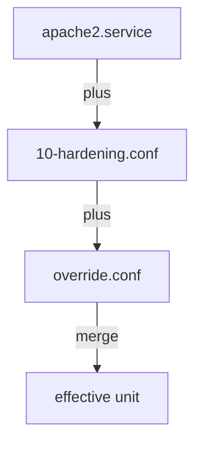

# The Effective Unit Definition

`systemctl status` tells you which unit file the manager *loaded*. That is rarely the whole story. The definition `systemd` really acts on is a **merge** of one base unit file and any number of small extra files, layered in a fixed order. This part shows where those pieces come from, which one wins, how to see the merged result, and why `daemon-reload` is not optional after you change any of them.

A **unit file** is the duty card for one station: it tells the duty officer (`systemd`) what to run and how. The extra files are sticky notes on that card.

## The unit load path

When the manager needs `apache2.service`, it searches a list of folders **in priority order**. It takes the first match as the base unit file, then collects the extra files from *all* of the folders. Here is the path for the system manager, highest priority first:

```
  /etc/systemd/system/        ← admin. You put overrides here. WINS.
  /run/systemd/system/        ← runtime-generated (tmpfiles, generators). Lost on reboot.
  /usr/lib/systemd/system/    ← vendor. The package ships the unit here. Lowest.
```

The administrator's folder `/etc/systemd/system/` wins. The vendor folder `/usr/lib/systemd/system/` is where the package puts its unit file, and it has the lowest priority.

<!-- astrona:playground:renew -->

See the full search path on the machine:

```bash
# shell: any host, unprivileged
systemctl show -p UnitPath | tr ' ' '\n' | head
```

So an `apache2.service` file placed in `/etc/systemd/system/` **fully replaces** the one the package put in `/usr/lib/systemd/system/`. That is a blunt tool. When the package is updated later, its new unit file never reaches a service you have fully replaced. Drop-ins are the careful alternative.

## Drop-ins: small overrides that survive updates

A **drop-in** is a sticky note on the duty card: a small `.conf` file that changes a few lines and leaves the rest alone. This section shows where drop-ins live, how they merge, and the one trap in that merge.

### Where drop-ins live and how they merge

A drop-in lives in a folder named after the unit, with `.d` on the end:

```
  /etc/systemd/system/apache2.service.d/override.conf
  /etc/systemd/system/apache2.service.d/10-hardening.conf
```

The manager loads the base unit. Then it applies every `*.conf` file from every `<unit>.d/` folder it found, **sorted by file name** across all those folders. A later file wins on any setting it touches. Settings it does not mention keep the base value.



The diagram shows the merge order. The base unit in `/usr/lib/systemd/system/apache2.service` has `Type=forking` and `ExecStart=/usr/sbin/apachectl start`; `10-hardening.conf` adds `PrivateTmp=true`; `override.conf` adds `Environment=APACHE_PORT=8080`. The effective unit has all four settings.

Order is decided only by the sorted file name: the last file wins. That is why people start drop-in names with numbers such as `10-` and `20-`, to control which one comes last.

### The trap: settings that hold a list

Some settings hold a **list**, not a single value. `ExecStart=`, `Environment=` and `After=` are lists. A drop-in line `ExecStart=/new/thing` **adds** a second start command to the list, which is usually an error. To replace the command, empty the list first and then set the new entry. A drop-in that replaces the start command looks like this (do not apply this one; it only shows the shape):

```ini
[Service]
ExecStart=
ExecStart=/usr/sbin/apachectl -DFOREGROUND
```

The empty `ExecStart=` line clears the list. The next line sets the only entry. A single-value setting such as `Type=` or `User=` just overrides the old value; it needs no empty line first. The manual page `man systemd.directives` points to the description of every setting, and `man systemd.unit` has the exact load path and merge rules.

## See the effective definition, not a guess

Two commands show you what the manager really holds. Use them before you edit anything.

### `systemctl cat`: every file, in order

**`systemctl cat`** prints the base unit and every drop-in, each under a comment line that names its file:

```bash
systemctl cat apache2
```

```text
# /usr/lib/systemd/system/apache2.service
[Unit]
Description=The Apache HTTP Server
After=network.target

[Service]
Type=forking
ExecStart=/usr/sbin/apachectl start

# /etc/systemd/system/apache2.service.d/override.conf
[Service]
Environment=APACHE_PORT=80
```

If you opened `/usr/lib/systemd/system/apache2.service` in a pager instead, you would miss `override.conf` completely. An override is exactly where a colleague's half-finished change hides. `systemctl cat` is the first thing to run before you edit a unit.

### `systemctl show`: the computed values

**`systemctl show`** prints the *computed* properties: every value after the full merge, which is what the manager will act on:

```bash
systemctl show apache2 -p FragmentPath -p DropInPaths -p ExecStart -p User -p Type
```

```text
FragmentPath=/usr/lib/systemd/system/apache2.service
DropInPaths=/etc/systemd/system/apache2.service.d/override.conf
ExecStart={ path=/usr/sbin/apachectl ; argv[]=/usr/sbin/apachectl start ; ... }
User=
Type=forking
```

`FragmentPath` is the base unit file. `DropInPaths` lists every drop-in layered on top of it. If `DropInPaths` lists a file you did not expect, read it.

### See it in your playground

In your playground, show the effective definition of `apache2`:

```bash
systemctl cat apache2 | head -20
systemctl show apache2 -p FragmentPath -p DropInPaths -p ExecStart
```

You should see something like this:

```text
# /usr/lib/systemd/system/apache2.service
[Unit]
Description=The Apache HTTP Server
...
FragmentPath=/usr/lib/systemd/system/apache2.service
DropInPaths=/usr/lib/systemd/system/apache2.service.d/apache2-systemd.conf
ExecStart={ path=/usr/sbin/apachectl ; argv[]=/usr/sbin/apachectl start ; ... }
```

`systemctl cat` shows the base unit plus every drop-in with its file path. `show -p` gives the computed values. Here the package itself ships a drop-in next to its unit file, so reading the vendor unit file alone would already miss part of the definition.

## Editing, the safe way

`systemctl edit` is the safe way to write a drop-in, because `systemd` puts the file in the right folder for you:

```bash
# shell: host, root
sudo systemctl edit apache2          # create/modify /etc/.../apache2.service.d/override.conf
sudo systemctl edit --full apache2   # copy the whole unit to /etc/ and edit that
```

`systemctl edit` opens an empty drop-in in your editor (`$EDITOR`). When you save, it writes the file as `/etc/systemd/system/<unit>.d/override.conf` and runs `daemon-reload` for you. `edit --full` instead copies the whole vendor unit into `/etc/systemd/system/` for big changes. That copy fully replaces the vendor file, with the same update problem as above. Use plain `edit` unless you are rewriting most of the unit. `systemctl revert <unit>` deletes your drop-ins and returns a unit to the vendor version.

## `daemon-reload`: read the duty cards again

The manager reads every unit file **once, at boot**, into a map of units in its memory, and it acts on that map. Changing a file on disk changes nothing the manager sees until you tell the duty officer to read the duty cards again:

```bash
sudo systemctl daemon-reload
```

`daemon-reload` reads every unit file and drop-in from the load path again and rebuilds the map in memory. It does this **without stopping or restarting any running unit**. It works like `sysctl -p` reading `sysctl.conf` again, or `nginx -s reload` reading `nginx.conf` again.

There are two things it is *not*:

- It is **not** `systemctl reload apache2`. That runs the unit's `ExecReload=` command, which tells the *service* to read *its own* configuration again. That is a different layer.
- It does **not** apply a changed `ExecStart=` or `Environment=` to the process that is already running. `daemon-reload` updates the plan. You still need `systemctl restart apache2` to start the process again under the new plan.

The manager keeps track of whether you owe it a reload:

```bash
systemctl show apache2 -p NeedDaemonReload
# NeedDaemonReload=yes
```

`systemctl status` also prints a warning line, `warning: The unit file … changed on disk. Run 'systemctl daemon-reload'`, when a reload is due.

## Common pitfalls

> [!WARNING]
> - **Editing a `.service` file or drop-in by hand, then running `systemctl restart`, and seeing no change.** You skipped `daemon-reload`, so the manager restarted the process under the *old* plan. Reload, then restart.
> - **Running `daemon-reload` and expecting the running service to pick up a new `ExecStart=`.** It will not. `daemon-reload` only updates the plan. A changed running unit needs `restart` (or `reload`, if only the service's own configuration changed and the service supports it).
> - **Setting `ExecStart=` in a drop-in without the empty line first.** `ExecStart=` is a list, so a single new line adds a second command instead of replacing the first.
> - **Reading only the vendor unit file.** Drop-ins in any `<unit>.d/` folder change the definition. Use `systemctl cat` and `systemctl show -p`.

> *The effective unit is the base file plus every `<unit>.d/*.conf` drop-in, merged so the last sorted file name wins. Read it with `systemctl cat` and `systemctl show -p`. After any edit, run `daemon-reload` (updates the plan), then `restart` (starts the process under it).*
