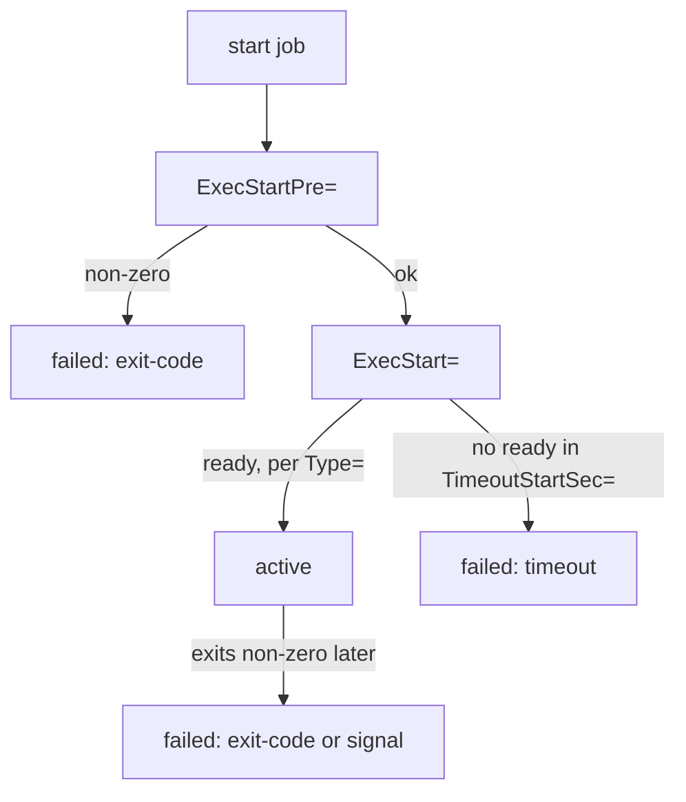

# Bad Commands And Taken Ports

You now have the reading tools: the state, the effective unit and the journal. This part puts them to work. Almost every "it will not start" falls into one of four kinds of failure, and each kind follows from *how* `systemd` runs a start job. Each one leaves its own fingerprint in `systemctl status` and `journalctl`. This part covers the two you will meet most often: a start command or configuration that is wrong, and a port that another program already holds.

## How a start job runs

To see why failures fall into a few kinds, first look at the steps the duty officer (`systemd`) takes when it starts a station:



The diagram shows the start job's path: `ExecStartPre=` first, then `ExecStart=`, then waiting for "ready", with a way into `failed` at each step. If readiness does not come in time, `systemd` sends `SIGTERM`, then `SIGKILL`, and records `Result: timeout`.

What "ready" means depends on the unit's `Type=`:

- `simple` or `exec`: active as soon as the program has been started.
- `forking`: active when the first process exits and leaves a child process running.
- `notify`: active when the service itself sends the message `READY=1` (through `sd_notify`).
- `oneshot`: the start job succeeds when the process exits with code 0. With `RemainAfterExit=yes`, the unit then stays `active` with the `SubState` `exited`.

Every kind of failure in this module is one of these arrows going wrong. The manual page `man systemd.service` describes `Type=`, `Restart=`, `TimeoutStartSec=` and `ExecStartPre=` in full.

## Kind 1: bad configuration or bad `ExecStart`

This kind happens at the `ExecStart=` step. Either the program runs and refuses its own configuration, or the program cannot be run at all. This section shows both fingerprints and how to confirm them.

### The program rejects its configuration

`ExecStart=` runs, the program reads its configuration file, finds an error and exits with a non-zero code. The fingerprint is `Result: exit-code`, a `status=` of 1 or more, and **the program's own error message** in the journal (`journalctl -eu apache2`).

You can confirm it without touching the service. Most servers ship a configuration check, and `systemd` has one for unit files:

<!-- astrona:playground:renew -->

```bash
# shell: host, root
sudo apache2ctl configtest         # Debian/Ubuntu;  'httpd -t' or 'nginx -t' elsewhere
sudo systemd-analyze verify apache2.service   # checks the UNIT file itself for errors
```

```text
AH00526: Syntax error on line 12 of /etc/apache2/sites-enabled/000-default.conf:
Invalid command 'DocumentRoott', perhaps misspelled or defined by a module not included
```

Fix the file, run the check again until it is clean, then run `systemctl restart`. If `systemd-analyze verify` complains about the *unit file* (a bad `ExecStart=` path, an unknown setting), fix the unit with a drop-in and run `daemon-reload` before the restart.

### The program cannot be run at all

Sometimes `ExecStart=` names a file that does not exist, or a file that cannot be run. Then the program never starts. `systemd` itself fails at the step where it tries to run (execute) it. The `Process:` line in `systemctl status` shows `status=203/EXEC`, and the journal says `Failed at step EXEC` with the reason, such as `No such file or directory`.

`203/EXEC` is not an exit code from the program, because the program never ran. It is `systemd` telling you it could not start it. Compare the path in `systemctl cat <unit>` with where the program really is on disk.

## Kind 2: the address is already in use

A **port** is a radio channel on the ship, and only one station can listen on one channel at a time. This section shows the fingerprint when a second station tries the same channel, and the tool that names whoever holds it.

### The fingerprint, and the owner of the port

`ExecStart=` runs and the program asks the kernel to listen on a port (the `bind()` system call). The kernel answers `EADDRINUSE`: someone already listens there. The fingerprint in the journal is `(98)Address already in use`, `AH00072`, `could not bind` and `no listening sockets`.

Find who holds the port with `ss` (socket statistics, the modern replacement for `netstat`):

```bash
sudo ss -ltnp 'sport = :80'
```

```text
State  Recv-Q Send-Q Local Address:Port Peer Address:Port Process
LISTEN 0      511          0.0.0.0:80        0.0.0.0:*     users:(("nginx",pid=3901,fd=6))
```

The options are `-l` for listening sockets, `-t` for TCP, `-n` for port numbers instead of names (`80`, not `:http`), and `-p` for the process that owns the socket. Here `nginx` (process ID 3901) holds port 80.

Then decide: stop that program, move one of the two services to another port, or, if the holder is a leftover copy, clean it up. After that, restart `apache2`.

### See it in your playground

Your playground's `apache2` fails in exactly this way. The journal names the symptom, and `ss` names the program to blame:

```bash
systemctl status apache2 | grep -i 'bind\|address'
sudo ss -ltnp 'sport = :80'
```

You should see something like this:

```text
... (98)Address already in use: AH00072: make_sock: could not bind to address [::]:80
LISTEN 0 5 0.0.0.0:80 0.0.0.0:* users:(("socat",pid=812,fd=5))
```

A `socat` process holds port 80. It belongs to the playground's helper unit `port80-hog.service`. Leave it running for now: freeing the port and proving the repair is a job of its own.

## Common pitfalls

> [!WARNING]
> - **Restarting again and again without reading.** A start that failed with `exit-code` fails the same way on every retry. Read the program's own message in the journal first.
> - **Taking `203/EXEC` for a program error.** The program never ran. Check the `ExecStart=` path and whether the file can be run.
> - **Stopping the wrong program on a port conflict.** `ss -ltnp` names the real owner. Do not guess from the service names.
> - **Fixing the unit file and forgetting `daemon-reload`.** A changed unit file or drop-in only counts after `daemon-reload`.

> *A bad configuration shows the program's own error and `Result: exit-code`. A bad `ExecStart=` path shows `status=203/EXEC`. A taken port shows `Address already in use`, and `ss -ltnp` names the program that holds it.*

## Your mission: Service Won't Start: Bad ExecStart Path Lab

You can now read a start failure and tell a program that rejected its configuration from one that could not be run at all. The mission gives you a service whose start command points at the wrong place, and asks you to fix the unit so the service runs and is enabled.

The mission runs on its own training ship. Your playground cannot be paused, so remove it first. It always starts clean, so you lose nothing you need:

```sh
astrona destroy systemd-service-debugging
```

Then start the mission and open a terminal on it:

```sh
astrona run --git git@github.com:astrona-io/ATS002.git -c sections/section-010/module-06/labs/lab-01
astrona ssh ats-002-lab-016
```

Read the task in [`question.md`](./labs/lab-01/question.md) and solve it on your own first. When you think you are done, send it for grading:

```sh
astrona submit -c sections/section-010/module-06/labs/lab-01
```

When the mission is done, remove it and start your playground again:

```sh
astrona destroy ats-002-lab-016
astrona run --git git@github.com:astrona-io/ATS002.git -c sections/section-010/module-06/playground
```

## Your mission: Service Won't Start: Port Already In Use Lab

You can now find which program holds a port with `ss -ltnp`. The mission gives you a web service that cannot listen on its port because a leftover service holds it, and asks you to clear the conflict and get the right service running.

The mission runs on its own training ship. Your playground cannot be paused, so remove it first. It always starts clean, so you lose nothing you need:

```sh
astrona destroy systemd-service-debugging
```

Then start the mission and open a terminal on it:

```sh
astrona run --git git@github.com:astrona-io/ATS002.git -c sections/section-010/module-06/labs/lab-03
astrona ssh ats-002-lab-018
```

Read the task in [`question.md`](./labs/lab-03/question.md) and solve it on your own first. When you think you are done, send it for grading:

```sh
astrona submit -c sections/section-010/module-06/labs/lab-03
```

When the mission is done, remove it and start your playground again:

```sh
astrona destroy ats-002-lab-018
astrona run --git git@github.com:astrona-io/ATS002.git -c sections/section-010/module-06/playground
```
