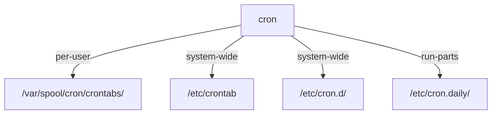

# Where A Cron Job Lives

Astronaut, a **cron job** is a standing order on the ship's duty roster: "at 22:00, do this". A **crontab** (short for "cron table") is a file that holds those orders, one per line. A cron job can live in one of two kinds of place, and the place decides the line format. In particular, it decides whether the line carries a username. Get that wrong and the job fails at 22:00 with nobody watching.

## Two places, read by the same daemon

The `cron` daemon is the program that reads the roster and starts each job. On Ubuntu it is called `cron`; on Red Hat style systems it is called `crond`. It wakes up once a minute and checks a fixed set of places.

### What cron reads every minute

Here is the full list of places the `cron` daemon checks on Ubuntu:



The diagram shows the three kinds of source: one spool file per account under `/var/spool/cron/crontabs/<user>`, the shared files `/etc/crontab` and `/etc/cron.d/*`, and the script folders `/etc/cron.hourly/`, `/etc/cron.daily/`, `/etc/cron.weekly/` and `/etc/cron.monthly/`.

- **The per-user spool.** `crontab -e` writes here. There is one file per account, owned by that account, with mode `600` (only the owner may read or write it).
- **The shared area.** `/etc/crontab` is a single file. `/etc/cron.d/` holds drop-in files, usually one job or one topic per file. Only root may edit them, because of what their line format allows.
- **The script folders.** The program `run-parts` runs every script in `/etc/cron.daily/` and its sister folders. These hold scripts, not cron lines.

### A picture to remember

Think of the shared area as the ship's main duty roster on the bridge wall. It belongs to no single crew member, so every order on it must name who carries it out. A per-user crontab is one crew member's personal order book. The book already says whose it is, so the orders inside need no name.

The picture has one limit. A personal order book is trusted because of where it sits, who owns it and its file mode. If any of those is wrong, the `cron` daemon stops trusting the file and ignores it.

## The line format: six fields or five

The two places use almost the same line. The only difference is one extra field in the shared area.

### A system-wide line has six fields

A line in `/etc/crontab` or in a file under `/etc/cron.d/` has **six** fields before the command:

```text
0  22 * * *  archivist  /home/archivist/archive-logs.sh
│  │  │ │ │   └─ USER the command runs as (required here)
│  │  │ │ └───── day of week   (0-7, 0 and 7 = Sunday; or SUN..SAT)
│  │  │ └─────── month         (1-12 or JAN..DEC)
│  │  └───────── day of month  (1-31)
│  └──────────── hour          (0-23, 24-hour clock, no am/pm)
└─────────────── minute        (0-59)
```

That username field is the reason these files belong to root. A line in `/etc/cron.d/` can run any command as any account on the machine.

### A per-user line has five fields

A line in a per-user crontab (the one `crontab -e` edits) drops the username. It has five time fields, then the command:

```text
0  22 * * *  /home/archivist/archive-logs.sh
```

The owner is implied. The `cron` daemon runs the command as whoever owns the spool file.

### The silent failure

Paste a six-field system line into a five-field per-user crontab, and cron does not complain. It reads `archivist` as the first word of the command and tries to start a program with that name. No such program exists, so the job fails every time the schedule comes round, and nothing tells you.

## Field rules you will need under time pressure

Each of the five time fields takes more than a single number or `*`. These forms come up again and again in exam tasks.

### The forms each field accepts

| Form | Example | Means |
|---|---|---|
| value | `15` | exactly 15 |
| list | `MON,THU` or `1,4` | any of these |
| range | `1-5` | 1 through 5, both included |
| step | `*/10` | every 10 (0, 10, 20, ...) |
| range with step | `0-30/5` in minutes | 0, 5, 10, ..., 30 |
| names | `MON`, `JAN` | upper or lower case, first three letters; lists and ranges of names work, but not every mix works on every cron version |

Here is "06:45 every Tuesday and Friday" as a per-user line:

```cron
45 6 * * TUE,FRI  bash /home/archivist/rotate.sh
```

The minute is `45` and the hour is `6` (24-hour clock). Day of month and month are `*`, so any day and any month. Day of week is the list `TUE,FRI`. Numbers (`0` to `7`) work for weekdays too, but names remove any doubt about whether Monday is `0` or `1`.

### Settings and shortcuts

A crontab file can also set environment values above the jobs: `PATH=`, `SHELL=` and `MAILTO=`. An empty `MAILTO=""` stops cron from mailing the job's output.

Shortcuts that start with `@` can replace all five time fields: `@reboot`, `@daily`, `@hourly`, `@weekly` and `@monthly`.

## Common pitfalls

> [!WARNING]
> - **A username field pasted into a per-user crontab.** Cron treats it as the command name, and the job fails without a word. Remove it.
> - **Editing `/var/spool/cron/crontabs/<user>` by hand.** The file can end up with the wrong mode or owner, and cron stops trusting it. Always go through the `crontab` command.
> - **Mixing up numeric weekdays.** Both `0` and `7` mean Sunday. Use the names `SUN` to `SAT` to avoid the question.
> - **Reading `*/N` as "every N from now".** `*/10` in the minute field fires at :00, :10, :20 and so on. It does not count from the moment you save. Use an explicit list if you need a different starting minute.
