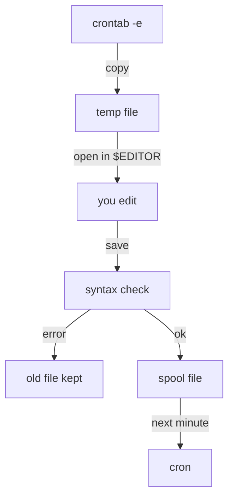

# Migrating A Job Safely

Astronaut, moving a standing order from the main duty roster into one crew member's personal order book takes three steps, in a fixed order. First write the new order correctly, then check it, and only then delete the old one. Skip the last step and the job runs twice. This part shows what the `crontab` command does for you, why you never edit the spool file by hand, and the one check that counts.

The examples below move a job for an account called `archivist`. The job lives in the system-wide file `/etc/cron.d/log-archive`, which holds one line: `0 22 * * * archivist /home/archivist/archive-logs.sh`.

## `crontab -u` edits another account's crontab

When you run plain `crontab -e` as root, you edit **root's own** crontab. That is almost never what you want when you move a service account's job. Name the account with `-u` instead.

### Open the account's crontab

Run this as a user with `sudo` rights:

```bash
sudo crontab -u archivist -e
```

`-u archivist` makes `crontab` work on `/var/spool/cron/crontabs/archivist` instead of root's file. Two related options are useful too: `crontab -u archivist -l` lists that account's crontab, and `crontab -u archivist -r` removes the whole crontab without asking first, so be careful with it.

### What `crontab -e` does when you save

The `crontab` command does more than open an editor. It checks your work and installs the file with the right owner:



The diagram shows the path of your edit. `crontab` copies the current spool file to a temporary file and opens it in `$EDITOR` (or `$VISUAL`). When you save, it checks every line. On a syntax error it rejects your change and keeps the old file. If the check passes, it installs the file as `/var/spool/cron/crontabs/archivist` with owner `archivist`, group `crontab` and mode `0600`, and it tells the `cron` daemon to read it again on its next tick.

Editing the spool file with a text editor skips all of that. There is no syntax check. An editor running as root may also save the file as `root:root` with mode `0644`. Then cron refuses to trust it, and the jobs simply never run.

## Find the original before you touch it

The job can be a file of its own in `/etc/cron.d/`, or a single line inside the shared `/etc/crontab`. Find it exactly before you change anything.

### Search both system-wide places

Search for the script name in both places:

```bash
sudo grep -rn 'archive-logs.sh' /etc/crontab /etc/cron.d/
```

```text
/etc/cron.d/log-archive:1:0 22 * * * archivist /home/archivist/archive-logs.sh
```

`grep -rn` prints the file, the line number and the line. If the hit is one line inside `/etc/crontab` or inside a shared drop-in file, you remove just that line. If the hit is a whole file of its own under `/etc/cron.d/`, as here, you delete the file.

## Recreate, check, then delete

The `cron` daemon has **no deduplication**. If the same command is scheduled in two places, it runs twice, on its own each time, at the same second. On a script that writes shared data, two copies running at once can damage that data.

### The safe order

Follow these four steps in this order:

1. Run `sudo crontab -u archivist -e` and add the job **without the username field**: `0 22 * * * /home/archivist/archive-logs.sh`.
2. Run `sudo crontab -u archivist -l` and confirm the line is there exactly as you meant it.
3. Only now remove the original: `sudo rm /etc/cron.d/log-archive` (or delete the one line from `/etc/crontab`).
4. Run `sudo grep -rn 'archive-logs.sh' /etc/crontab /etc/cron.d/` again. Expect no output.

If you delete first and then find a typo in the new line, the job does not run at all until someone notices.

### The only check that matters

List the account's crontab:

```bash
sudo crontab -u archivist -l
```

```text
0 22 * * * /home/archivist/archive-logs.sh
```

This is what the `cron` daemon will really run for that account. If a job is not listed here, it does not belong to that account, whatever you typed into an editor. Trust this output over reading spool files.

> [!TIP]
> After any change to scheduled jobs, list the result with `crontab -u <user> -l` and search the system-wide files with `grep -rn`. Two quick checks catch both a missing job and a duplicate one.

## Common pitfalls

> [!WARNING]
> - **Deleting the system-wide original before you check the per-user copy.** The job does not run at all until you notice.
> - **Leaving both copies in place.** The command runs twice each time; on shared data, the two runs can damage each other's work.
> - **Running `crontab -e` as root when you meant a service account.** You just edited root's crontab. Always add `-u <user>`.
> - **Typing `crontab -r` by mistake.** It wipes the whole crontab with no question. Run `-l` first and keep a copy.

## Your mission: Per-User Cron Job Scheduling Lab

You can now move a job from the shared roster into one account's crontab without a gap and without a duplicate. The mission asks you to move a system-wide job into a service account's own crontab, add a new job with a two-day weekly schedule, and remove the original.

The mission runs on its own training ship. Start it and open a terminal on it:

```sh
astrona run --git git@github.com:astrona-io/ATS002.git -c sections/section-020/module-01/labs/lab-01
astrona ssh ats-002-lab-021
```

Read the task in [`question.md`](./labs/lab-01/question.md) and solve it on your own first. When you think you are done, send it for grading:

```sh
astrona submit -c sections/section-020/module-01/labs/lab-01
```

When the mission is done, remove it:

```sh
astrona destroy ats-002-lab-021
```
