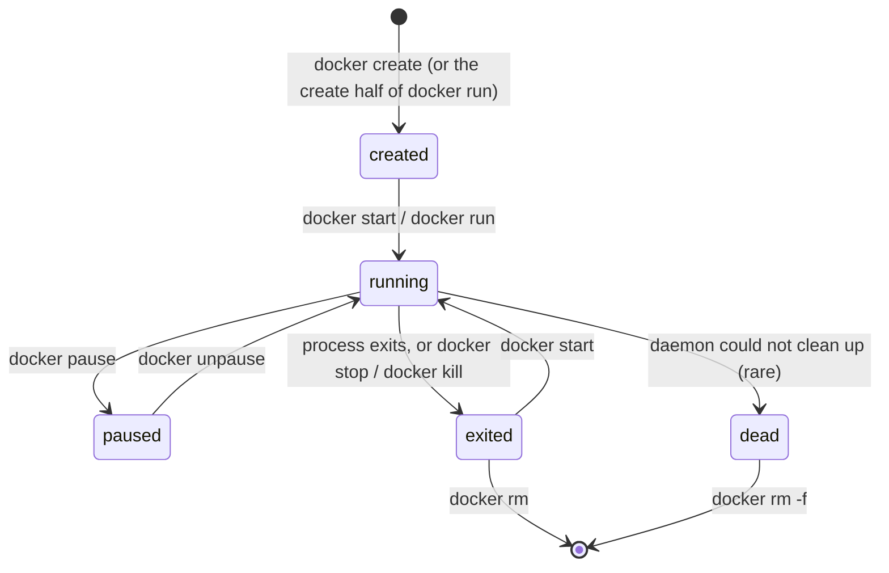

# Part 1 — The container lifecycle, and stopping one cleanly

> Prerequisite: [module landing page](./course.md). Next: [Part 2 — Inspecting with `--format`](./course-02-inspecting-with-format.md).

Every `docker` verb moves a container between a small set of states, and "stop" is two different operations depending on whether you want the process inside to shut down cleanly or just die. This part is the state machine and the signal mechanics behind `docker stop` versus `docker kill`.

## The container state machine

`docker run` is not one action — it is **create** then **start**. A container is always in exactly one state:



- **created** — filesystem and config exist, no process yet.
- **running** — PID 1 inside the container is alive.
- **paused** — every process frozen via the cgroup freezer; still resident, no CPU.
- **exited** — the process is gone; the container, its writable layer, and its config remain. `docker ps -a` shows it; `docker start` revives it; only `docker rm` deletes it.
- **dead** — the daemon failed to tear it down; needs `docker rm -f`.

The distinction that trips people: **`docker stop` leaves the container in `exited`, not gone.** "Stop" and "remove" are separate verbs. A task that says "stop the container" is satisfied by `STATUS = Exited` in `docker ps -a` — removing it would be doing extra, possibly destructive, work.

## `docker stop` — ask, then insist

```bash
# shell: host with docker; user in the docker group or via sudo
docker stop frontend_v1
```

```
  docker stop
        │  SIGTERM → container PID 1
        ▼
  wait up to --time seconds (default 10)
        │
        ├─ process exited?  ──► state: exited (clean)
        └─ still alive after the timeout?  ──► SIGKILL ──► state: exited (forced)
```

`docker stop` sends **`SIGTERM`** to the container's **PID 1**, waits the grace period (`--time` / `-t`, default 10s), and only then sends **`SIGKILL`**. This is the correct default for "stop": a well-behaved process catches `SIGTERM`, flushes, and exits inside the window.

Two things determine whether the clean path actually works:

- **PID 1 must handle signals.** A container started as `CMD ["nginx"]` (exec form) has `nginx` as PID 1 and it handles `SIGTERM`. A container started as `CMD nginx` (shell form) has `/bin/sh -c nginx` as PID 1 — and a bare `sh` does **not** forward `SIGTERM` to its child, so `docker stop` waits the full 10s then `SIGKILL`s. `docker run --init` inserts a tiny init (`tini`) as PID 1 to forward signals and reap zombies.
- **The grace period must be long enough** for the app's shutdown. Databases and queue workers often need `docker stop -t 30` or more.

## `docker kill` — straight to SIGKILL

```bash
docker kill frontend_v1          # SIGKILL now, no grace period
docker kill --signal=HUP frontend_v1   # or send an arbitrary signal
```

`docker kill` skips the grace period entirely and delivers `SIGKILL` (or the `--signal` you name) immediately. `SIGKILL` cannot be caught, so the process gets no chance to flush or checkpoint. Reach for it only when a container is genuinely hung and ignoring `SIGTERM` — using it as the default is unplugging the machine instead of shutting it down, every time.

> [!WARNING]
> - **Assuming `docker stop` removes the container.** It moves it to `exited`; `docker ps -a` still lists it. Removal is `docker rm`.
> - **`docker stop` hanging for the full 10s on a shell-form `CMD`.** `/bin/sh` does not forward `SIGTERM`. Use exec-form `CMD`, or `docker run --init`.
> - **Defaulting to `docker kill`.** No clean shutdown; risks data loss for stateful containers. `docker stop` first, longer `-t` if needed.

> *`docker run` = create + start; `docker stop` sends `SIGTERM` to PID 1, waits `--time` (default 10s), then `SIGKILL`, leaving the container `exited` (not removed); `docker kill` is immediate `SIGKILL` — the escalation, not the default.*

## Reference

- `docker stop --help` / `docker kill --help` — `--time`/`-t`, `--signal`.
- `man 7 signal` — `SIGTERM` (catchable, the polite request) vs `SIGKILL` (kernel-enforced).
- Docker docs, "Run multiple processes in a container" / `--init` — why PID 1 signal handling matters and what `tini` does.
