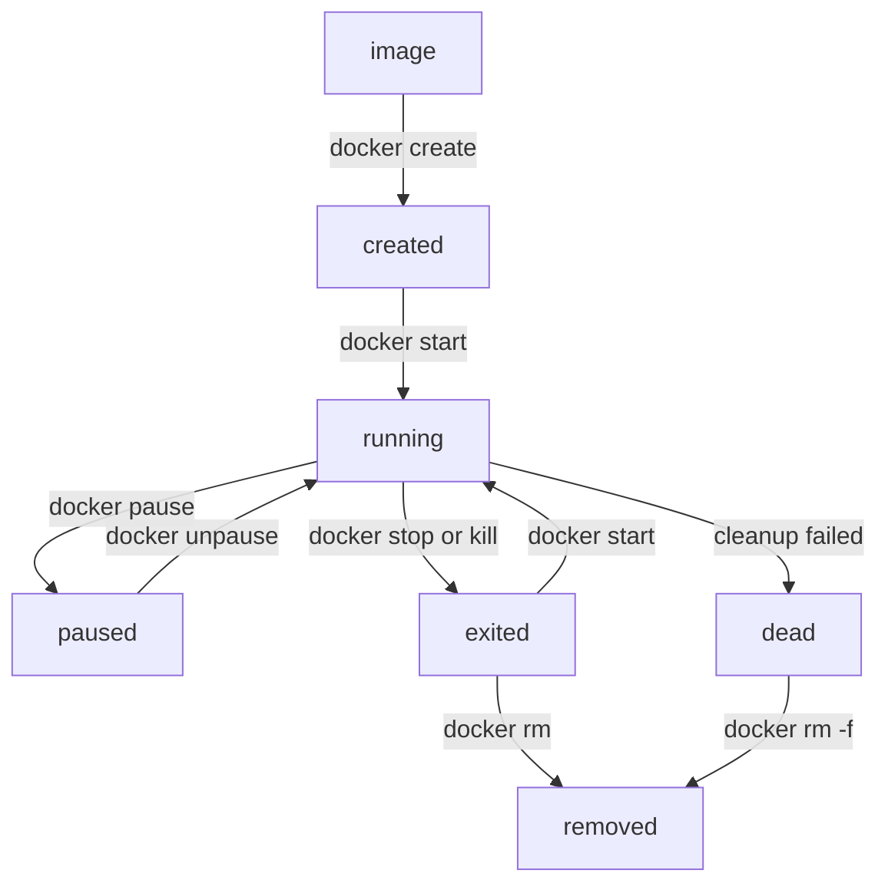
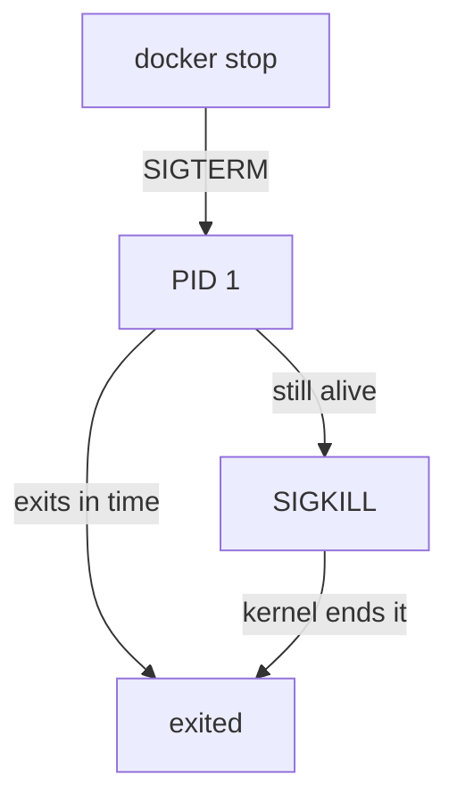

# The Container Lifecycle And Stopping Cleanly

Astronaut, a **container** is a sealed pod docked to your ship. It has its own crew and its own air, but it shares the ship's reactor core, the Linux kernel. It is built from a **container image**, a sealed crate with a ready-to-run module inside. The Docker engine (`dockerd`) is the docking bay crew: it docks, starts and stops the pods when you give orders with the `docker` command.

Every `docker` order moves a container between a small set of states. "Stop" can mean two different things: let the crew inside finish up and leave, or throw them out of the airlock at once. This part covers the states and the signals behind `docker stop` and `docker kill`.

## The container states

`docker run` is not one action. It is **create** followed by **start**. At any moment a container is in exactly one state.

### How the orders move a container

Each arrow below is one `docker` order, or something that happens on its own:


```mermaid
flowchart TB
    N["image"] -->|"docker create"| C["created"]
    C -->|"docker start"| R["running"]
    R -->|"docker pause"| P["paused"]
    P -->|"docker unpause"| R
    R -->|"docker stop or kill"| X["exited"]
    X -->|"docker start"| R
    X -->|"docker rm"| G["removed"]
    R -->|"cleanup failed"| D["dead"]
    D -->|"docker rm -f"| G
```

The diagram shows that `docker run` is the create and start steps together, and that a container also moves to `exited` when its main process ends by itself. Only `docker rm` takes a container away for good.

### What each state means

- **created**: the filesystem and the settings exist, but no process runs yet.
- **running**: the main process inside the container, PID 1, is alive. PID 1 is the crew badge number of the first crew member in the pod; every other process inside starts from it.
- **paused**: the kernel freezes every process through the cgroup freezer. The processes stay in memory but get no CPU time. A cgroup (control group) is the kernel's way to group processes and set limits on them.
- **exited**: the process is gone, but the container, its writable layer and its settings remain. `docker ps -a` shows it, `docker start` brings it back, and only `docker rm` deletes it.
- **dead**: `dockerd` failed to clean the container up. It needs `docker rm -f`.

### Stop is not remove

The point that trips people up: **`docker stop` leaves the container in `exited`, not gone.** "Stop" and "remove" are separate orders. If a task says "stop the container", `STATUS` showing `Exited` in `docker ps -a` is the right result. Removing it as well does extra work the task did not ask for, and you cannot undo it.

## `docker stop`: ask first, then insist

A **signal** is a short order the kernel delivers to a process. `SIGTERM` means "finish up and leave"; the process can catch it and shut down cleanly. `SIGKILL` means "out of the airlock now"; the kernel ends the process, and it cannot refuse.

### What `docker stop` sends

Stop a container named `web_demo` like this (add `sudo` if your user is not in the `docker` group):

```bash
docker stop web_demo
```

The Docker engine then works through these steps:


```mermaid
flowchart TB
    S["docker stop"] -->|"SIGTERM"| P["PID 1"]
    P -->|"exits in time"| E["exited"]
    P -->|"still alive"| K["SIGKILL"]
    K -->|"kernel ends it"| E
```

The diagram shows the two ways to `exited`. `dockerd` sends `SIGTERM` to the container's PID 1 and waits for the grace period (`--time` or `-t`, 10 seconds by default). If the process is still alive after that, `dockerd` sends `SIGKILL`. A well-behaved program catches `SIGTERM`, saves its work and exits inside the window, so this is the right default for "stop".

### When the clean path fails

Two things decide whether the clean shutdown really happens:

- **PID 1 must handle signals.** A container started with `CMD ["nginx"]` (the exec form) has `nginx` as PID 1, and `nginx` handles `SIGTERM`. A container started with `CMD nginx` (the shell form) has `/bin/sh -c nginx` as PID 1. A bare `sh` does **not** pass `SIGTERM` on to its child, so `docker stop` waits the full 10 seconds and then sends `SIGKILL`. `docker run --init` puts a tiny init program (`tini`) in as PID 1. It passes signals on and cleans up finished child processes.
- **The grace period must be long enough** for the program to shut down. Databases and queue workers often need `docker stop -t 30` or more.

## `docker kill`: straight to SIGKILL

Sometimes a container hangs and ignores `SIGTERM`. Then you skip the polite step.

### Send a signal at once

```bash
docker kill web_demo                 # SIGKILL now, no grace period
docker kill --signal=HUP web_demo    # or send any signal you name
```

`docker kill` skips the grace period and delivers `SIGKILL` (or the `--signal` you name) straight away. The process cannot catch `SIGKILL`, so it gets no chance to save its work. Use it only when a container really hangs and ignores `SIGTERM`. Using it as your default is like cutting the power to a station instead of shutting it down, every time.

## Common pitfalls

> [!WARNING]
> - **Thinking `docker stop` removes the container.** It moves it to `exited`, and `docker ps -a` still lists it. Removing is `docker rm`.
> - **`docker stop` hanging for the full 10 seconds on a shell-form `CMD`.** `/bin/sh` does not pass `SIGTERM` on. Use the exec form of `CMD`, or `docker run --init`.
> - **Using `docker kill` by default.** There is no clean shutdown, so a container that holds data can lose it. Use `docker stop` first, with a longer `-t` if needed.
