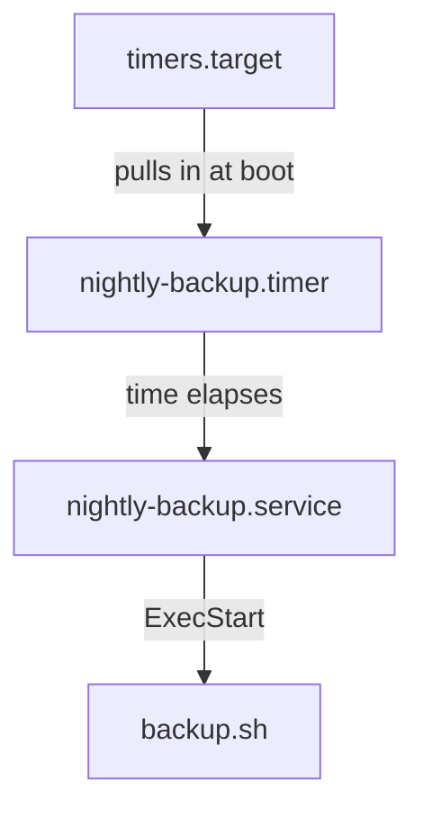

# The Timer And Service Pair

Astronaut, systemd is the ship's duty officer: it starts every station, watches it and restarts it. A **systemd timer** is an alarm clock on the duty officer's desk that starts one station on schedule. Unlike a cron line, a timer is not a job on its own. It is one unit that *starts another unit*. Getting that two-unit link right, and knowing which unit to enable, is the base for everything else about timers.

## A timer starts the service with the same name

A **unit** is anything systemd manages, described by a **unit file** (the duty card for one station). A scheduled job needs two of them: a `.service` that says what to run, and a `.timer` that says when.

### A nightly backup as two unit files

Say you want `/usr/local/sbin/backup.sh` to run every night. You write **two** unit files.

Save this as `/etc/systemd/system/nightly-backup.service`:

```ini
[Unit]
Description=Nightly backup

[Service]
Type=oneshot
ExecStart=/usr/local/sbin/backup.sh
```

Save this as `/etc/systemd/system/nightly-backup.timer`:

```ini
[Unit]
Description=Run the nightly backup

[Timer]
OnCalendar=*-*-* 02:30:00
Persistent=true

[Install]
WantedBy=timers.target
```

`Type=oneshot` tells systemd that the service runs one command to the end and then stops, which is what a scheduled job does. `OnCalendar=*-*-* 02:30:00` means every day at 02:30.

### The naming rule

The rule: **`nightly-backup.timer` starts `nightly-backup.service`**. Same base name, different suffix. When the timer fires, systemd does the same as `systemctl start nightly-backup.service`.



The diagram shows the chain. At boot, `timers.target` pulls in every enabled `.timer` unit, because each one says `WantedBy=timers.target`. When the time in `[Timer]` comes round, the timer starts its service, and the service runs the command in `ExecStart=`.

To pair a timer with a service that has a different name, set `Unit=` in the `[Timer]` section. Without it, the base-name match happens on its own.

## Enable and start the timer, never the service

Now tell systemd about the two files and arm the alarm clock. This is where most mistakes happen: you enable the timer, not the service.

### Load and arm the timer

Apply it:

```sh
sudo systemctl daemon-reload
sudo systemctl enable --now nightly-backup.timer
```

- **`daemon-reload`** tells the duty officer to read the duty cards again, so systemd sees the new files. Run it after you create or edit any unit file.
- **`enable`** creates a link under `timers.target.wants/`, so the timer is armed on every boot.
- **`--now`** also starts the timer right away, in this session.

You enable the **`.timer`**. The `.service` stays `inactive (dead)` between runs. That is correct: it is `oneshot` and only runs when the timer (or you) starts it. If you enabled the `.service` itself, systemd would try to run it at every boot, which is not what a schedule means.

`systemctl status nightly-backup.timer` shows when the timer last fired and when it fires next. `systemctl status nightly-backup.service` shows the result of the last run.

## `systemctl list-timers`: the overview

One command shows every armed timer, when it fires next and which service it starts.

### Read the table

Then check the result:

```sh
systemctl list-timers
```

```text
NEXT                        LEFT       LAST                        PASSED    UNIT                   ACTIVATES
Wed 2026-09-09 02:30:00 UTC  14h left   Tue 2026-09-08 02:30:00 UTC  9h ago    nightly-backup.timer   nightly-backup.service
```

This sample shows only the line for the new timer. Your machine also lists the timers Ubuntu ships with, and prints its own dates.

- **NEXT and LEFT** say when the timer fires next.
- **LAST and PASSED** say when it fired last.
- **ACTIVATES** names the service it starts. Check that this column shows the service you meant.

`systemctl list-timers --all` also shows timers that are not active. This command is the fastest check that a timer is armed and points at the right service.

## Common pitfalls

> [!WARNING]
> - **Enabling the `.service` instead of the `.timer`.** The job runs once at every boot and never on schedule. Enable the `.timer`.
> - **Forgetting `systemctl daemon-reload`** after writing the unit files. systemd does not see them yet, and `enable` fails with "Unit … not found".
> - **A `.timer` with no `[Install]` section.** `systemctl enable` has nothing to link, so the timer does not survive a reboot. Add `WantedBy=timers.target`.
> - **Base names that do not match, and no `Unit=`.** The timer fires but starts nothing, or the wrong unit. Match the names, or set `Unit=`.
