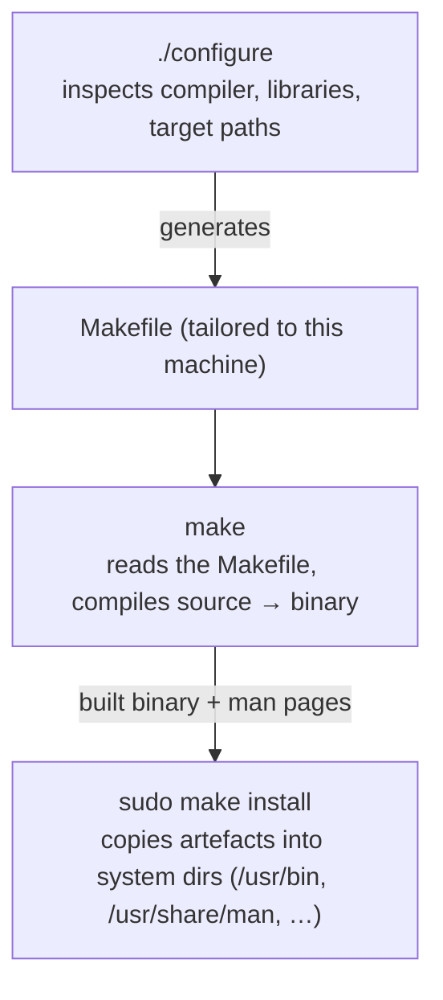

# Part 1 — Unpacking the tarball, and the build pipeline

> Prerequisite: [module landing page](./course.md). Next: [Part 2 — Discovering and choosing configure flags](./course-02-discovering-and-choosing-flags.md).

A source install starts with two mechanical steps that have to be right before anything else can work: extract the archive with the compression the filename declares, then run a three-stage pipeline where each stage produces the input the next one needs. This part is those steps and why skipping or reordering one fails immediately.

## `tar` needs to know the compression

A source tarball arrives compressed. The extension tells you which algorithm; `tar`'s flags tell `tar`:

```bash
# shell: any host, unprivileged
tar xjf links-2.14.tar.bz2
```

Flag by flag:

| Flag | Meaning |
|---|---|
| `x` | e**x**tract (vs `c` create, `t` list) |
| `f` | the **f**ile that follows is the archive — must come last in the cluster, right before the filename |
| `j` | the archive is **bzip2**-compressed (`.tar.bz2` / `.tbz2`) |
| `z` | gzip instead (`.tar.gz` / `.tgz`) |
| `J` | xz instead (`.tar.xz`) |

GNU `tar` can usually auto-detect the compression from the file's **magic bytes** (the first few bytes identify the format), so `tar xf` alone often works. Naming the algorithm is faster (it skips detection) and portable to a non-GNU `tar` that has no auto-detect.

Get it wrong — `-z` on a bzip2 file — and `tar` does **not** extract a partial or corrupt tree. It fails outright:

```text
gzip: stdin: not in gzip format
tar: Child returned status 1
```

because the gzip decompressor cannot make sense of bzip2 bytes. A hard, obvious failure, not a silent one.

## The `./configure && make && make install` pipeline

Inside the extracted directory you almost always find a `configure` script. The three stages, each feeding the next:



```bash
cd links-2.14
./configure
make
sudo make install
```

- **`./configure`** probes the build environment (which C compiler, which libraries and headers are present, where you want the result to land) and **writes a `Makefile`** specific to this host. It is generated by the project's build system — commonly **Autoconf** — from a `configure.ac` template.
- **`make`** reads that `Makefile` and compiles. Run it *before* `./configure` and there is no `Makefile` yet:
  ```text
  make: *** No targets specified and no makefile found.  Stop.
  ```
- **`sudo make install`** copies the built binary (and man pages, data files) into the directories `configure` was told to target. `sudo` because those directories (`/usr/bin`, `/usr/local/bin`) are root-owned.

The surprise for anyone coming from `apt`/`dnf`: **`configure` is not a system command.** There is no `man configure`. It is a per-project shell script, and every project's script accepts a different set of flags. Part 2 is about reading *this* script's flags instead of guessing.

As an analogy (flagged): a distro package is a meal off a menu — you name it, it arrives plated. Compiling from source is cooking from a recipe card: exact control over ingredients (which features are compiled in) and where the finished plate goes (which directory the binary lands in) — but you read the recipe, and nobody fixes a mis-step for you. Where it breaks down: a recipe is the same every kitchen; a `configure` script genuinely differs per project and per machine it runs on.

> [!WARNING]
> - **Wrong `tar` compression flag** → immediate decompression error, not a partial extract. Match the flag to the extension (`j` bz2, `z` gz, `J` xz) or use bare `tar xf` and let GNU `tar` detect.
> - **Running `make` before `./configure`** → "No targets specified and no makefile found". The `Makefile` does not exist until `configure` writes it.
> - **Looking for `man configure`** → there is none. `./configure --help` (Part 2) is the only reference.
> - **`make install` without `sudo`** → permission denied writing to `/usr/bin`. (Or install under a `--prefix` in your home dir — Part 2.)

> *Extract with the compression the extension declares, then run `./configure` (probes the machine, writes a per-host `Makefile`) → `make` (compiles) → `sudo make install` (copies into system dirs); each stage needs the previous one's output, and `configure` is a per-project script with no man page.*

## Reference

- `man tar` — the `x`/`c`/`t` modes and every compression flag; the auto-detect note.
- `man make` — how `make` locates and reads a `Makefile`; `-C`, `-j`, targets.
- GNU Autoconf manual, "Running configure Scripts" — what a generated `configure` does and the standard variables it honours.
