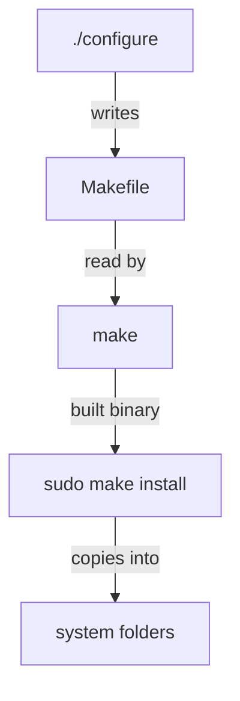

# Unpacking The Tarball And The Build Pipeline

Astronaut, a source install is like receiving a kit of parts in a crate instead of a finished module. Before you can fit anything to your ship, you have to open the crate the right way and follow the build steps in the right order. This part covers both: unpacking the archive with the compression its name tells you, and the three build steps where each one makes what the next one needs.

## `tar` needs to know the compression

A **source tarball** is one archive file that holds a program's source code, packed with `tar` and then compressed. Think of it as the kit of parts in a sealed crate. The file name's extension tells you how the crate was sealed, and the `tar` flags tell `tar` how to open it.

Here is a real example:

```bash
# shell: any host, unprivileged
tar xjf links-2.14.tar.bz2
```

Flag by flag:

| Flag | Meaning |
|---|---|
| `x` | e**x**tract (vs `c` create, `t` list) |
| `f` | the **f**ile that follows is the archive — must come last in the cluster, right before the filename |
| `j` | the archive is **bzip2**-compressed (`.tar.bz2` / `.tbz2`) |
| `z` | gzip instead (`.tar.gz` / `.tgz`) |
| `J` | xz instead (`.tar.xz`) |

GNU `tar` can usually work out the compression on its own. It reads the file's **magic bytes**, the first few bytes that name the format, so `tar xf` alone often works. Naming the compression is still a good habit: it skips the guessing, and it also works with a `tar` from another vendor that cannot guess.

If you pick the wrong flag, for example `-z` on a bzip2 file, `tar` does **not** unpack half a tree. It fails straight away:

```text
gzip: stdin: not in gzip format
tar: Child returned status 1
```

`tar` handed the bytes to the gzip decompressor, and gzip cannot read bzip2 data. The error is loud and clear, not silent.

## The `./configure && make && make install` pipeline

Inside the unpacked folder you almost always find a script called `configure`. It starts a pipeline of three steps, and each step makes the input for the next one. In the space picture, `./configure` writes the fitting plan for this ship, `make` builds the part, and `make install` bolts it into place.

### The three steps in order

This is the order every source build follows:


```mermaid
flowchart TB
    C["./configure"] -->|"writes"| M["Makefile"]
    M -->|"read by"| MK["make"]
    MK -->|"built binary"| I["sudo make install"]
    I -->|"copies into"| D["system folders"]
```

The diagram shows that `./configure` writes a `Makefile`, `make` reads it and builds the binary, and `sudo make install` copies the result into system folders such as `/usr/bin` and `/usr/share/man`.

These are the commands:

```bash
cd links-2.14
./configure
make
sudo make install
```

### What each step does

Each step is run by a different tool, and it helps to know which one does the work:

- **`./configure`** is a shell script that bash runs. It checks the build machine: which C compiler is there, which libraries and headers are present, and where you want the result to land. Then it **writes a `Makefile`** made for this machine. The project's build system, often **Autoconf**, generated the script from a `configure.ac` template.
- **`make`** reads that `Makefile` and calls the compiler to build the program. If you run it *before* `./configure`, there is no `Makefile` yet:
  ```text
  make: *** No targets specified and no makefile found.  Stop.
  ```
- **`sudo make install`** copies the built binary, and also manual pages and data files, into the folders that `configure` was told to use. It needs `sudo` (the captain's authority) because those folders, such as `/usr/bin` and `/usr/local/bin`, belong to root.

### There is no `man configure`

This surprises people who are used to `apt` or `dnf`: **`configure` is not a system command.** There is no `man configure`. Every project ships its own script, and every script accepts its own set of flags. So you read *this* script's flags with `./configure --help` instead of guessing.

A package from a depot is a finished supply crate: you ask the quartermaster for it, and it arrives ready to use. A source build is the kit of parts: you choose exactly which features go in and which folder the binary lands in, but nobody fixes a wrong step for you. The picture has one limit: the fitting plan is not the same on every ship, because `configure` writes a different `Makefile` for each project and each machine.

## Common pitfalls

> [!WARNING]
> - **Wrong `tar` compression flag** → immediate decompression error, not a partial extract. Match the flag to the extension (`j` bz2, `z` gz, `J` xz) or use bare `tar xf` and let GNU `tar` detect.
> - **Running `make` before `./configure`** → "No targets specified and no makefile found". The `Makefile` does not exist until `configure` writes it.
> - **Looking for `man configure`** → there is none. `./configure --help` is the only reference.
> - **`make install` without `sudo`** → permission denied writing to `/usr/bin`. Or install under a `--prefix` in your home folder instead.

> *Extract with the compression the extension declares, then run `./configure` (checks the machine, writes a `Makefile` for it), `make` (builds) and `sudo make install` (copies into system folders). Each step needs the one before it, and `configure` is a script of the project, with no manual page.*
