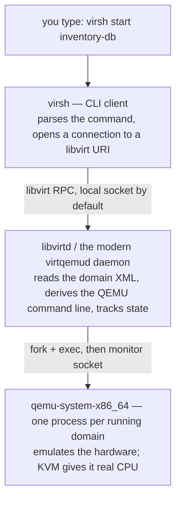

# Part 1 — The domain and the libvirt stack

> Prerequisite: [module landing page](./course.md). Next: [Part 2 — Defining a domain around an existing disk](./course-02-defining-around-an-existing-disk.md).

Before you can define, start, or stop a virtual machine, you need to know exactly what you are talking to when you type `virsh`. This part settles the vocabulary and the software layers: what libvirt calls a **domain**, which process actually runs the guest, and where the one file that describes each VM lives on disk. Every later part refers back to these terms.

## A domain is libvirt's word for one virtual machine

Concrete first. You run:

```bash
# shell: host, unprivileged user is fine for read-only virsh
virsh list --all
```

```
 Id   Name          State
----------------------------------
 -    inventory-db   shut off
```

`inventory-db` there is a **domain**. libvirt never says "virtual machine" in its command output or its API — it says domain, and it means one managed guest: a named bundle of a memory size, a vCPU count, one or more virtual disks, and one or more network attachments. The word comes from the Xen hypervisor libvirt was first written for; it stuck even though almost everyone now runs the KVM hypervisor underneath.

A domain has a **name** (`inventory-db`), a permanent **UUID**, and — only while it is running — a numeric **Id**. The Id is recycled: stop the domain and start it again and it usually gets a different number. Scripts and tasks always key off the name or UUID, never the Id.

## What runs when a domain is running

`virsh` is a thin client. It does almost nothing itself. The work is spread across three layers:



Read that top to bottom every time something misbehaves. If `virsh list` shows a domain `running` but the guest is unreachable, the QEMU process is alive and the fault is inside the guest. If `virsh` itself hangs or errors, you have not reached the daemon yet and the guest state is irrelevant.

The daemon has historically been a single `libvirtd`. Recent libvirt splits it into per-hypervisor daemons — `virtqemud` for QEMU/KVM — plus side daemons like `virtnetworkd`. You rarely need to care: `systemctl status libvirtd` on an older host, `systemctl status virtqemud` on a newer one, and `virsh` finds whichever is present.

> [!TIP]
> **Try it — find the daemon, confirm no domains yet.**
>
> The playground from the callout under the landing page's H1 is already up. Get a shell on the host:
>
> ```sh
> astrona ssh astro-libvirt-vm-lifecycle
> ```
>
> Then, on that host:
>
> ```sh
> systemctl is-active libvirtd
> sudo virsh list --all
> ```
>
> Expect something like:
>
> ```text
> active
>  Id   Name   State
> --------------------
> ```
>
> The daemon (middle layer) is running; the bottom layer has no QEMU process yet because no domain is defined — you define `inventory-db` in Part 2. Later checkpoints run commands directly on this host; they do not repeat the `astrona ssh` line.

## The connection URI decides *which* libvirt you manage

`virsh` always connects to a URI. The default depends on how you invoke it, and getting it wrong is the most common "my domain disappeared" surprise:

| URI | What it manages | Runs guests as |
|---|---|---|
| `qemu:///system` | one system-wide set of domains, storage, and networks | the `qemu` system user, via the system daemon |
| `qemu:///session` | a per-user set, private to your login | your own uid, no root |

Run `virsh` as root, or with `sudo`, and you get `qemu:///system`. Run it as an unprivileged user with no `--connect` flag and you may silently get `qemu:///session` — a completely separate, usually empty, world. A domain defined under `sudo virsh` will **not** appear in a plain `virsh list --all` run as yourself.

Analogy (structural, not exact): the system vs session URI split is like a system-wide `systemd` versus `systemctl --user`. Same tool, same command verbs, two independent registries of units, and a unit you created in one is invisible from the other. Where it breaks down: `systemctl --user` units still run under your always-present user manager, whereas `qemu:///session` has no shared network by default, so session guests often cannot reach anything.

For this module, always use the system instance:

```bash
# either run everything through sudo, or export this once per shell:
export LIBVIRT_DEFAULT_URI=qemu:///system
```

> [!TIP]
> **Try it — see the two worlds.** On the playground host, ask `virsh` which URI it picked, as yourself and then as root:
>
> ```sh
> virsh uri
> sudo virsh uri
> ```
>
> Expect something like:
>
> ```text
> qemu:///session
> qemu:///system
> ```
>
> Same binary, two different registries. Anything you do in the rest of this module goes through `qemu:///system`, so prefix `virsh` with `sudo` (or export the variable above). A domain you define under `sudo` genuinely will not show up in a bare `virsh list --all`.

## The domain XML is the definition; everything else refers to it

Every persistent domain is described by one XML document. That document is the source of truth for the domain's shape — memory, vCPUs, disks, network, boot order. `virsh` sub-commands are just structured ways to read or edit it.

Analogy (flagged): the domain XML is a virtual machine's **birth certificate** — one document that states how much memory it is entitled to, how many CPUs, which disk it boots from, which network it plugs into, and everything `virsh` does afterward refers back to it. Where it breaks down: a birth certificate never changes, whereas you edit this one with `virsh edit` and the running system also keeps a second, expanded copy — see just below.

```bash
sudo virsh dumpxml inventory-db     # print the live definition to stdout
sudo virsh edit inventory-db        # open the persistent definition in $EDITOR, validate on save
```

There are **two versions** of a running domain's XML and confusing them wastes debugging time:

- **On-disk / persistent** — what the domain will look like next time it starts cold. This is the file `virsh edit` opens.
- **Live / in-memory** — the persistent definition plus whatever the daemon and QEMU filled in at start time: the real PCI addresses assigned to each device, the actual VNC port, a resolved machine type. `virsh dumpxml` of a *running* domain prints this expanded version.

Edit the persistent file and the change does not touch the running guest — it takes effect on the next full start (not a reboot from inside the guest; a `virsh destroy` / `virsh start` or `virsh shutdown` / `virsh start` cycle). Part 3 comes back to why "next cold start" is the key phrase.

## Where the definition lives on disk

For `qemu:///system`, the persistent XML files are here:

```bash
sudo ls -l /etc/libvirt/qemu/
# inventory-db.xml
# networks/            <- the 'default' NAT network lives here
```

`/etc/libvirt/qemu/inventory-db.xml` **is** the domain `inventory-db`. Two rules that follow directly from that:

- Do **not** hand-edit that file with a text editor. The daemon caches definitions in memory and only re-reads this directory on restart; your edit will be silently overwritten the next time anything calls `virsh define`. Use `virsh edit`, which locks, validates, and reloads.
- Copying `inventory-db.xml` to another host is *most* of a migration, but not all of it — anything libvirt tracks as separate metadata (autostart, snapshots) is not inside that file. Part 4 shows exactly what autostart stores instead.

The `inventory-db` domain does not exist yet — you build it in Part 2. But the same "a definition is a file on disk, and `virsh` reads it through the daemon" rule already applies to the `default` NAT network the playground set up, so you can see the pattern now.

> [!TIP]
> **Try it — a definition is a file.** On the playground host:
>
> ```sh
> sudo ls /etc/libvirt/qemu/            # no domain XML yet
> sudo ls /etc/libvirt/qemu/networks/   # but the 'default' network is here
> diff <(sudo virsh net-dumpxml default) <(sudo cat /etc/libvirt/qemu/networks/default.xml)
> ```
>
> Expect something like:
>
> ```text
> networks
> default.xml
> 1c1
> < <network>
> ---
> > <network connections='1'>
> ```
>
> The only difference is a live-only `connections='1'` attribute the daemon adds in memory — exactly the persistent-vs-live split described above, here for a network instead of a domain. After you define `inventory-db` in Part 2, `sudo ls /etc/libvirt/qemu/` will show `inventory-db.xml` next to `networks/`.

> *A domain is one guest; its XML file under `/etc/libvirt/qemu/` is the definition, and `virsh` is a client that edits or acts on that file through the daemon — never touch the file directly.*

## Reference

- `man virsh` — the client's full sub-command list; skim the "DOMAIN COMMANDS" and "Connecting to the hypervisor" sections once.
- `man 7 virsh` connection URI notes, and `https://libvirt.org/uri.html` — the definitive explanation of `qemu:///system` vs `qemu:///session`.
- `https://libvirt.org/formatdomain.html` — the domain XML schema, element by element; the reference you return to when `virsh edit` rejects a change.
