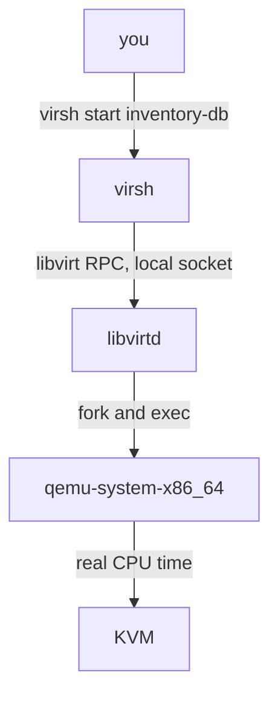

# The Domain And The libvirt Stack

Astronaut, before you launch, land or inspect a smaller ship in the hangar, you need to know exactly who you are talking to when you type `virsh`. This part settles the words and the software layers: what libvirt calls a **domain**, which process really runs the guest, and which of two separate hangars your command reaches.

## A domain is libvirt's word for one virtual machine

**libvirt** is the hangar control system: a set of programs that defines, starts, stops and watches virtual machines on a Linux host. **`virsh`** is its control console, the command you type. Everything libvirt manages has a name, and the first one to learn is "domain".

<!-- astrona:playground:renew -->

Here is a real example. You run:

```bash
# shell: host, unprivileged user is fine for read-only virsh
virsh list --all
```

```
 Id   Name          State
----------------------------------
 -    inventory-db   shut off
```

`inventory-db` there is a **domain**: a smaller ship flown inside the hangar. libvirt never says "virtual machine" in its output or its programming interface. It says domain, and it means one managed guest: a named bundle of a memory size, a number of virtual CPUs, one or more virtual disks and one or more network connections. The word comes from the Xen hypervisor that libvirt was first written for. It stuck, even though almost everyone now runs the KVM (Kernel-based Virtual Machine) hypervisor underneath.

A domain has a **name** (`inventory-db`), a permanent **UUID** (a long unique ID), and, only while it is running, a number in the **Id** column. The Id is reused: stop the domain and start it again, and it usually gets a different number. Scripts and tasks always use the name or the UUID, never the Id.

## What runs when a domain is running

`virsh` is a thin client. It does almost nothing by itself. The real work is spread over three layers, and knowing them tells you where to look when something breaks.

### The three layers

This is the path one command takes:


```mermaid
flowchart TB
    U["you"] -->|"virsh start inventory-db"| V["virsh"]
    V -->|"libvirt RPC, local socket"| D["libvirtd"]
    D -->|"fork and exec"| Q["qemu-system-x86_64"]
    Q -->|"real CPU time"| K["KVM"]
```

The diagram shows that `virsh` reads your command and sends it over a local socket to the libvirt daemon, which reads the domain's XML, builds the full QEMU command line from it and starts one `qemu-system-x86_64` process per running domain; that process emulates the hardware, and KVM in the kernel gives it real CPU time when it is available.

Read the layers from top to bottom whenever something goes wrong. If `virsh list` shows a domain as `running` but you cannot reach the guest, the QEMU process is alive and the fault is inside the guest. If `virsh` itself hangs or fails, you have not reached the daemon yet, and the guest's state does not matter.

### `libvirtd` or `virtqemud`

The daemon used to be one program, `libvirtd`. Recent libvirt versions split it into one daemon per hypervisor, `virtqemud` for QEMU and KVM, plus helpers such as `virtnetworkd`. You rarely need to care. Use `systemctl status libvirtd` on an older host and `systemctl status virtqemud` on a newer one, and `virsh` finds whichever is there. Your playground runs `libvirtd`.

### See it in your playground

Your playground is already running. Open a terminal on it:

```sh
astrona ssh astro-libvirt-vm-lifecycle
```

Then, on that host, ask systemd whether the daemon runs, and ask libvirt for its domains:

```sh
systemctl is-active libvirtd
sudo virsh list --all
```

Expect something like:

```text
active
 Id   Name   State
--------------------
```

The daemon, the middle layer, is running. The bottom layer has no QEMU process yet, because no domain is defined. You define `inventory-db` soon. The commands in the rest of this module run directly on this host; they do not repeat the `astrona ssh` line.

## The connection URI decides *which* libvirt you manage

`virsh` always connects to a **URI** (a uniform resource identifier, here simply an address that names one libvirt instance). Picture two separate hangars on the same ship: the ship's main hangar and your own private one. The default depends on how you start `virsh`, and getting it wrong is the most common "my domain disappeared" surprise.

### Two hangars

The table shows the two addresses:

| URI | What it manages | Runs guests as |
|---|---|---|
| `qemu:///system` | one system-wide set of domains, storage, and networks | the `qemu` system user, via the system daemon |
| `qemu:///session` | a per-user set, private to your login | your own uid, no root |

Run `virsh` as root, or with `sudo`, and you get `qemu:///system`. Run it as a normal user with no `--connect` flag, and you may quietly get `qemu:///session`: a completely separate hangar, usually empty. A domain you defined with `sudo virsh` does **not** appear in a plain `virsh list --all` that you run as yourself.

The session hangar has one more limit: it has no shared network by default, so guests in it often cannot reach anything. For this module, always use the system hangar:

```bash
# either run everything through sudo, or export this once per shell:
export LIBVIRT_DEFAULT_URI=qemu:///system
```

### See the two hangars

On the playground host, ask `virsh` which URI it picked, first as yourself and then as root:

```sh
virsh uri
sudo virsh uri
```

Expect something like:

```text
qemu:///session
qemu:///system
```

It is the same program with two different hangars. Everything you do in the rest of this module goes through `qemu:///system`, so put `sudo` in front of `virsh`, or export the variable above.

> [!TIP]
> When a domain seems to have vanished, run `virsh uri` before anything else. Most of the time you are simply looking into the wrong hangar.

## Common pitfalls

> [!WARNING]
> - **Running `virsh` without `sudo` and seeing an empty list.** You are connected to `qemu:///session`, not `qemu:///system`. Use `sudo virsh` or export `LIBVIRT_DEFAULT_URI=qemu:///system`.
> - **Using the Id to name a domain.** The Id changes every time the domain starts. Use the name or the UUID.
> - **Debugging the guest when `virsh` itself fails.** If `virsh` hangs or errors, the problem is between `virsh` and the daemon. Check `systemctl status libvirtd` first.

> *A domain is one guest. `virsh` is a client that talks to the libvirt daemon, which starts one QEMU process per running domain, and the connection URI decides which set of domains you see.*
