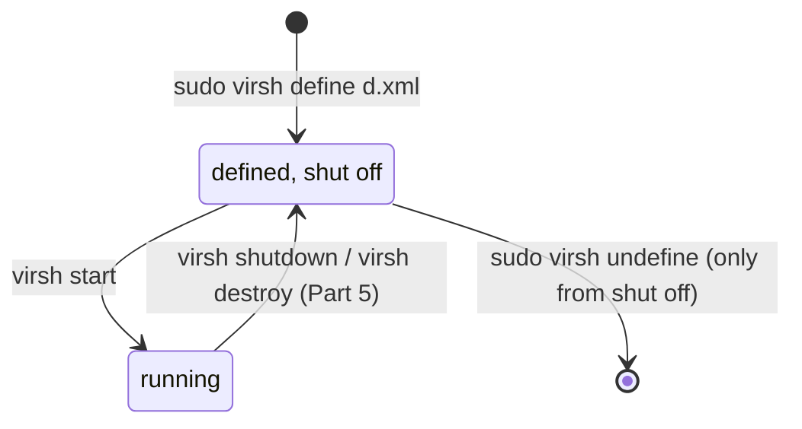
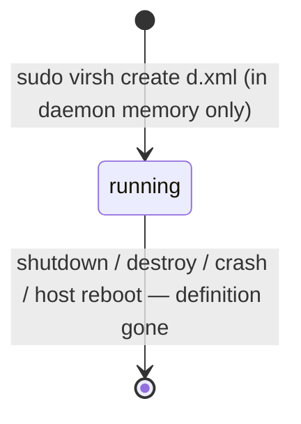

# Part 3 — Persistent vs. transient: the domain lifecycle

> Prerequisite: [Part 2 — Defining a domain around an existing disk](./course-02-defining-around-an-existing-disk.md). Next: [Part 4 — Autostart and reading a domain's true state](./course-04-autostart-and-reading-true-state.md).

This is the single most consequential idea in the module, and the one most likely to be tested as a trap: `virsh define` and `virsh create` accept the **exact same XML**, but only one of them leaves anything behind when the domain stops. Get this wrong on a VM meant to survive a maintenance window and it looks, under exam pressure, exactly like data loss. This part turns the difference into a state machine you can draw from memory.

## The two commands, the same input

```bash
# shell: host, root
sudo virsh define /path/to/domain.xml   # persistent — survives being stopped
sudo virsh create /path/to/domain.xml   # transient  — gone the moment it stops
```

Both read the identical file. The difference is entirely in where the definition is kept and how long it lives.

- **`define`** writes the XML into libvirt's permanent config store — the `/etc/libvirt/qemu/<name>.xml` file from Part 1 — and does **not** start the domain. The domain now exists in state `shut off`. It stays registered, running or not, until you explicitly `virsh undefine` it.
- **`create`** does **not** write any file. It builds the domain straight into the daemon's memory and starts it immediately. There is no `shut off` state to return to: while it runs it is a real domain, and the instant it stops — clean shutdown, guest crash, `virsh destroy`, host reboot — its definition evaporates. Nothing is left to start again.

Restated as the rule to memorise: **`define` = register (and don't start); `create` = start-only (and don't register).**

## The persistent lifecycle



Key properties:

- Appears in `virsh list --all` at all times, with `State` `shut off` or `running`.
- `virsh start <name>` boots it from the on-disk XML. `virsh shutdown` / `virsh destroy` return it to `shut off` — **the definition stays**.
- `virsh undefine <name>` is the only exit. It deletes the `/etc/libvirt/qemu/<name>.xml` file. By default it leaves the disk image alone (add `--remove-all-storage` to delete disks too — a separate, deliberate choice).
- `virt-install` from Part 2, run without any transient flag, lands you at **running**, having passed through `define`.

## The transient lifecycle



Key properties:

- Appears in `virsh list` (running only). Appears in `virsh list --all` **only while running** — once stopped there is nothing to list.
- There is no `shut off` resting state. Stopped *is* gone.
- `virsh start` on it is meaningless — there is no stored definition to start from.
- Useful on purpose for genuinely throwaway guests: CI runners, scratch test VMs, anything orchestrated by a higher-level tool that keeps its own copy of the XML and will just `create` again.

Side by side, the thing to see is that the persistent machine has a state the transient one lacks — the resting `shut off` box. That missing box is the entire distinction.

## Confirming which one you got

After a `virt-install` or a `virsh define`, prove the persistent definition actually landed:

```bash
sudo virsh list --all
#  Id   Name          State
#  3    inventory-db   running          <- good: it's listed

sudo ls -l /etc/libvirt/qemu/inventory-db.xml
#  -rw------- 1 root root 3xxx ... inventory-db.xml   <- good: file exists
```

Both checks matter. `virsh list --all` showing it while running does **not** by itself prove persistence — a transient domain shows there too, right up until it stops. The file under `/etc/libvirt/qemu/` is the unambiguous proof.

`virsh dominfo inventory-db` also reports it directly (Part 4 covers the full output):

```
Persistent:     yes
```

`Persistent: yes` is the definitive answer. `Persistent: no` on a VM that is supposed to survive maintenance is the bug, caught before it bites.

> [!TIP]
> **Try it — watch a transient domain vanish.** Build a throwaway domain on its own fresh disk and start it the *transient* way with `virsh create`. On the host:
>
> ```sh
> sudo qemu-img create -f qcow2 /var/lib/libvirt/images/scratch-vm.qcow2 1G
> sudo virt-install --name scratch-vm --memory 512 --vcpus 1 \
>   --disk path=/var/lib/libvirt/images/scratch-vm.qcow2,format=qcow2 \
>   --import --network network=default --graphics none --noautoconsole \
>   --print-xml > /tmp/scratch.xml
> sudo virsh create /tmp/scratch.xml       # transient: start, do NOT register
> sudo virsh list --all
> sudo virsh destroy scratch-vm            # stop it (empty disk, no clean shutdown possible)
> sudo virsh list --all
> sudo virsh start scratch-vm              # nothing to start from
> ```
>
> Expect something like:
>
> ```text
> Domain 'scratch-vm' created from /tmp/scratch.xml
>  Id   Name          State
> -----------------------------
>  4    scratch-vm    running
>  5    inventory-db  running
> Domain 'scratch-vm' destroyed
>  Id   Name          State
> -----------------------------
>  5    inventory-db  running
> error: failed to get domain 'scratch-vm'
> ```
>
> `virt-install --print-xml` builds the domain XML and prints it instead of defining anything — a clean way to hand `virsh create` some input. The moment `scratch-vm` stopped it was gone from `virsh list --all` entirely — no `shut off` line — and `virsh start` has nothing to work from. Now repeat with `sudo virsh define /tmp/scratch.xml` plus a separate `sudo virsh start scratch-vm`: this time after `destroy` it stays listed as `shut off` and starts again. Clean up: `sudo virsh undefine scratch-vm` and `sudo rm /var/lib/libvirt/images/scratch-vm.qcow2`.

> [!WARNING]
> The classic mistake in this topic: defining a VM that is meant to outlive reboots with `virsh create` (or a bare `virt-install --transient`, which behaves the same way). Symptoms:
> - the VM works perfectly until the first time it powers off, then disappears from `virsh list --all`;
> - `virsh start <name>` fails with "Domain not found";
> - the disk image is still on disk untouched — the data was never lost, only the definition.
> The fix is to `virsh define` the XML (you can dump it from a still-running transient domain with `virsh dumpxml` *before* it stops) and from then on start it normally. Also don't overcorrect: `virsh destroy` on a **persistent** domain is fine — it only stops the guest, the definition stays (Part 5).

> *`define` registers a domain and does not start it; `create` starts a domain and does not register it — the persistent one has a `shut off` state to come back to, the transient one does not.*

## Reference

- `man virsh` — read the `define`, `create`, `start`, `undefine`, and `dominfo` entries together; the `--transient` note under `virt-install` too.
- `https://libvirt.org/manpages/virsh.html#create` — the upstream wording on transient vs persistent, including what happens on daemon restart.
- `virsh undefine --help` — the `--remove-all-storage` and `--nvram` flags, so you know exactly what an undefine does and does not delete.
