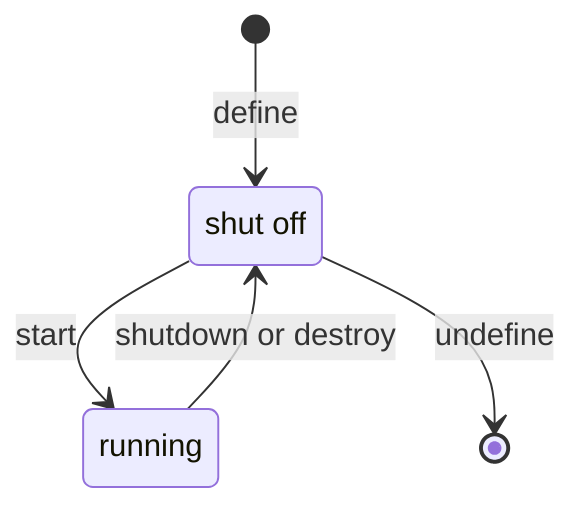
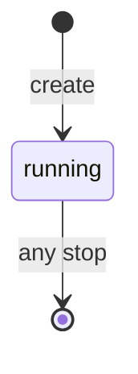

# Persistent Vs Transient: The Domain Lifecycle

Astronaut, this is the most important idea in the module, and the one most likely to be tested as a trap. `virsh define` and `virsh create` accept the **exact same XML**, but only one of them leaves anything behind when the domain stops. Get it wrong on a virtual machine that must survive a maintenance window, and under exam pressure it looks exactly like data loss. This part turns the difference into two small state diagrams you can draw from memory.

## The two commands, the same input

A **persistent** domain is a ship whose blueprint is registered on file in the hangar. A **transient** domain is a ship launched from a blueprint nobody filed: it flies fine, but once it lands, nobody remembers it.

<!-- astrona:playground:renew -->

```bash
# shell: host, root
sudo virsh define /path/to/domain.xml   # persistent — survives being stopped
sudo virsh create /path/to/domain.xml   # transient  — gone the moment it stops
```

Both commands read the same file. The difference is where the libvirt daemon keeps the definition, and for how long:

- **`define`** writes the XML into libvirt's permanent store, the `/etc/libvirt/qemu/<name>.xml` file, and does **not** start the domain. The domain now exists in the state `shut off`. It stays registered, running or not, until you remove it with `virsh undefine`.
- **`create`** does **not** write any file. The daemon builds the domain straight into its memory and starts it at once. There is no `shut off` state to go back to. While it runs it is a real domain. The moment it stops, whether by a clean shutdown, a guest crash, `virsh destroy` or a host reboot, its definition is gone. Nothing is left to start again.

The rule to remember: **`define` = register (and don't start); `create` = start only (and don't register).**

## The persistent lifecycle

A persistent domain has a resting state: `shut off`. It can stop and start as often as you like, because its blueprint stays on file.

### The diagram



The diagram shows that `sudo virsh define d.xml` creates the domain in `shut off`, `virsh start` moves it to `running`, `virsh shutdown` or `virsh destroy` bring it back to `shut off`, and only `sudo virsh undefine` removes it, from `shut off`.

### What to remember

- It appears in `virsh list --all` at all times, with the `State` `shut off` or `running`.
- `virsh start <name>` boots it from the XML on disk. `virsh shutdown` and `virsh destroy` return it to `shut off`, and **the definition stays**.
- `virsh undefine <name>` is the only way out. It deletes the `/etc/libvirt/qemu/<name>.xml` file. By default it leaves the disk image alone. Add `--remove-all-storage` to delete the disks too, which is a separate, deliberate choice.
- `virt-install` without any transient flag lands you at **running**, after passing through `define`.

## The transient lifecycle

A transient domain has no resting state. It only exists while it runs.

### The diagram



The diagram shows that `sudo virsh create d.xml` puts the domain straight into `running`, held only in the daemon's memory, and any stop (shutdown, destroy, crash or host reboot) removes the definition.

### What to remember

- It appears in `virsh list` while it runs. It appears in `virsh list --all` **only while it runs**; once it stops, there is nothing to list.
- There is no `shut off` resting state. Stopped *is* gone.
- `virsh start` does not work on it, because there is no stored definition to start from.
- It is useful on purpose for throwaway guests: test runners, scratch virtual machines, or anything driven by a higher-level tool that keeps its own copy of the XML and simply runs `create` again.

Put the two diagrams side by side. The persistent one has a state the transient one lacks: the resting `shut off` box. That missing box is the whole difference.

## Confirming which one you got

After `virt-install` or `virsh define`, prove that the persistent definition really landed. Two checks together settle it.

### Two checks

```bash
sudo virsh list --all
#  Id   Name          State
#  3    inventory-db   running          <- good: it's listed

sudo ls -l /etc/libvirt/qemu/inventory-db.xml
#  -rw------- 1 root root 3xxx ... inventory-db.xml   <- good: file exists
```

Both checks matter. `virsh list --all` showing a running domain does **not** prove it is persistent on its own, because a transient domain shows there too, right up until it stops. The file under `/etc/libvirt/qemu/` is the clear proof.

### One line from `dominfo`

`virsh dominfo inventory-db` also reports it directly:

```
Persistent:     yes
```

`Persistent: yes` is the final answer. `Persistent: no` on a virtual machine that must survive maintenance is the bug, caught before it hurts.

## See a transient domain vanish

Build a throwaway domain on its own new disk and start it the *transient* way, with `virsh create`. On the host:

```sh
sudo qemu-img create -f qcow2 /var/lib/libvirt/images/scratch-vm.qcow2 1G
sudo virt-install --name scratch-vm --memory 512 --vcpus 1 \
  --disk path=/var/lib/libvirt/images/scratch-vm.qcow2,format=qcow2 \
  --import --network network=default --graphics none --noautoconsole \
  --print-xml > /tmp/scratch.xml
sudo virsh create /tmp/scratch.xml       # transient: start, do NOT register
sudo virsh list --all
sudo virsh destroy scratch-vm            # stop it (empty disk, no clean shutdown possible)
sudo virsh list --all
sudo virsh start scratch-vm              # nothing to start from
```

Expect something like:

```text
Domain 'scratch-vm' created from /tmp/scratch.xml
 Id   Name          State
-----------------------------
 4    scratch-vm    running
 5    inventory-db  running
Domain 'scratch-vm' destroyed
 Id   Name          State
-----------------------------
 5    inventory-db  running
error: failed to get domain 'scratch-vm'
```

`virt-install --print-xml` builds the domain XML and prints it instead of defining anything, which is a clean way to give `virsh create` its input. The moment `scratch-vm` stopped, it was gone from `virsh list --all`, with no `shut off` line, and `virsh start` had nothing to work from. If your playground is fresh and has no `inventory-db` yet, its line is simply missing from the lists.

Now repeat with `sudo virsh define /tmp/scratch.xml` plus a separate `sudo virsh start scratch-vm`. This time, after `destroy`, the domain stays listed as `shut off` and starts again. Clean up with `sudo virsh undefine scratch-vm` and `sudo rm /var/lib/libvirt/images/scratch-vm.qcow2`.

## Common pitfalls

> [!WARNING]
> The classic mistake in this topic: defining a virtual machine that is meant to outlive reboots with `virsh create` (or a bare `virt-install --transient`, which behaves the same way). Symptoms:
> - the virtual machine works perfectly until the first time it powers off, then disappears from `virsh list --all`;
> - `virsh start <name>` fails with "Domain not found";
> - the disk image is still on disk, untouched: the data was never lost, only the definition.
>
> The fix is to `virsh define` the XML (you can dump it from a still-running transient domain with `virsh dumpxml` *before* it stops) and from then on start it normally. Also do not overcorrect: `virsh destroy` on a **persistent** domain is fine. It only stops the guest, and the definition stays.

> *`define` registers a domain and does not start it; `create` starts a domain and does not register it. The persistent one has a `shut off` state to come back to, the transient one does not.*

