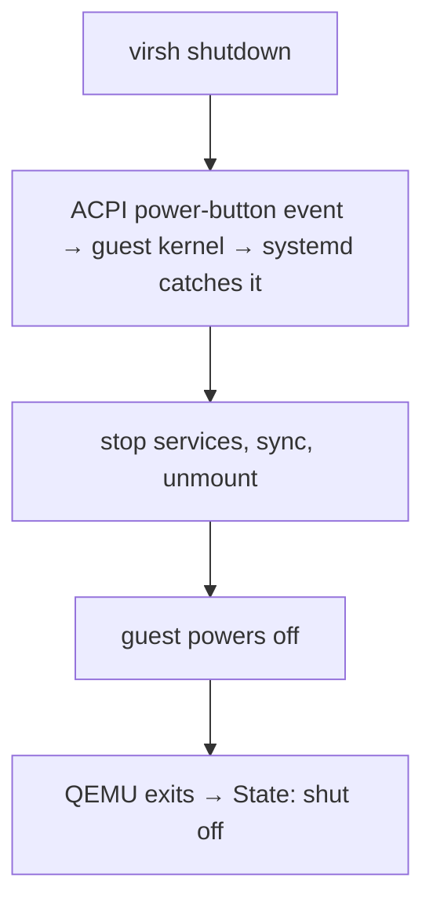
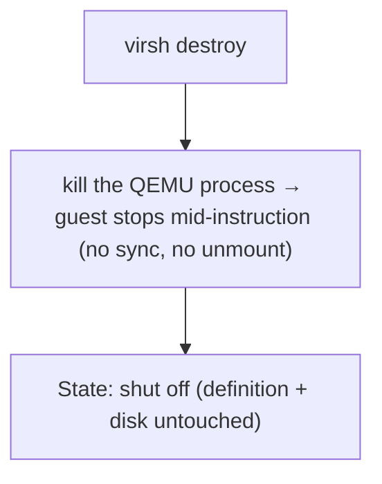

# Part 5 — Graceful shutdown vs. hard power-off

> Prerequisite: [Part 4 — Autostart and reading a domain's true state](./course-04-autostart-and-reading-true-state.md). Next: [Section 030 Knowledge Check](../quiz.md).

Stopping a domain is not one operation. It is two — `virsh shutdown` and `virsh destroy` — with genuinely different mechanisms and genuinely different consequences, and the gap between them is a favourite exam trap. This part settles which one asks and which one yanks, why `destroy` is not the deletion its name suggests, and how neither one is the same as `undefine`.

## `virsh shutdown` — send a request, then wait

```bash
# shell: host, root
virsh shutdown inventory-db
# Domain 'inventory-db' is being shut down
```

What this actually does: it delivers an **ACPI power-button event** into the guest — the virtual equivalent of a human briefly pressing the physical power button on a desktop. It does **not** stop the VM. It asks the guest's own init system (systemd on most modern Linux) to notice that event and run its normal clean shutdown: stop services in order, flush and sync filesystem caches, unmount, then power off. Only after the guest does all that does QEMU exit and the domain reach `shut off`.



Because every step after the first depends on the **guest cooperating**, `shutdown` is **asynchronous**: the command returns immediately, before anything has actually stopped. You have to poll to see whether it worked:

```bash
watch -n1 virsh list --all
# wait for inventory-db to move from 'running' to 'shut off'
```

If the guest has no ACPI handler installed (`acpid` missing on some minimal images), is hung, or is mid-crash, the event lands on the floor. The domain never leaves `running`. It will sit there indefinitely, waiting for a cooperation that is not coming. That is the signal to escalate.

The playground's `inventory-db` has an **empty** disk — no OS, so nothing inside it listens for the ACPI event. That makes it a perfect demonstration of the stuck case: `virsh shutdown` returns success and the domain never stops.

> [!TIP]
> **Try it — a shutdown request that goes nowhere.** `inventory-db` should be `running` (re-`start` it if a previous checkpoint left it stopped). On the host:
>
> ```sh
> sudo virsh start inventory-db 2>/dev/null; sleep 2
> sudo virsh shutdown inventory-db
> sudo virsh list --all
> sleep 10
> sudo virsh list --all
> ```
>
> Expect something like:
>
> ```text
> Domain 'inventory-db' is being shut down
>  Id   Name          State
> -----------------------------
>  6    inventory-db  running
>  Id   Name          State
> -----------------------------
>  6    inventory-db  running
> ```
>
> The command reported success and returned immediately — but ten seconds later the domain is still `running`, and it will stay that way forever. No OS caught the power-button event. On a real guest with `systemd` (or `acpid`) running, the second `virsh list --all` would instead show `shut off`, after a short delay while the guest ran its shutdown scripts. Either way, `virsh shutdown` returning tells you nothing — you confirm with `virsh list`.

## `virsh destroy` — pull the cord now

```bash
virsh destroy inventory-db
# Domain 'inventory-db' destroyed
```

Despite the name, `destroy` **deletes nothing** — not the domain definition, not the disk image, not a byte of guest data on disk. What it does is immediately terminate the underlying `qemu-system-*` process (a signal to that process, not a request to the guest). The guest gets **no** chance to flush caches, sync filesystems, or stop services. It is the exact software equivalent of pulling the power cord out of a running physical machine.



`destroy` is **synchronous and unconditional**: by the time the command returns, the domain is `shut off`. It always works — there is no guest cooperation to fail.

The cost is real: an unclean stop can leave the guest filesystem needing a journal replay on next boot, and any application data still in guest RAM is lost. Modern journalling filesystems almost always recover cleanly, but "almost always" is why `destroy` is the escalation, not the default.

> [!TIP]
> **Try it — the stop that always works.** Following straight on from the previous checkpoint, `inventory-db` is still stuck `running` after the ignored `shutdown`. Escalate:
>
> ```sh
> pgrep -af "guest=inventory-db" | head -1
> sudo virsh destroy inventory-db
> sudo virsh list --all
> pgrep -af "guest=inventory-db" | head -1 || echo "(qemu process gone)"
> sudo ls /etc/libvirt/qemu/inventory-db.xml
> sudo virsh start inventory-db
> ```
>
> Expect something like:
>
> ```text
> 12874 /usr/bin/qemu-system-x86_64 -name guest=inventory-db,debug-threads=on ...
> Domain 'inventory-db' destroyed
>  Id   Name          State
> -----------------------------
>  -    inventory-db  shut off
> (qemu process gone)
> /etc/libvirt/qemu/inventory-db.xml
> Domain 'inventory-db' started
> ```
>
> `destroy` returned with the domain already `shut off` — no delay, no polling — and the QEMU process is gone. The definition file is untouched, so `virsh start` brings it right back. That is the difference from `undefine`, covered just below.

Analogy (flagged as analogy): `shutdown` versus `destroy` is the difference between *asking someone to finish what they're doing and leave the room*, versus *cutting the lights and locking the door regardless of whether they're mid-sentence*. Both end with an empty room. Only one gives the occupant a chance to save their work first. Where it breaks down: a hung guest is someone who has already stopped responding to any request — at that point locking the door is the only move left.

## Choosing between them

| | `virsh shutdown` | `virsh destroy` |
|---|---|---|
| Mechanism | ACPI power-button event to the guest | kill the QEMU process |
| Needs the guest to cooperate | yes | no |
| Timing | asynchronous — returns before it's done, poll to confirm | synchronous — done when it returns |
| Can it fail / hang | yes, if guest ignores ACPI | no |
| Guest data integrity | clean: services stopped, caches synced | risk: abrupt, mid-write |
| Correct as | the default, always try first | escalation for a guest that won't respond |

The rule: **`shutdown` first; `destroy` only when `shutdown` has been given a fair chance and the domain is still `running`.**

Because `inventory-db` is **persistently defined** (Part 3), either path leaves you free to bring it straight back:

```bash
virsh start inventory-db
```

That would not be true for a transient domain — for that one, either stop is permanent.

## `destroy` is not `undefine`

They sound similarly final; they touch completely different things.

| Command | Acts on | Result | Reversible by |
|---|---|---|---|
| `virsh destroy <name>` | the **running QEMU process** | domain → `shut off`; definition and disk intact | `virsh start <name>` |
| `virsh undefine <name>` | the **persistent XML file** under `/etc/libvirt/qemu/` | definition deleted; a *running* domain keeps running but becomes transient; disk left alone unless `--remove-all-storage` | re-`define` from a saved XML |

So: `destroy` stops a VM you will start again in a minute. `undefine` deregisters a VM you are done with. Running `undefine` on a running domain does not stop it — it silently converts it to transient, and *then* the next stop makes it vanish (Part 3's failure mode, reached by a different route).

> [!WARNING]
> - Do not make `virsh destroy` your first move on a guest that might still respond. Try `virsh shutdown` and actually wait — poll `virsh list --all`. Reserve `destroy` for a guest that has demonstrably ignored the ACPI event.
> - `virsh shutdown` returning does **not** mean the domain stopped. It is asynchronous. Confirm with `virsh list --all` before assuming the guest is down.
> - `destroy` does not delete the disk or the definition. If you actually want the domain gone, that is `undefine` (optionally `--remove-all-storage`) — a separate, deliberate command.
> - On a guest with no ACPI handling, `virsh shutdown` will never complete. That is not a bug in your command; it is the mechanism. Escalate to `destroy`.

## Common pitfalls recap (whole module)

- **`create` instead of `define`** for a VM that must survive a reboot — it works until it stops, then vanishes (Part 3).
- **Forgetting `virsh autostart`** — a defined domain does *not* come up on host boot by itself (Part 4).
- **Autostart assumed to be in the XML** — it is a symlink; migrating the `dumpxml` output does not carry it (Part 4).
- **Misreading `dominfo` memory** — KiB not MiB, and `Max memory` (entitlement) not `Used memory` (Part 4).
- **`destroy` as the default stop** — it is the escalation; `shutdown` first (this part).
- **Assuming `virsh shutdown` is synchronous** — it returns immediately; poll to confirm (this part).
- **Confusing `destroy` with `undefine`** — one stops the process, the other deletes the definition (this part).

> *`virsh shutdown` sends an ACPI request the guest can ignore and returns before it finishes; `virsh destroy` kills the QEMU process immediately and always works but risks the guest's data — and neither one deletes anything the way `undefine` does.*

## Reference

- `man virsh` — the `shutdown`, `destroy`, `reboot`, `start`, and `undefine` entries; note `shutdown --mode acpi|agent` for forcing the delivery method.
- `https://libvirt.org/manpages/virsh.html#destroy` — upstream's own wording that `destroy` does not remove the domain configuration or storage.
- `man 8 acpid` (in the guest) — the daemon that catches the ACPI power-button event; its absence is why `virsh shutdown` sometimes does nothing.
