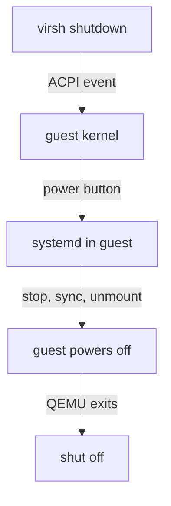
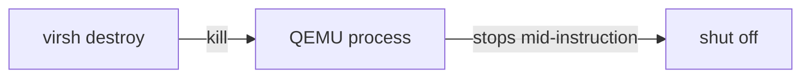

# Graceful Shutdown Vs Hard Power-Off

Astronaut, there are two ways to bring a smaller ship down: ask the pilot to land, or cut the engines. In libvirt those are `virsh shutdown` and `virsh destroy`. They work in different ways and have different results, and the gap between them is a favourite exam trap. This part settles which one asks and which one forces, why `destroy` does not delete anything despite its name, and why neither is the same as `undefine`.

## `virsh shutdown`: send a request, then wait

`virsh shutdown` is asking the pilot to land. Here is what you type and what you get back:

<!-- astrona:playground:renew -->

```bash
# shell: host, root
virsh shutdown inventory-db
# Domain 'inventory-db' is being shut down
```

The `# shell: host, root` comment means a root shell. As a normal user, put `sudo` in front, or `virsh` may look into the private `qemu:///session` hangar and not find the domain.

### What happens inside the guest

`virsh shutdown` sends an **ACPI** (Advanced Configuration and Power Interface) power-button event into the guest. It is the virtual version of briefly pressing the power button on a desktop computer. It does **not** stop the virtual machine. It asks the guest's own init system (systemd on most modern Linux) to notice the event and run its normal clean shutdown: stop services in order, write cached data to disk, unmount filesystems, then power off. Only after the guest has done all that does the QEMU process exit and the domain reach `shut off`.



The diagram shows that `virsh shutdown` only starts a chain inside the guest: the guest kernel passes the power-button event to systemd, systemd shuts the guest down cleanly, and only then does QEMU exit and the domain reach `shut off`.

### It returns before anything stops

Every step after the first one needs the **guest to cooperate**, so `shutdown` is **asynchronous**: the command returns at once, before anything has stopped. You have to check again to see whether it worked:

```bash
watch -n1 virsh list --all
# wait for inventory-db to move from 'running' to 'shut off'
```

If the guest has no ACPI handler (`acpid` is missing on some minimal images), is hung, or is in the middle of a crash, the event is lost. The domain never leaves `running`. It waits there for ever, for cooperation that is not coming. That is your signal to escalate.

### See a request that goes nowhere

The playground's `inventory-db` has an **empty** disk. There is no operating system on it, so nothing inside listens for the ACPI event. That makes it a perfect example of the stuck case: `virsh shutdown` reports success, and the domain never stops.

If your playground is fresh, for example after a mission, `inventory-db` is not defined yet. Define it again first:

```sh
sudo virt-install \
  --name inventory-db \
  --memory 2048 \
  --vcpus 2 \
  --disk path=/var/lib/libvirt/images/inventory-db.qcow2,format=qcow2 \
  --import \
  --network network=default \
  --os-variant detect=on,require=off \
  --graphics none \
  --noautoconsole
```

`inventory-db` should be `running`. The first line below starts it if it was stopped. On the host:

```sh
sudo virsh start inventory-db 2>/dev/null; sleep 2
sudo virsh shutdown inventory-db
sudo virsh list --all
sleep 10
sudo virsh list --all
```

Expect something like:

```text
Domain 'inventory-db' is being shut down
 Id   Name          State
-----------------------------
 6    inventory-db  running
 Id   Name          State
-----------------------------
 6    inventory-db  running
```

The command reported success and returned at once. But ten seconds later the domain is still `running`, and it will stay that way, because no operating system caught the power-button event. On a real guest with systemd (or `acpid`) running, the second `virsh list --all` would show `shut off` instead, after a short delay while the guest ran its shutdown. Either way, `virsh shutdown` returning tells you nothing; you confirm with `virsh list`.

## `virsh destroy`: cut the engines now

`virsh destroy` is cutting the engines. It does not ask the guest anything.

### What it does

```bash
virsh destroy inventory-db
# Domain 'inventory-db' destroyed
```

Despite the name, `destroy` **deletes nothing**: not the domain definition, not the disk image, not a byte of guest data on disk. The libvirt daemon simply ends the underlying `qemu-system-*` process at once, with a signal to that process, not a request to the guest. The guest gets **no** chance to write its cached data, sync its filesystems or stop its services. It is the software version of pulling the power cord out of a running computer.



The diagram shows that `virsh destroy` goes straight to the QEMU process and ends it, so the domain is `shut off` at once, while its definition and disk stay untouched and the guest gets no time to sync or unmount.

`destroy` is **synchronous and unconditional**: when the command returns, the domain is `shut off`. It always works, because there is no guest cooperation to fail.

The cost is real. An unclean stop can leave the guest's filesystem needing a journal replay at the next boot, and any application data still in the guest's memory is lost. Modern journalling filesystems almost always recover cleanly, but "almost always" is why `destroy` is the escalation, not the default.

### See the stop that always works

Your `inventory-db` is still stuck in `running` after the ignored `shutdown`. Escalate:

```sh
pgrep -af "guest=inventory-db" | head -1
sudo virsh destroy inventory-db
sudo virsh list --all
pgrep -af "guest=inventory-db" | head -1 || echo "(qemu process gone)"
sudo ls /etc/libvirt/qemu/inventory-db.xml
sudo virsh start inventory-db
```

Expect something like:

```text
12874 /usr/bin/qemu-system-x86_64 -name guest=inventory-db,debug-threads=on ...
Domain 'inventory-db' destroyed
 Id   Name          State
-----------------------------
 -    inventory-db  shut off
(qemu process gone)
/etc/libvirt/qemu/inventory-db.xml
Domain 'inventory-db' started
```

`destroy` returned with the domain already `shut off`, with no delay and no need to check again, and the QEMU process is gone. The definition file is untouched, so `virsh start` brings the domain right back. That is the difference from `undefine`.

## Choosing between them

Both commands end with a domain in `shut off`. Only one gives the pilot a chance to land safely. The table puts them side by side.

| | `virsh shutdown` | `virsh destroy` |
|---|---|---|
| Mechanism | ACPI power-button event to the guest | kill the QEMU process |
| Needs the guest to cooperate | yes | no |
| Timing | asynchronous — returns before it's done, poll to confirm | synchronous — done when it returns |
| Can it fail / hang | yes, if guest ignores ACPI | no |
| Guest data integrity | clean: services stopped, caches synced | risk: abrupt, mid-write |
| Correct as | the default, always try first | escalation for a guest that won't respond |

The rule: **`shutdown` first; `destroy` only when `shutdown` has had a fair chance and the domain is still `running`.** A hung guest is a pilot who no longer answers the radio. At that point cutting the engines is the only move left.

Because `inventory-db` is **persistently defined**, either path lets you bring it straight back:

```bash
virsh start inventory-db
```

That is not true for a transient domain: for a transient domain, either stop is permanent.

## `destroy` is not `undefine`

The two sound equally final, but they touch completely different things:

| Command | Acts on | Result | Reversible by |
|---|---|---|---|
| `virsh destroy <name>` | the **running QEMU process** | domain → `shut off`; definition and disk intact | `virsh start <name>` |
| `virsh undefine <name>` | the **persistent XML file** under `/etc/libvirt/qemu/` | definition deleted; a *running* domain keeps running but becomes transient; disk left alone unless `--remove-all-storage` | re-`define` from a saved XML |

So `destroy` stops a virtual machine you will start again in a minute. `undefine` removes the registration of a virtual machine you are done with. Running `undefine` on a running domain does not stop it. It quietly turns it into a transient domain, and *then* the next stop makes it vanish.

## Common pitfalls

> [!WARNING]
> - Do not make `virsh destroy` your first move on a guest that might still respond. Try `virsh shutdown` and actually wait — poll `virsh list --all`. Keep `destroy` for a guest that has clearly ignored the ACPI event.
> - `virsh shutdown` returning does **not** mean the domain stopped. It is asynchronous. Confirm with `virsh list --all` before you assume the guest is down.
> - `destroy` does not delete the disk or the definition. If you really want the domain gone, that is `undefine` (optionally with `--remove-all-storage`), a separate, deliberate command.
> - On a guest with no ACPI handling, `virsh shutdown` will never complete. That is not a bug in your command; it is how the mechanism works. Escalate to `destroy`.

> *`virsh shutdown` sends an ACPI request the guest can ignore and returns before it finishes; `virsh destroy` ends the QEMU process at once and always works but risks the guest's data. Neither one deletes anything the way `undefine` does.*

## Your mission: libvirt Virtual Machine Lifecycle Lab

You can now define a domain around an existing disk, make it start with the host, read its real state, and stop it gently or by force. The mission asks you to do the whole lifecycle on a fresh host: define a persistent domain with an exact size and network, set it to autostart, and run it.

The mission runs on its own training ship. Your playground cannot be paused, so remove it first. It always starts clean, so you lose nothing you need:

```sh
astrona destroy libvirt-vm-lifecycle
```

Then start the mission and open a terminal on it:

```sh
astrona run --git git@github.com:astrona-io/ATS002.git -c sections/section-030/module-02/labs/lab-01
astrona ssh ats-002-lab-032
```

Read the task in [`question.md`](./labs/lab-01/question.md) and solve it on your own first. When you think you are done, send it for grading:

```sh
astrona submit -c sections/section-030/module-02/labs/lab-01
```

When the mission is done, remove it and start your playground again:

```sh
astrona destroy ats-002-lab-032
astrona run --git git@github.com:astrona-io/ATS002.git -c sections/section-030/module-02/playground
```
