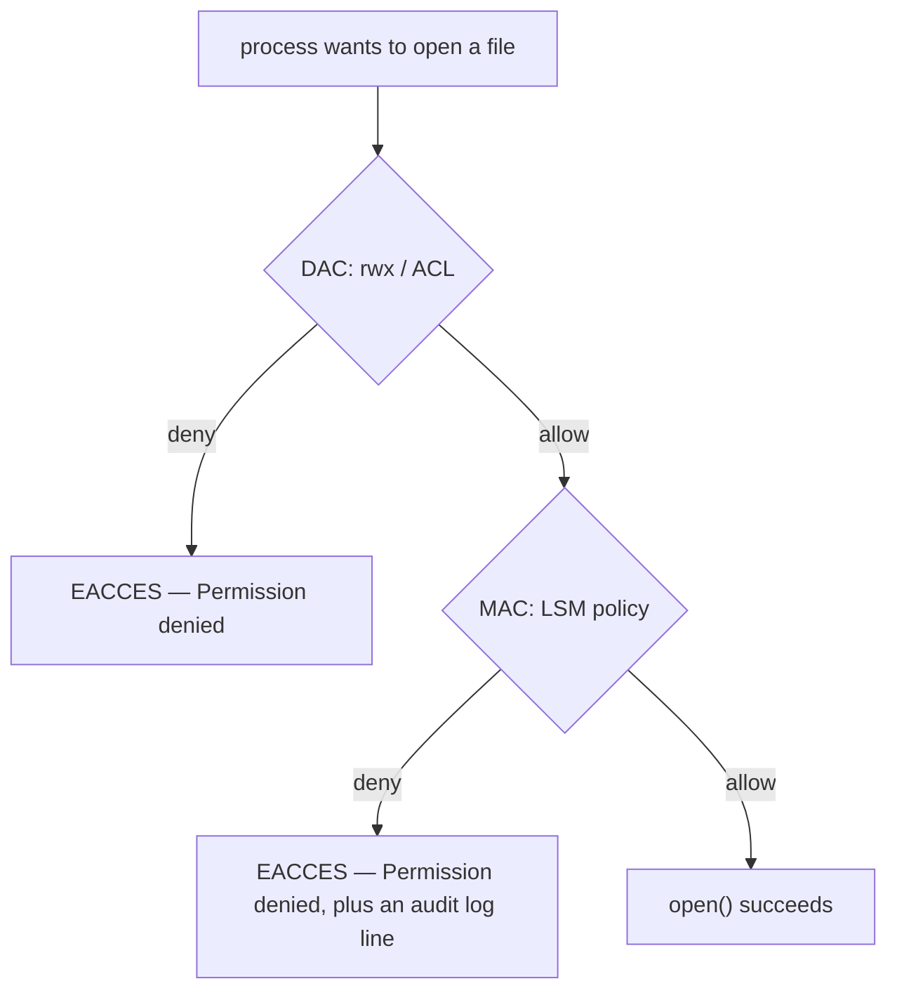

# Part 1 — Two gates: DAC, MAC, and which system you're on

> Prerequisite: [module landing page](./course.md). Next: [Part 2 — AppArmor: profiles, modes, and what's loaded](./course-02-apparmor-profiles-and-modes.md).

Before any command in this module makes sense you need one mental model: there are **two** independent permission checks between a process and a file, not one. This part settles what each gate is, how to recognise which one denied you, and the single structural difference between the two systems that implement the second gate. Every later part builds on these terms.

## The gate you already know, and the one behind it

Concrete first. You are logged in as `alice`. You run:

```bash
# shell: any Linux host, unprivileged
cat /srv/reports/q3.csv
```

```text
cat: /srv/reports/q3.csv: Permission denied
```

You check the file:

```bash
ls -l /srv/reports/q3.csv
```

```text
-rw-r--r-- 1 alice alice 4096 Sep  7 09:00 /srv/reports/q3.csv
```

`alice` owns it, the owner has `r`, and she still cannot read it. The rwx bits are the **first** gate — **Discretionary Access Control (DAC)**: "discretionary" because the file's *owner* sets who gets in, at their discretion. Here DAC says yes. Something else said no.

That something is the **second** gate — **Mandatory Access Control (MAC)**: a system-wide security policy, set by the administrator (or shipped by the distro), that the file's owner cannot override. It decides independently whether a process may touch a resource. Both gates must open for the action to succeed:



The kernel checks DAC first, then hands the decision to a **Linux Security Module (LSM)** — the kernel framework MAC plugs into. If the LSM's policy denies, the syscall fails with the same `EACCES` / "Permission denied" that a DAC failure gives. The error text does not tell you which gate stopped you.

## The signature: correct permissions, still denied

The one diagnostic instinct this module is built around: **when `ls -l` shows permissions that clearly should allow the action, and it is still denied, stop adjusting `chmod` / `chown` and start looking at MAC.**

- `chmod 644` on a file the owner already reads → the fix does nothing, because DAC was never the problem.
- A service that worked yesterday, no permission change, now gets "Permission denied" writing its own log → suspect a policy that does not cover a path the service newly uses.
- `strace` shows `openat(...) = -1 EACCES` on a path whose mode is `666` → MAC.

MAC denials also leave an audit-log record that a DAC denial does not. Parts 3 and 4 read those records for each system; recognising that a record *exists to look for* is the point here.

## Two implementations — and the distro decides

You do not choose your MAC system per task; it is baked into the distribution:

| MAC system | LSM | Ships enforcing on |
|---|---|---|
| **AppArmor** | `apparmor` | Ubuntu, Debian, openSUSE, SUSE Linux Enterprise |
| **SELinux** | `selinux` | RHEL, CentOS Stream, Fedora, Rocky, AlmaLinux |

Only one LSM of this kind is active on a given boot. This course's playground and lab are Ubuntu 24.04 → **AppArmor** is loaded and enforcing right now, and Parts 2–3 are hands-on against it. RHEL-family exam hosts run **SELinux**, so Parts 4–5 walk through it in full even though there is no SELinux kernel here to run commands on.

To see which you are on, on any host:

```bash
# shell: host, unprivileged
cat /sys/kernel/security/lsm
```

```text
capability,landlock,lockdown,yama,apparmor
```

The list is every LSM compiled in; the MAC one is `apparmor` **or** `selinux`, never both. (`capability`, `yama`, `landlock` are smaller, single-purpose LSMs, not full MAC policy.)

## The one structural difference: path vs label

Everything else in this module follows from *how* each system decides. Concretely:

- **AppArmor matches on the filesystem path.** A profile for `/usr/sbin/nginx` is a list of path rules — `/var/www/** r,` — and the kernel checks the literal path string the process asked for against that list.
- **SELinux matches on a label.** Every process and every file carries a *security context*; policy is a table of "context X may do Y to context Z." The path the file lives at is almost irrelevant.

As an analogy: it is a building where visitors are checked before an elevator moves. **AppArmor's list is by street address** — the guard only cares whether the exact address you are heading to is on this visitor's approved list. **SELinux's list is by name badge** — every person is issued a badge with a category on it, and the list says which badge categories ride which elevators. Where it breaks down: a real guard can see both your address and your badge; each MAC system deliberately ignores the other's criterion.

The consequence you will see again and again: **move or rename a file, and AppArmor's old path rule stops matching entirely** (the profile has no memory that the file "used to" be somewhere permitted), whereas **SELinux's decision usually does not change**, because the label travelled with the file. Part 2 starts on the AppArmor side of that.

> *Two independent gates sit between a process and a file: DAC (owner-set rwx) then MAC (system LSM policy); a denial with correct `ls -l` permissions means look at MAC, which is AppArmor on Debian/SUSE and SELinux on RHEL — path-matched vs label-matched.*

## Reference

- `man 7 apparmor` and `man 8 selinux` — one-screen overviews of each system's model; read whichever your host runs first.
- `/sys/kernel/security/lsm` and `man 7 lsm` — how the kernel stacks security modules and why only one MAC LSM is active.
- LFCS objective "Create and enforce MAC using SELinux" — the exam competency this whole module maps to; both systems are fair game to reason about.
