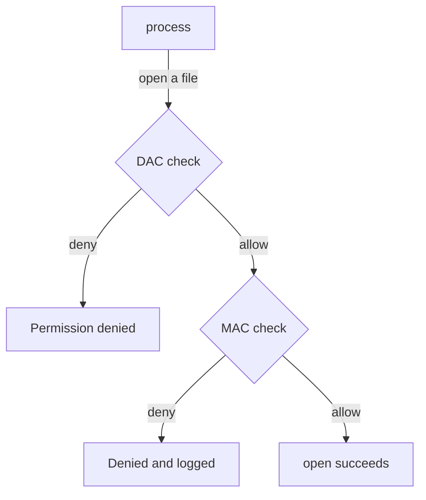

# Two Gates: DAC, MAC And Which System You Are On

Astronaut, before any command in this module makes sense, you need one picture in your head. Between a crew member (a process) and a crate (a file) there are **two** separate checks, not one. This part shows what each check is, how to tell which one stopped you, and the one big difference between the two systems that run the second check.

## The gate you already know, and the one behind it

Most "Permission denied" errors come from the file permissions you already know. Some do not. This section shows a case where the permissions are fine and the access still fails, and explains which part of the system said no.

### A denial with correct permissions

Here is a story from an ordinary Linux machine. You are logged in as `alice`, and you run:

```bash
# shell: any Linux host, unprivileged
cat /srv/reports/q3.csv
```

```text
cat: /srv/reports/q3.csv: Permission denied
```

You check the file:

```bash
ls -l /srv/reports/q3.csv
```

```text
-rw-r--r-- 1 alice alice 4096 Sep  7 09:00 /srv/reports/q3.csv
```

`alice` owns the file, the owner has `r` (read), and she still cannot read it. The rwx bits are the **first** gate. Its name is **Discretionary Access Control (DAC)**. "Discretionary" means the file's *owner* decides who gets in. Picture DAC as the lock on each hatch of your ship: the owner of the crate behind the hatch decides who gets a key. Here DAC says yes. Something else said no.

### The second gate

That something is **Mandatory Access Control (MAC)**. MAC is a security policy for the whole system. The administrator sets it, or the Linux distribution ships it, and the file's owner cannot override it. Picture MAC as the ship's security chief: a second check that can overrule the owner's keys. It decides on its own whether a process may touch a resource.

Both gates must open before the action succeeds:


```mermaid
flowchart TB
    P["process"] -->|"open a file"| D{"DAC check"}
    D -->|"deny"| E1["Permission denied"]
    D -->|"allow"| M{"MAC check"}
    M -->|"deny"| E2["Denied and logged"]
    M -->|"allow"| OK["open succeeds"]
```

The diagram shows the order: the kernel checks DAC first, and only if DAC allows does it ask MAC, and a MAC denial also leaves an audit line in the log.

The kernel (the ship's reactor core, which runs everything) does both checks. It first checks DAC. Then it hands the decision to a **Linux Security Module (LSM)**. An LSM is a slot in the kernel where a security system plugs in, like a security chief's desk built into the reactor room. If the policy behind that slot says no, the system call fails with the same `EACCES` error ("Permission denied") that a DAC failure gives. The error text does not tell you which gate stopped you.

## The signature: correct permissions, still denied

This whole module is built around one habit. **When `ls -l` shows permissions that clearly allow the action, and the action is still denied, stop changing `chmod` and `chown`. Start looking at MAC.**

Three examples of that signature:

- You run `chmod 644` on a file the owner can already read, and nothing changes. DAC was never the problem.
- A service worked yesterday. Nobody changed any permissions. Today it gets "Permission denied" when it writes its own log. Suspect a policy that does not cover a path the service now uses.
- `strace` shows `openat(...) = -1 EACCES` on a file whose mode is `666`. That is MAC.

A MAC denial also leaves an audit record in the log, which a DAC denial does not. Picture it as the security chief writing a report about the hatch they kept shut. For now, just remember that such a record exists and is worth looking for.

## Two systems, and the distribution decides

You do not pick a MAC system for each task. The Linux distribution decides it for you:

| MAC system | LSM | Ships enforcing on |
|---|---|---|
| **AppArmor** | `apparmor` | Ubuntu, Debian, openSUSE, SUSE Linux Enterprise |
| **SELinux** | `selinux` | RHEL, CentOS Stream, Fedora, Rocky, AlmaLinux |

Only one full MAC system of this kind is active at a time. Your playground and the missions in this module run Ubuntu 24.04, so **AppArmor** is loaded and enforcing on them right now, and the AppArmor parts are hands-on. Exam machines from the RHEL family (Red Hat Enterprise Linux and its relatives) run **SELinux**. This module explains SELinux in full as a worked walkthrough, but the Ubuntu training ship has no SELinux to run commands on.

### See it in your playground

Open a terminal on your playground. You can check which system a machine runs by reading the list of active security modules:

<!-- astrona:playground:renew -->

```bash
# shell: host, unprivileged
cat /sys/kernel/security/lsm
```

```text
capability,landlock,lockdown,yama,apparmor
```

The list shows every security module the kernel has switched on. The MAC one is `apparmor` **or** `selinux`, never both. `capability`, `landlock`, `lockdown` and `yama` are smaller modules with one narrow job each. They are not full MAC systems.

## The one big difference: path or label

Everything else in this module follows from *how* each system makes its decision. The two systems answer the same question in very different ways.

- **AppArmor matches the file's path.** A profile for `/usr/sbin/nginx` is a list of path rules, such as `/var/www/** r,`. The kernel compares the exact path the process asked for with that list.
- **SELinux matches a label.** Every process and every file carries a *security context*, a label. The policy is a table that says "label X may do Y to label Z". Where the file lives hardly matters.

In space terms: AppArmor's security chief holds a list of the exact hatches one crew member may use, by hatch address. SELinux's security chief ignores addresses. Every crew member and every crate carries a security tag, and the rules compare tags. A real guard could look at both, but each MAC system deliberately looks only at its own thing.

This has one result you will see again and again. **Move or rename a file, and AppArmor's old path rule stops matching.** The profile does not remember that the file "used to" be somewhere allowed. **SELinux's decision usually does not change**, because the label moved with the file.

## Common pitfalls

> [!WARNING]
> - **Fixing permissions that are already correct.** If `ls -l` allows the action and it still fails, more `chmod` or `chown` will not help. Look at MAC.
> - **Trusting the error text.** DAC and MAC both say "Permission denied". The message never tells you which gate closed.
> - **Expecting both systems at once.** A machine runs AppArmor or SELinux as its MAC system, not both. Check `/sys/kernel/security/lsm` before you reach for the tools of either one.

> *Two separate gates sit between a process and a file: DAC (owner-set rwx) and then MAC (a system-wide policy). A denial with correct `ls -l` permissions means look at MAC, which is AppArmor on Debian and SUSE and SELinux on RHEL. AppArmor matches paths; SELinux matches labels.*
