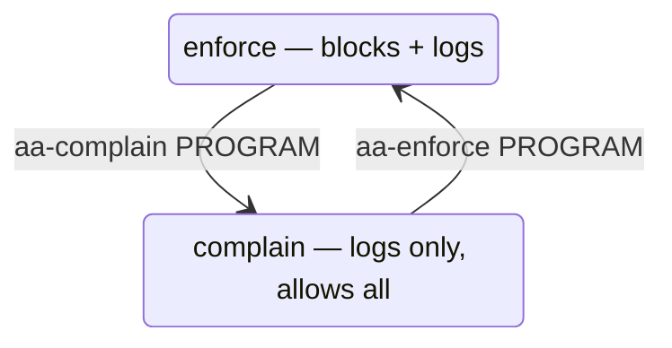

# Part 2 — AppArmor: profiles, modes, and what's loaded

> Prerequisite: [Part 1 — Two gates: DAC, MAC, and which system you're on](./course-01-two-gates-dac-mac-and-which-system.md). Next: [Part 3 — AppArmor: diagnosing and fixing a path denial](./course-03-apparmor-diagnosing-and-fixing.md).

Part 1 said AppArmor matches on the filesystem path. This part is the object model behind that: what a **profile** is, where it lives, how to read one, and the two **modes** a profile can be in — because a profile that is loaded but in the wrong mode is doing nothing, and that is a favourite exam trap. By the end you can look at `aa-status` output and a profile file and say exactly what a given program is and is not allowed to touch.

## What `aa-status` tells you

`aa-status` — read it as **A**pp**A**rmor **status** — is the first command every time, before you diagnose anything:

```bash
# shell: playground host, root
sudo aa-status
```

```text
apparmor module is loaded.
40 profiles are loaded.
38 profiles are in enforce mode.
   /usr/sbin/appservice
   ...
2 profiles are in complain mode.
   ...
5 processes have profiles defined.
3 processes are in enforce mode.
   /usr/sbin/appservice (1287) /usr/sbin/appservice
```

It answers three separate questions in one shot:

1. **Is the AppArmor LSM active at all?** — `apparmor module is loaded.` If this line is missing, nothing below matters; MAC is not your problem.
2. **Which profiles exist, and in which mode?** — the "enforce mode" and "complain mode" lists. A profile name appears in exactly one.
3. **Which running processes are actually confined right now?** — the "processes ... in enforce mode" block. A profile can be loaded for a program that is not currently running, in which case it is in the profile list but not the process list.

> [!TIP]
> **Try it — confirm AppArmor is active and find the demo profile.** On the playground host:
>
> ```bash
> sudo aa-status
> ```
>
> Expect something like the output above. Profile counts vary with the image. The load-bearing facts: `apparmor module is loaded`, `/usr/sbin/appservice` is under **enforce mode** (not complain), and it also appears in the "processes ... in enforce mode" block — so the running `appservice` daemon really is confined at this moment.

## Where profiles live and how they are named

Profiles are plain text under `/etc/apparmor.d/`. The filename is the confined program's path with `/` turned into `.`:

```
  program:  /usr/sbin/appservice
  profile:  /etc/apparmor.d/usr.sbin.appservice
  override: /etc/apparmor.d/local/usr.sbin.appservice   ← your edits go here (Part 3)
```

That `local/` file is a Debian/Ubuntu convention: the shipped profile ends with a soft include of it, so a package update can replace the main profile without discarding your site additions. Part 3 uses it; note now that it exists.

## Reading a profile

Here is a realistic profile — the playground's is this shape:

```text
#include <tunables/global>

/usr/sbin/appservice {
  #include <abstractions/base>
  #include <abstractions/bash>

  /usr/sbin/appservice  r,
  /bin/bash             ix,
  /usr/bin/date         rix,
  /usr/bin/sleep        rix,

  /var/log/appservice/       r,
  /var/log/appservice/*.log  rw,

  #include if exists <local/usr.sbin.appservice>
}
```

Top to bottom:

- **`#include <tunables/global>` / `#include <abstractions/base>`** — shared boilerplate pulled in by name. `abstractions/base` alone covers the dozens of paths almost every program needs (shared libraries, `/dev/null`, `/dev/urandom`, locale data). You `#include` it instead of retyping it.
- **`/usr/sbin/appservice { ... }`** — the profile *head* is the path of the program this profile confines. Everything in the braces is that program's allow-list.
- **Each bare `path mode,` line is a path rule.** The path may contain globs: `*` (one path segment), `**` (any depth). The trailing comma is required — a missing comma is the most common syntax error.
- **Access modes** after the path:

  | Mode | Means |
  |---|---|
  | `r` | read |
  | `w` | write (implies create/append/truncate) |
  | `k` | file lock |
  | `m` | memory-map executable (`mmap` with `PROT_EXEC`) |
  | `ix` | execute this file, staying under **this same** profile ("inherit") |
  | `px` | execute, switching to that file's **own** profile ("profile transition"; needs one to exist) |
  | `Ux` / `ux` | execute **unconfined** — dangerous, drops confinement for the child |
  | `rix` | just `r` + `ix` together — readable and inherit-executable |

- **`capability <name>,`** lines (none above) are a *different rule type*: they grant a specific Linux capability (`capability net_bind_service,`), not access to a path. Do not confuse a `capability` line with a path rule.
- **`#include if exists <local/...>`** — a soft include: pulls in the `local/` override if present, silently does nothing if not. `#include` (no `if exists`) would be a hard error when the file is missing.

What this profile *permits* to disk: read + write under `/var/log/appservice/`, and nothing else writable. Point the program at any other directory and every write there is denied — not a `chmod` problem, a missing-rule problem. Part 3 is that exact scenario.

> [!TIP]
> **Try it — read the real profile and spot the gap.** On the host:
>
> ```bash
> cat /etc/apparmor.d/usr.sbin.appservice
> grep -c 'srv' /etc/apparmor.d/usr.sbin.appservice
> systemctl show -p ExecStart --value appservice
> ```
>
> Expect the profile text above, then:
>
> ```text
> 0
> /usr/sbin/appservice
> ```
>
> `grep -c srv` returns `0` — no rule anywhere mentions `/srv`. Yet the running daemon writes `/srv/applogs/app.log` every few seconds (Part 3 confirms it from the audit log). Correct DAC on `/srv/applogs`, no matching path rule in the profile: that is the whole bug.

## The two modes — and why the distinction bites

Every loaded profile is in exactly one mode:

- **enforce** — the profile is a hard allow-list. Anything not permitted is **blocked** and logged. This is MAC doing its job.
- **complain** — the profile still evaluates every access and **logs** what it *would* have denied, but **allows it anyway**. Nothing is blocked.



`complain` exists for one legitimate job: watching what a program actually needs while you build its profile, without breaking it. It is **never a permanent fix**. A profile parked in `complain` will make a failing action "succeed" — but only because nothing is being checked, not because you closed the gap. Part 3's last checkpoint is about telling those two apart.

Switch one profile without touching any other:

```bash
# shell: host, root
sudo aa-complain /usr/sbin/appservice   # observe only
sudo aa-enforce  /usr/sbin/appservice   # confine for real again
```

Both are thin wrapper scripts (`aa-complain` edits the profile flags and reloads); their `--help` is more useful than their man pages.

> [!TIP]
> **Try it — move one profile between modes.** On the host:
>
> ```bash
> sudo aa-complain /usr/sbin/appservice
> sudo aa-status | grep -B1 -A0 'appservice'
> sudo aa-enforce /usr/sbin/appservice
> sudo aa-status | grep -B1 -A0 'appservice'
> ```
>
> Expect something like:
>
> ```text
> Setting /usr/sbin/appservice to complain mode.
>    /usr/sbin/appservice
> Setting /usr/sbin/appservice to enforce mode.
>    /usr/sbin/appservice
> ```
>
> The profile name moves between the "complain mode" and "enforce mode" sections of `aa-status`. Only that one profile moved. **Leave it in `enforce`** — the denial you read in Part 3 only happens while it is enforcing.

> [!WARNING]
> `aa-status` showing a profile as "loaded" is **not** the same as it enforcing. Always check *which list* the name is in. A profile in `complain` mode is loaded, evaluated, and logging — and stopping nothing.

> *A profile is a path allow-list under `/etc/apparmor.d/`, named after the program with `/`→`.`; `aa-status` tells you whether it is loaded and in `enforce` (blocks) or `complain` (logs only) mode, and only `enforce` is real confinement.*

## Reference

- `man apparmor.d` — the full profile syntax: every access mode, glob rules, `capability` / `network` / `dbus` rule types, variable expansion.
- `aa-status --help`, `aa-enforce --help`, `aa-complain --help` — the wrapper tools; more accurate than their thin man pages.
- `/etc/apparmor.d/abstractions/` on the host — read `base` to see what every profile inherits for free.
