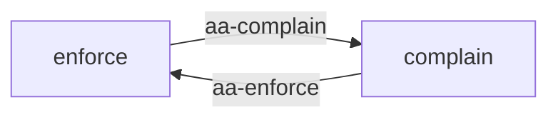

# AppArmor Profiles And Modes

AppArmor decides by the file's path. This part shows what that looks like in practice: what a **profile** is, where it lives, how to read one, and the two **modes** a profile can be in. A profile that is loaded but in the wrong mode stops nothing, and that is a favourite exam trap. By the end you can read `aa-status` and a profile file and say exactly what one program may and may not touch.

## What `aa-status` tells you

`aa-status` stands for **A**pp**A**rmor **status**. Run it first, every time, before you diagnose anything. It asks the AppArmor module in the kernel what it has loaded right now.

### See it in your playground

Run it on your playground:

<!-- astrona:playground:renew -->

```bash
# shell: playground host, root
sudo aa-status
```

```text
apparmor module is loaded.
40 profiles are loaded.
38 profiles are in enforce mode.
   /usr/sbin/appservice
   ...
2 profiles are in complain mode.
   ...
5 processes have profiles defined.
3 processes are in enforce mode.
   /usr/sbin/appservice (1287) /usr/sbin/appservice
```

The profile counts change from image to image, so yours may differ. The facts that matter: `apparmor module is loaded`, `/usr/sbin/appservice` is under **enforce mode** (not complain), and it also appears in the "processes ... in enforce mode" block. So the running `appservice` daemon really is held in check by AppArmor at this moment.

### Three questions in one output

`aa-status` answers three separate questions at once:

1. **Is AppArmor active at all?** Look for `apparmor module is loaded.` If this line is missing, nothing below matters, and MAC is not your problem.
2. **Which profiles exist, and in which mode?** Look at the "enforce mode" and "complain mode" lists. A profile name appears in exactly one of them.
3. **Which running processes are held by a profile right now?** Look at the "processes ... in enforce mode" block. A profile can be loaded for a program that is not running. Then it is in the profile list but not in the process list.

## Where profiles live and how they are named

An AppArmor **profile** is the security chief's list of hatches that one crew member may use, by path. It is plain text under `/etc/apparmor.d/`. The file name is the path of the program it guards, with each `/` turned into a `.`:

```
  program:  /usr/sbin/appservice
  profile:  /etc/apparmor.d/usr.sbin.appservice
  override: /etc/apparmor.d/local/usr.sbin.appservice   ← your edits go here
```

The `local/` file is a Debian and Ubuntu habit. The main profile ends with a "soft include" of it, so a package update can replace the main profile without throwing away your own additions. Your fixes go into this `local/` file.

## Reading a profile

A profile is short once you know its parts. This section walks through a real one line by line, then shows you the gap in the one on your playground.

### A profile, line by line

Here is a realistic profile. The playground's profile has this shape:

```text
#include <tunables/global>

/usr/sbin/appservice {
  #include <abstractions/base>
  #include <abstractions/bash>

  /usr/sbin/appservice  r,
  /bin/bash             ix,
  /usr/bin/date         rix,
  /usr/bin/sleep        rix,

  /var/log/appservice/       r,
  /var/log/appservice/*.log  rw,

  #include if exists <local/usr.sbin.appservice>
}
```

From top to bottom:

- **`#include <tunables/global>` and `#include <abstractions/base>`** pull in shared building blocks by name. `abstractions/base` alone covers dozens of paths that almost every program needs: shared libraries, `/dev/null`, `/dev/urandom`, language data. You include it instead of typing it all again.
- **`/usr/sbin/appservice { ... }`** is the profile's *head*: the path of the program this profile guards. Everything inside the braces is that program's allowed list.
- **Each `path mode,` line is a path rule.** The path may contain wildcards: `*` matches one part of a path, `**` matches any depth. The comma at the end is required. A missing comma is the most common syntax error.
- **Access modes** come after the path:

  | Mode | Means |
  |---|---|
  | `r` | read |
  | `w` | write (also covers create, append and truncate) |
  | `k` | lock the file |
  | `m` | map the file into memory as runnable code (`mmap` with `PROT_EXEC`) |
  | `ix` | run this file, staying under **this same** profile ("inherit") |
  | `px` | run this file under **its own** profile ("profile transition"; that profile must exist) |
  | `Ux` / `ux` | run this file with **no** profile at all. Dangerous: the child is not held in check |
  | `rix` | `r` and `ix` together: readable and runnable under the same profile |

- **`capability <name>,`** lines (there are none above) are a *different kind* of rule. They grant one Linux capability, a single piece of root power such as `capability net_bind_service,`. They do not grant access to a path. Do not mix up a `capability` line with a path rule.
- **`#include if exists <local/...>`** is a soft include. It pulls in the `local/` file if it exists and quietly does nothing if it does not. A plain `#include` (without `if exists`) is an error when the file is missing.

So what does this profile let the program write to disk? Reading and writing under `/var/log/appservice/`, and nothing else. Point the program at any other directory, and every write there is denied. That is not a `chmod` problem. It is a missing rule.

The manual page `man apparmor.d` on the ship lists the full profile syntax, including the `network` and `dbus` rule types this module does not use. To see what every profile gets for free, read `/etc/apparmor.d/abstractions/base`.

### See the gap in your playground

Read the real profile and look for the gap:

```bash
cat /etc/apparmor.d/usr.sbin.appservice
grep -c 'srv' /etc/apparmor.d/usr.sbin.appservice
systemctl show -p ExecStart --value appservice
```

You see the profile text above, then:

```text
0
/usr/sbin/appservice
```

`grep -c srv` returns `0`: no rule anywhere mentions `/srv`. Yet the running daemon writes `/srv/applogs/app.log` every few seconds, which the audit log confirms. The DAC permissions on `/srv/applogs` are correct, and the profile has no matching path rule. That is the whole bug.

## The two modes, and why the difference bites

Every loaded profile is in exactly one of two modes. Mixing them up is the easiest way to believe a problem is fixed when it is not.

### Enforce and complain

- **enforce**: the profile is a strict allowed list. Anything it does not allow is **blocked** and logged. This is MAC doing its job.
- **complain**: the profile still checks every access and **logs** what it *would* have denied, but **allows it anyway**. Nothing is blocked.


```mermaid
flowchart LR
    E["enforce"] -->|"aa-complain"| C["complain"]
    C -->|"aa-enforce"| E
```

The diagram shows that `aa-complain` moves a profile from enforce (blocks and logs) to complain (only logs), and `aa-enforce` moves it back.

Complain mode has one honest job: watching what a program really needs while you build its profile, without breaking it. It is **never a lasting fix**. A profile left in complain makes a failing action "work", but only because nothing is checked, not because you closed the gap.

You switch one profile at a time, without touching any other:

```bash
# shell: host, root
sudo aa-complain /usr/sbin/appservice   # observe only
sudo aa-enforce  /usr/sbin/appservice   # confine for real again
```

Both commands are small wrapper scripts: `aa-complain` changes the profile's flags and reloads it. Their `--help` output is more useful than their manual pages.

### Switch modes in your playground

Move the `appservice` profile to complain mode and back:

```bash
sudo aa-complain /usr/sbin/appservice
sudo aa-status | grep -B1 -A0 'appservice'
sudo aa-enforce /usr/sbin/appservice
sudo aa-status | grep -B1 -A0 'appservice'
```

You see something like:

```text
Setting /usr/sbin/appservice to complain mode.
   /usr/sbin/appservice
Setting /usr/sbin/appservice to enforce mode.
   /usr/sbin/appservice
```

The profile name moves between the "complain mode" and "enforce mode" lists of `aa-status`. Only that one profile moved. **Leave it in enforce mode**: the denial you read next only happens while the profile is enforcing.

> [!TIP]
> When you read `aa-status`, always check *which list* a profile name sits in. "Loaded" alone tells you nothing about whether it blocks anything.

## Common pitfalls

> [!WARNING]
> - **Taking "loaded" to mean "enforcing".** A profile in complain mode is loaded, checked and logging, and it stops nothing. Check which list `aa-status` puts it in.
> - **Leaving a profile in complain mode as a fix.** The action works because nothing is checked, not because the rule exists.
> - **Forgetting the comma.** Every path rule ends with `,`. A missing comma is the most common syntax error in a profile.
> - **Mixing up a `capability` line with a path rule.** `capability net_bind_service,` grants a power, not access to a file or directory.

> *A profile is an allowed list of paths under `/etc/apparmor.d/`, named after the program with `/` turned into `.`. `aa-status` tells you whether it is loaded and whether it is in enforce mode (blocks) or complain mode (only logs). Only enforce mode really holds a program in check.*
