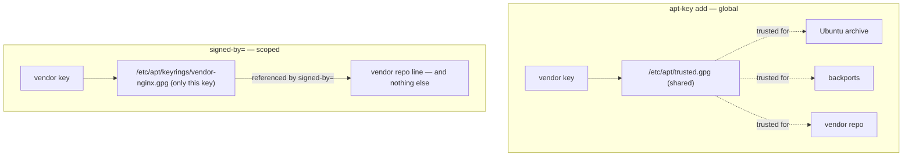

# Part 1 — Scoped trust: keyrings and `signed-by`

> Prerequisite: [module landing page](./course.md). Next: [Part 2 — Adding the repository and confirming it registered](./course-02-adding-the-repository.md).

Before a package installs from anywhere outside Ubuntu's own archive, `apt` needs cryptographic proof it is what the vendor published. *How* you give it that proof decides how much of your system's trust is at stake if the vendor's key is ever compromised. This part is the old global model, the modern scoped model, and the two files the scoped model uses.

## Why `apt-key add` is deprecated

`apt` verifies each repository's index against a GPG public key. The old way to supply one:

```bash
man apt-key      # note the deprecation banner at the very top
```

`apt-key add` drops the vendor's key into **one shared global keyring** — the same keyring `apt` consults when verifying *every* repository it knows about. If that key is compromised, or the vendor turns out less trustworthy than assumed, the blast radius is the entire system's package trust, not just that one repository.

As an analogy (flagged): `apt-key add` is handing someone a master key to every apartment in the building because you wanted to let them into one unit. Where it breaks down: a physical master key still needs a hand to turn it; a compromised signing key in the global keyring is trusted automatically, for every repo, with no further action.

## The scoped replacement: one keyring file + `signed-by=`

The modern model narrows the blast radius to exactly one repository. Two parts:



- a **dedicated keyring file** holding only this vendor's key, and
- a **`signed-by=`** option inside the repository's definition line saying "only this key may vouch for this line".

## Importing the key

Keep third-party keys in their own directory, one file per vendor:

```bash
# shell: host, root
sudo install -d -m 0755 /etc/apt/keyrings
```

`install -d` creates the directory *with the mode you specify* in one step — more predictable than `mkdir`, which leaves the mode to your umask.

A vendor usually publishes the key **ASCII-armored** (a `-----BEGIN PGP PUBLIC KEY BLOCK-----` text block) — pasteable, but not the binary form `apt` consumes. Fetch and convert in one pipeline:

```bash
curl -fsSL https://vendor.example.com/nginx/gpg | sudo gpg --dearmor -o /etc/apt/keyrings/vendor-nginx.gpg
```

- **`gpg --dearmor`** strips the armor and writes the raw binary keyring `signed-by=` expects.
- **`curl -fsSL`** — `-f` fail on an HTTP error (do not save an error page as if it were a key), `-s` quiet, `-L` follow redirects. Memorise this cluster; it recurs whenever piping a remote resource into another command.

Inspect what you imported before trusting it:

```bash
gpg --show-keys /etc/apt/keyrings/vendor-nginx.gpg      # fingerprint, uid, expiry
```

> [!WARNING]
> - **`apt-key add`** — deprecated; puts the key in the global keyring, trusted for every repo. Use a per-vendor file under `/etc/apt/keyrings/` plus `signed-by=`.
> - **Skipping `--dearmor`** on an ASCII-armored key → `apt update` fails with a signature/format error. `apt` wants the binary keyring.
> - **`curl` without `-f`** → on a 404 or proxy error page, the "key" file is HTML, and the failure surfaces confusingly later at `apt update`.
> - **World-writable keyring** → `apt` may refuse it. `install -d -m 0755` the dir; the file should be `0644 root:root`.

> *Trust an external repo with a per-vendor binary keyring under `/etc/apt/keyrings/` (convert with `gpg --dearmor`) referenced by `signed-by=` on that one repo line — never `apt-key add`, which trusts the key for every repository on the system.*

## Reference

- `man apt-key` — the deprecation notice and the rationale for `signed-by=`.
- `man 5 sources.list` — the `[signed-by=...]` option syntax on a `deb` line.
- `man gpg` — `--dearmor`, `--show-keys`; ASCII-armor vs binary keyrings.
