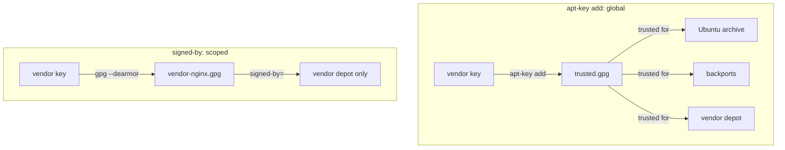

# Scoped Trust With Keyrings And signed-by

Before `apt` installs a crate from a depot outside Ubuntu's own archive, it wants proof that the crate is really what the vendor shipped. That proof is a **signing key**: think of it as the depot's wax seal. How you hand that seal to `apt` decides how much of your ship's trust is at risk if the seal is ever stolen. This part shows the old, global way, the modern, scoped way, and the two files the scoped way uses.

## Why `apt-key add` is deprecated

`apt` checks the **package index** of every repository against a GPG public key. The package index is the depot's catalogue: the list of crates it offers and their versions, downloaded to your ship. GPG (GNU Privacy Guard) is the tool that creates and checks these seals.

The old way to give `apt` a key was `apt-key add`. Its own manual page now warns you off it:

```bash
man apt-key      # note the deprecation banner at the very top
```

`apt-key add` drops the vendor's key into **one shared, global keyring**. A keyring is a file that holds one or more keys. `apt` reads this shared keyring when it checks *every* repository it knows about. So the vendor's seal is now accepted on crates from every depot, not just the vendor's.

If that key is ever stolen, or the vendor turns out less trustworthy than you thought, the damage covers all package trust on the ship. Picture the quartermaster accepting one vendor's wax seal on crates from *every* depot in the galaxy, because you wanted to accept that vendor's crates from one depot. A stolen seal then works everywhere, with no further check.

## The scoped replacement: one keyring file and `signed-by=`

The modern model shrinks the damage to exactly one repository. It has two pieces:

- a **dedicated keyring file** that holds only this vendor's key, and
- a **`signed-by=`** option inside the repository's line that says "only this key may vouch for this depot".


```mermaid
flowchart TB
    subgraph OLD["apt-key add: global"]
      K1["vendor key"] -->|"apt-key add"| GK["trusted.gpg"]
      GK -->|"trusted for"| R1["Ubuntu archive"]
      GK -->|"trusted for"| R2["backports"]
      GK -->|"trusted for"| R3["vendor depot"]
    end
    subgraph NEW["signed-by: scoped"]
      K2["vendor key"] -->|"gpg --dearmor"| KF["vendor-nginx.gpg"]
      KF -->|"signed-by="| RN["vendor depot only"]
    end
```

The diagram shows the old way placing the key in the shared `/etc/apt/trusted.gpg`, where it vouches for every depot, and the new way placing it in `/etc/apt/keyrings/vendor-nginx.gpg`, where only the one repository line that names it with `signed-by=` uses it.

## Importing the key

Importing a key takes three steps: make a home for keyring files, download and convert the key, then look at what you imported. The examples use a made-up vendor address, `vendor.example.com`.

### Make the keyring directory

Keep third-party keys in their own directory, one file per vendor:

```bash
# shell: host, root
sudo install -d -m 0755 /etc/apt/keyrings
```

`install -d` creates the directory *with the mode you give it* in one step. That is more predictable than `mkdir`, which leaves the mode to your umask (the default permission mask of your shell).

### Download and convert the key

A vendor usually publishes its key **ASCII-armored**. That means it is a text block that starts with `-----BEGIN PGP PUBLIC KEY BLOCK-----`. You can paste it into an email, but it is not the binary form that `signed-by=` expects. Download it and convert it in one pipeline:

```bash
curl -fsSL https://vendor.example.com/nginx/gpg | sudo gpg --dearmor -o /etc/apt/keyrings/vendor-nginx.gpg
```

Here is what each piece does:

- **`gpg --dearmor`** strips the text armor and writes the raw binary keyring that `signed-by=` expects.
- **`curl -fsSL`** downloads the key. `-f` makes `curl` fail on an HTTP error, so it does not save an error page as if it were a key. `-s` keeps it quiet, `-S` still shows an error if one happens, and `-L` follows redirects.

> [!TIP]
> Learn the `curl -fsSL` cluster by heart. You will use it every time you pipe a file from the network into another command, and the `-f` saves you from feeding an HTML error page to the next tool.

### Look at what you imported

Check the key before you trust it:

```bash
gpg --show-keys /etc/apt/keyrings/vendor-nginx.gpg      # fingerprint, uid, expiry
```

GPG prints the key's fingerprint (its unique ID), the name and email on it, and its expiry date. Compare the fingerprint with the one the vendor publishes. The manual pages `man gpg` and `man 5 sources.list` hold the full option lists.

## Common pitfalls

> [!WARNING]
> - **Using `apt-key add`.** It is deprecated and puts the key in the global keyring, trusted for every repository. Use a per-vendor file under `/etc/apt/keyrings/` plus `signed-by=`.
> - **Skipping `--dearmor` on an ASCII-armored key.** `apt update` then fails with a signature or format error, because `apt` wants the binary keyring.
> - **Running `curl` without `-f`.** On a 404 or a proxy error page, the "key" file is really HTML, and the failure shows up later at `apt update`, where it is confusing.
> - **A world-writable keyring.** `apt` may refuse it. Create the directory with `install -d -m 0755`; the key file should be mode `0644` and owned by `root:root`.
