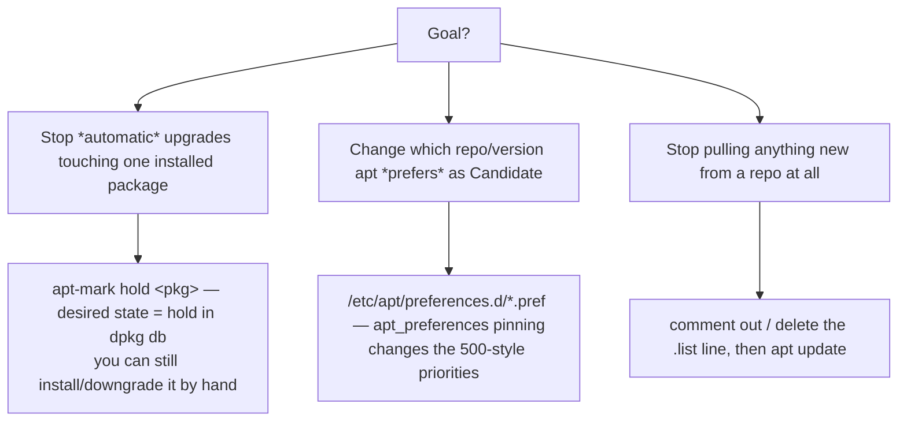

# Part 3 — Installing an exact version, and locking it

> Prerequisite: [Part 2 — Adding the repository and confirming it registered](./course-02-adding-the-repository.md). Next: [Section 050 quiz](../quiz.md).

"Install the vendor's build" is two requirements: pick the exact version now, and stop routine maintenance from moving it later. This part is APT's `=version` syntax, `apt-mark hold`, and the distinctions between a hold, a pin, and a disabled repository — three mechanisms that are easy to confuse.

## `=version` — exact match, copied verbatim

Plain `apt install nginx` grabs the `Candidate`. For a specific build:

```bash
# shell: host, root
sudo apt install nginx=1.24.0-1~jammy
```

Debian version strings are **exact-match**: the tilde `~`, the `-1` revision, the `~jammy` suffix — every character is significant. Copy it straight from the `apt-cache policy` version table (Part 2), not from a task description or memory. One wrong character and `apt` reports it cannot find a candidate matching the request — it does not guess the nearest version.

`~` sorts *before* everything, including the empty string, so `1.24.0-1~jammy` is considered **older** than `1.24.0-1`. That is deliberate — pre-release and distro-suffixed builds should lose to the plain upstream release.

## `apt-mark hold` — skip this package on upgrades

```bash
sudo apt-mark hold nginx
apt-mark showhold          # -> nginx
```

A **hold** sets the package's *desired state* to `hold` in the `dpkg` database. `apt upgrade` and `apt full-upgrade` still upgrade everything else; they silently skip a held package. It is not uninstalled, not downgraded, not made less usable — just left where it is.

```bash
sudo apt-mark unhold nginx      # release it for a deliberate, planned upgrade later
```

**Always verify with `apt-mark showhold`.** A hold applied in a script or a hurry can fail silently, or land on the wrong name (a metapackage instead of the binary). "The command exited 0" is not proof.

## Three mechanisms, easy to confuse



| | What it is | What it does **not** do |
|---|---|---|
| `apt-mark hold` | a per-package "leave alone" flag in the `dpkg` DB | does not stop *you* from `apt install`/downgrading it deliberately; does not disable the repo |
| APT pinning (`/etc/apt/preferences.d/`) | rules that change the priority numbers, so a different version/repo becomes `Candidate` | not a hold — the package still upgrades, just toward a different target |
| disabling the repo (remove/comment the `.list` line) | no new versions from that source enter the index at all | does not remove or downgrade what is already installed |

A hold with the repo still active means the vendor keeps publishing new versions in the background. Whoever later runs `apt-mark unhold` without first checking `apt-cache policy` can jump several versions in one `apt upgrade`.

Note also the override: `apt-get dist-upgrade --allow-change-held-packages` (or `apt upgrade --ignore-hold`) bypasses a hold on purpose. A hold is a default-behaviour safeguard, not an unbreakable lock.

> [!WARNING]
> - **Retyping the version string** → a single wrong character (`~`, `-1`, `~jammy`) and `apt` says "no candidate". Paste it from `apt-cache policy`.
> - **Trusting `apt-mark hold` exited cleanly** → it can hold nothing or the wrong package. `apt-mark showhold` and read the list.
> - **Confusing a hold with a pin** → a pin still upgrades the package (toward a different version); a hold freezes it. They solve different problems.
> - **Unholding without re-checking `apt-cache policy`** → the next `apt upgrade` may leap across several releases the vendor published while it was held.

> *`apt install <pkg>=<version>` needs the version string copied character-for-character from `apt-cache policy`; `apt-mark hold` freezes one installed package against automatic upgrades (verify with `apt-mark showhold`) and is distinct from APT pinning (changes the preferred version) and from disabling the repo (stops new versions entering the index).*

## Reference

- `man apt-mark` — `hold`, `unhold`, `showhold`, `showmanual`.
- `man apt_preferences` — the pinning system: priority values, `Pin:` / `Pin-Priority:`, and why it is not a hold.
- `man 5 sources.list` / `man apt` — `--allow-change-held-packages`, `--ignore-hold`; the deliberate hold overrides.
