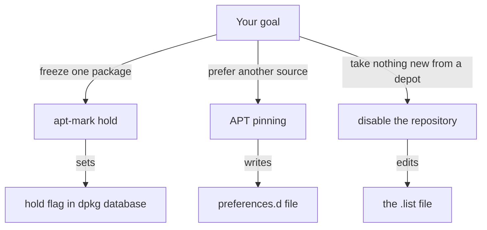

# Installing An Exact Version And Holding It

"Install the vendor's build" is really two jobs: pick the exact version now, and stop routine maintenance from swapping it later. This part covers APT's `=version` form, `apt-mark hold`, and the difference between a hold, a pin and a switched-off repository. Those three are easy to mix up.

## `=version`: an exact match, copied exactly

A plain `apt install nginx` takes whatever the `Candidate:` line of `apt-cache policy` says. To get one specific build, name the version:

```bash
# shell: host, root
sudo apt install nginx=1.24.0-1~jammy
```

Debian version strings are an **exact match**. Every character counts: the tilde `~`, the `-1` revision and the `~jammy` suffix. Copy the string straight from the `apt-cache policy` version table, never from a task description or from memory. If one character is wrong, `apt` reports that it cannot find a matching version. It does not guess the nearest one.

The tilde has a special job. It sorts *before* everything, even before an empty string, so `1.24.0-1~jammy` counts as **older** than `1.24.0-1`. That is on purpose: pre-release and distribution-suffixed builds should lose to the plain release.

## `apt-mark hold`: skip this package on upgrades

A **hold** is a "do not replace" tag on one crate. `apt-mark`, the tool that sets marks on packages, puts it there:

```bash
sudo apt-mark hold nginx
apt-mark showhold          # -> nginx
```

The hold sets the package's *desired state* to `hold` in the package database that `dpkg` keeps (the quartermaster's ledger of every crate on board). `apt upgrade` and `apt full-upgrade` still upgrade everything else, but they skip a held package. The package is not removed, not downgraded and no less usable. It is just left where it is.

When you plan a deliberate upgrade later, release it:

```bash
sudo apt-mark unhold nginx      # release it for a deliberate, planned upgrade later
```

**Always check with `apt-mark showhold`.** A hold set in a script or in a hurry can fail without a sound, or land on the wrong name, for example a metapackage instead of the real package. "The command exited 0" is not proof.

## Three mechanisms that are easy to confuse

A hold, a pin and a switched-off repository all seem to "keep a version", but each one does a different job. Pick the one that matches your goal.


```mermaid
flowchart TB
    Q["Your goal"] -->|"freeze one package"| H["apt-mark hold"]
    Q -->|"prefer another source"| P["APT pinning"]
    Q -->|"take nothing new from a depot"| D["disable the repository"]
    H -->|"sets"| HM["hold flag in dpkg database"]
    P -->|"writes"| PM["preferences.d file"]
    D -->|"edits"| DM["the .list file"]
```

The diagram shows the three goals and where each one acts: a hold is a flag in the `dpkg` database, a pin is a file under `/etc/apt/preferences.d/` that changes priorities, and switching off a repository means commenting out or deleting its `.list` line and then running `apt update`.

| | What it is | What it does **not** do |
|---|---|---|
| `apt-mark hold` | a per-package "leave alone" flag in the `dpkg` database | does not stop *you* from installing or downgrading it on purpose; does not switch off the repository |
| APT pinning (`/etc/apt/preferences.d/`) | rules that change the priority numbers, so a different version or depot becomes the `Candidate` | is not a hold: the package still upgrades, just toward a different target |
| switching off the repository (remove or comment out the `.list` line) | no new versions from that depot reach the catalogue at all | does not remove or downgrade what is already installed |

### What a pin file holds

A **pin** is a standing order to the quartermaster: "prefer this depot, or this version". It lives in a small file under `/etc/apt/preferences.d/` with three lines. `Package:` names the package. `Pin:` says which source to match, for example `release a=noble-backports` for Ubuntu's backports pocket, or `origin vendor.example.com` for one depot's host. `Pin-Priority:` gives the number.

The number decides what `apt` does with the match:

| Priority | Effect |
| --- | --- |
| below `0` | never install this version |
| `500` | the normal priority of a depot |
| above `500`, below `1000` (for example `990`) | prefer this version, even if a newer one exists elsewhere, but never downgrade an installed package to it |
| `1000` or more (for example `1001`) | prefer it and also allow a downgrade to it |

After you save a pin file, run `apt update` and read `apt-cache policy <package>`. The new priority shows in the version table, and the `Candidate:` line moves if the pin won. The manual page `man apt_preferences` has the full rules.

### Holds and overrides

A hold with the repository still switched on means the vendor keeps publishing new versions in the background. Whoever later runs `apt-mark unhold` without first checking `apt-cache policy` can jump several versions in one `apt upgrade`.

A hold can also be overridden on purpose: `apt-get dist-upgrade --allow-change-held-packages` (or `apt upgrade --ignore-hold`) skips it. A hold is a safety default, not an unbreakable lock.

## Common pitfalls

> [!WARNING]
> - **Retyping the version string.** One wrong character (`~`, `-1`, `~jammy`) and `apt` finds no matching version. Paste it from `apt-cache policy`.
> - **Trusting that `apt-mark hold` exited cleanly.** It can hold nothing, or the wrong package. Run `apt-mark showhold` and read the list.
> - **Confusing a hold with a pin.** A pin still upgrades the package, toward a different version. A hold freezes it. They solve different problems.
> - **Unholding without checking `apt-cache policy` again.** The next `apt upgrade` may jump across several releases the vendor published while the package was held.

## Your mission: Third-Party Repositories & Package Pinning Lab

You can now trust a vendor's depot with a scoped key, install an exact version from it and hold that version. The mission asks you to do all of that against a real signed repository running on the lab machine itself.

The mission runs on its own training ship. Start it and open a terminal on it:

```sh
astrona run --git git@github.com:astrona-io/ATS002.git -c sections/section-050/module-01/labs/lab-01
astrona ssh ats-002-lab-051
```

Read the task in [`question.md`](./labs/lab-01/question.md) and solve it on your own first. When you think you are done, send it for grading:

```sh
astrona submit -c sections/section-050/module-01/labs/lab-01
```

When the mission is done, remove it:

```sh
astrona destroy ats-002-lab-051
```

## Your mission: APT Pinning (not a hold) Lab

You can now tell a pin from a hold and read a pin's effect in `apt-cache policy`. The mission asks you to write a pin so that `apt` prefers the older version of `curl` from Ubuntu's release pocket over the newer one in the updates pocket.

The mission runs on its own training ship. Start it and open a terminal on it:

```sh
astrona run --git git@github.com:astrona-io/ATS002.git -c sections/section-050/module-01/labs/lab-02
astrona ssh ats-002-lab-051b
```

Read the task in [`question.md`](./labs/lab-02/question.md) and solve it on your own first. When you think you are done, send it for grading:

```sh
astrona submit -c sections/section-050/module-01/labs/lab-02
```

When the mission is done, remove it:

```sh
astrona destroy ats-002-lab-051b
```
