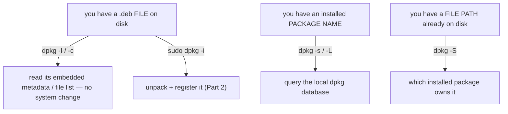

# Part 1 — What `dpkg` knows, and inspecting a `.deb` before you trust it

> Prerequisite: [module landing page](./course.md). Next: [Part 2 — Installing directly, and ownership queries](./course-02-installing-and-ownership-queries.md).

`apt` resolves dependencies and fetches over the network; `dpkg` does the actual installing, one file at a time, with no idea the internet exists. Everything in this module follows from that division. This part is the scope of `dpkg`, and the two read-only commands that tell you what a `.deb` is before you let it change anything.

## `dpkg` knows exactly one thing at a time

Hold this sentence for the whole module: **`dpkg` operates on exactly one thing in front of it** — a `.deb` file on disk, or the name of something already recorded as installed. No repositories. No dependency fetching. No automatic anything.

Every flag you meet here does one of two things, and mixing them up is the classic `dpkg` mistake:



## `dpkg -I` — read the control metadata

A colleague hands you `/home/candidate/downloads/logtail-utils_2.3.1_amd64.deb`. Before anything:

```bash
# shell: any host, unprivileged
dpkg -I /home/candidate/downloads/logtail-utils_2.3.1_amd64.deb
```

`-I` (`--info`) reads the **`control`** file inside the archive — a `.deb` is an `ar` archive containing `control.tar.*` (metadata) and `data.tar.*` (the files to install). It prints name, version, architecture, maintainer, installed-size estimate, and the `Depends:` / `Recommends:` / `Conflicts:` lines. It touches nothing about your system's package database — you are reading a file.

## `dpkg -c` — list what it would put on disk

```bash
dpkg -c /home/candidate/downloads/logtail-utils_2.3.1_amd64.deb
```

`-c` (`--contents`) lists every path in `data.tar.*`, with the mode and ownership each will get. This is where you catch a surprise: a "small logging utility" that wants to drop a file into `/etc/cron.d/`, or overwrite something in `/usr/bin`, is a red flag you see in five seconds now instead of discovering after the fact.

Both `-I` and `-c` take a **literal path to a `.deb` file**. They behave identically whether or not that package is ever installed. Part 2's ownership queries take a **package name** instead — that contrast is the whole point.

> [!WARNING]
> - **Expecting `dpkg -i` to fetch a missing dependency** → it cannot; `dpkg` has no repository. Part 2 covers the recovery.
> - **`dpkg -I` vs `dpkg -i`** → capital `-I` is read-only info on a file; lowercase `-i` installs. One character, opposite consequences.
> - **Installing a `.deb` without running `-c` first** → you skip the one cheap chance to see it write somewhere unexpected.

> *`dpkg` acts on one `.deb` file or one installed package name at a time, never a repository; `dpkg -I` (control metadata) and `dpkg -c` (file list) are read-only inspections of a `.deb` file on disk.*

## Reference

- `man dpkg-deb` — `-I` / `--info`, `-c` / `--contents`, `-e` / `--control`; the `.deb` archive layout.
- `man deb` — the `ar` container: `debian-binary`, `control.tar.*`, `data.tar.*`.
- `man dpkg` — the top-level flag list; note which take a file and which take a package name.
