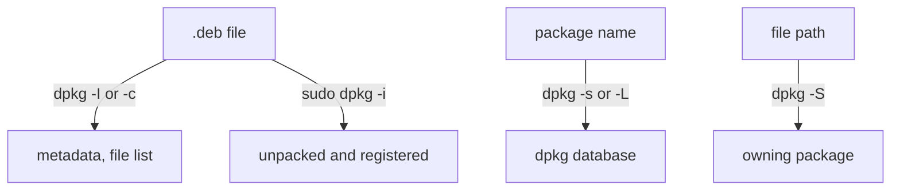

# What dpkg Knows And Inspecting A .deb

`apt` works out dependencies and downloads crates over the network. `dpkg` does the actual installing, one file at a time, with no idea the internet exists. Everything in this module follows from that split. This part covers what `dpkg` works on, and the two read-only commands that tell you what a `.deb` is before you let it change anything.

## `dpkg` knows exactly one thing at a time

Keep this sentence in mind for the whole module: **`dpkg` works on exactly one thing in front of it.** That thing is either a `.deb` file on disk or the name of a package already recorded as installed. There are no repositories, no dependency fetching and nothing automatic.

A `.deb` file is one packed supply crate. `dpkg` records every crate it unpacks in its **package database**, the quartermaster's ledger of every crate on board, kept under `/var/lib/dpkg/`. Every `dpkg` flag either reads a crate, changes the ledger, or asks the ledger a question. Mixing up which flag takes which kind of argument is the classic `dpkg` mistake:


```mermaid
flowchart TB
    F[".deb file"] -->|"dpkg -I or -c"| FM["metadata, file list"]
    F -->|"sudo dpkg -i"| INS["unpacked and registered"]
    N["package name"] -->|"dpkg -s or -L"| NM["dpkg database"]
    P["file path"] -->|"dpkg -S"| SR["owning package"]
```

The diagram shows the three kinds of argument: a `.deb` file you can read or install, an installed package name you look up in the database, and a file path on disk whose owner you look up.

## `dpkg -I`: read the control metadata

Picture a colleague handing you `/home/candidate/downloads/logtail-utils_2.3.1_amd64.deb`. Before anything else, read its label:

```bash
# shell: any host, unprivileged
dpkg -I /home/candidate/downloads/logtail-utils_2.3.1_amd64.deb
```

`-I` (`--info`) reads the **`control`** file inside the crate. A `.deb` is an `ar` archive (a simple bundle of files) that holds `control.tar.*` (the metadata) and `data.tar.*` (the files to install). `dpkg -I` prints the name, version, architecture, maintainer, estimated installed size, and the `Depends:`, `Recommends:` and `Conflicts:` lines.

It touches nothing in your system's package database. You are only reading a file.

## `dpkg -c`: list what it would put on disk

The second look shows every file the crate would unload:

```bash
dpkg -c /home/candidate/downloads/logtail-utils_2.3.1_amd64.deb
```

`-c` (`--contents`) lists every path in `data.tar.*`, with the mode and owner each file will get. This is where you catch a surprise. A "small logging tool" that wants to drop a file into `/etc/cron.d/`, or overwrite something in `/usr/bin`, is a red flag. You see it in five seconds now instead of finding out afterwards.

Both `-I` and `-c` take a **path to a `.deb` file**. They behave the same whether or not that package is ever installed. The ownership questions (`-S` and `-L`) take an installed package name or a file path on disk instead, and that contrast is the whole point. The manual pages `man dpkg-deb` and `man deb` describe the `.deb` layout in full.

## Common pitfalls

> [!WARNING]
> - **Expecting `dpkg -i` to fetch a missing dependency.** It cannot, because `dpkg` has no repository. `apt --fix-broken install` is the tool that fetches the gap.
> - **Mixing up `dpkg -I` and `dpkg -i`.** Capital `-I` is read-only information about a file; lower-case `-i` installs it. One character, opposite results.
> - **Installing a `.deb` without running `-c` first.** You skip the one cheap chance to see it write somewhere unexpected.
