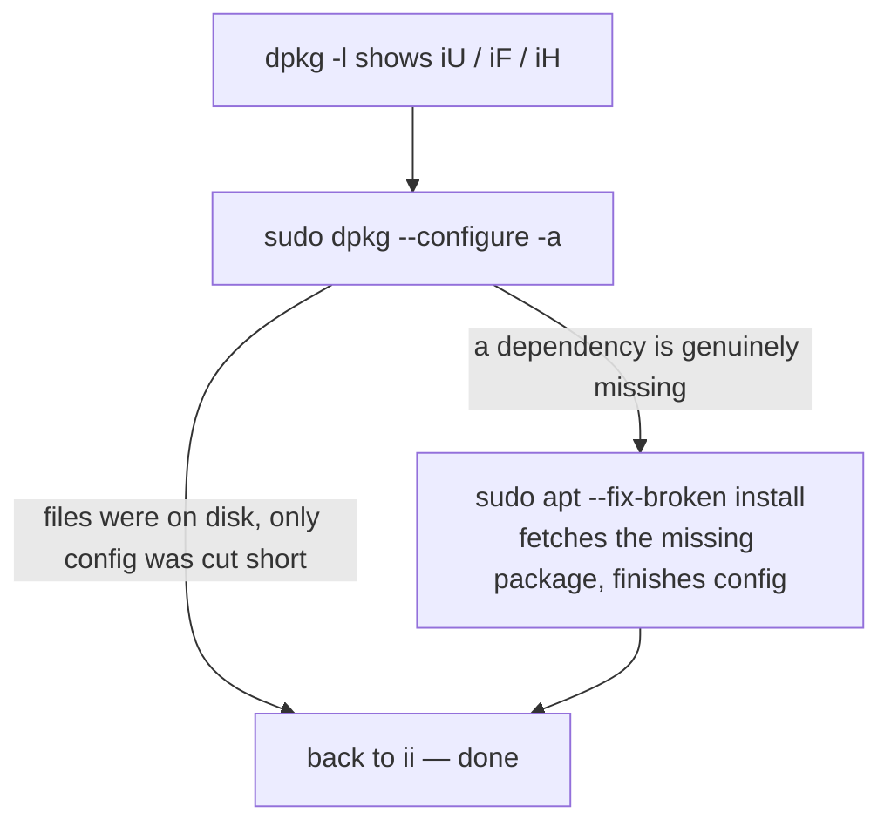

# Part 3 — Status codes and recovering an interrupted package

> Prerequisite: [Part 2 — Installing directly, and ownership queries in both directions](./course-02-installing-and-ownership-queries.md). Next: [Section 050 quiz](../quiz.md).

A package that is neither cleanly installed nor absent shows up not as an error but as a two-letter code in `dpkg -l`. This part is reading that column, what an interruption actually leaves behind, and the fixed two-command recovery.

## The `dpkg -l` status column

```text
Desired=Unknown/Install/Remove/Purge/Hold
| Status=Not/Inst/Conf-files/Unpacked/halF-conf/Half-inst/trig-aWait/Trig-pend
|/ Err?=(none)/Reinst-required (Status,Err: uppercase=bad)
||/ Name           Version      Architecture Description
+++-==============-============-============-=================
ii  logtail-utils  2.3.1        amd64        internal log utility
iU  cowsay         3.03+dfsg2-8 all          configurable cow
iF  banner         1.3.4        amd64        prints large text
rc  ftp            0.17-36      amd64        classic FTP client
```

Three positions:

1. **Desired** — what you want: `i` install (almost always), `h` hold, `r` remove, `p` purge.
2. **Status** — where it actually is: `n` not-installed, `i` installed, `c` config-files-only, `U` unpacked, `F` half-configured, `H` half-installed.
3. **Err** — usually blank; `R` means reinstall required.

The codes that matter:

| Code | Meaning | What it tells you |
|---|---|---|
| `ii` | installed, fully configured | the clean, target state |
| `iU` | unpacked, **not yet configured** | interrupted after unpack, before the config step |
| `iF` | half-configured | the post-install `configure` step started and was cut short |
| `iH` | half-installed | the unpack itself was cut short |
| `rc` | removed, **config files remain** | `apt remove` (not `purge`) ran; conffiles under `/etc` are still there |
| `rn` / `pn` | removed/purged, nothing left | fully gone |

`iU` / `iF` / `iH` are the fingerprint of an **interruption** — a killed process, a dropped SSH session mid-install, a power event. None means "broken beyond repair"; they mean "left mid-step".

## Recovering: `--configure -a`, then the safety net



```bash
sudo dpkg --configure -a
sudo apt --fix-broken install
```

- **`dpkg --configure -a`** — the `-a` / `--pending` finishes configuring **every** package currently in a pending state, not just one you name. Right approach when you do not know the full scope of what an interruption touched. For the common case (files already on disk, only the config step cut short) this alone fixes it.
- **`apt --fix-broken install`** — run it immediately after even on apparent success. It catches the other failure mode: a genuinely missing dependency, which `dpkg --configure -a` cannot resolve (no repository — same reason as Part 2).

This pair, in this order, is the standard answer to "this system's package state looks inconsistent" — not a disaster-only tool.

> [!WARNING]
> - **Reading `iF` / `iU` as "installed"** → it is mid-step; software may not run. `sudo dpkg --configure -a` first.
> - **`dpkg --configure -a` alone when a dependency is missing** → it cannot fetch anything. Always follow with `apt --fix-broken install`.
> - **`rc` mistaken for "still installed"** → the binaries are gone; only `/etc` conffiles remain. `apt purge <pkg>` clears them (relevant to the next module).
> - **Naming one package to `dpkg --configure`** → use `-a`; an interruption often leaves several packages pending and you may not see all of them.

> *`iU`/`iF`/`iH` in `dpkg -l` mean a package was left mid-install by an interruption; `sudo dpkg --configure -a` finishes every pending package, and `sudo apt --fix-broken install` right after covers the missing-dependency case `dpkg` cannot.*

## Reference

- `man dpkg` — the status-code legend (the header block of `dpkg -l`), `--configure`, `--pending` / `-a`.
- `man 1 dpkg-query` — `-l` output format and `-W` for machine-readable status.
- `man apt-get` — `-f` / `--fix-broken install` as the dependency-completing half of the recovery.
