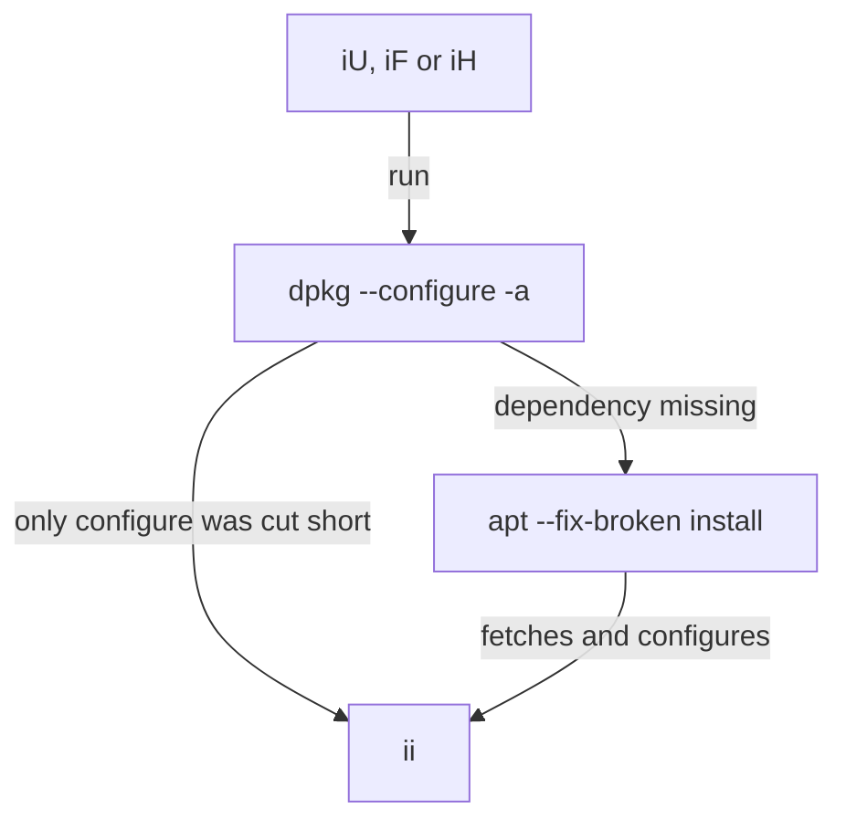

# Status Codes And Recovering An Interrupted Package

A package that is neither cleanly installed nor gone does not show up as an error. It shows up as a two-letter code in `dpkg -l`. This part covers reading that column, what an interruption really leaves behind, and the fixed two-command recovery.

## The `dpkg -l` status column

Here is what `dpkg -l` prints for four packages in four different states:

```text
Desired=Unknown/Install/Remove/Purge/Hold
| Status=Not/Inst/Conf-files/Unpacked/halF-conf/Half-inst/trig-aWait/Trig-pend
|/ Err?=(none)/Reinst-required (Status,Err: uppercase=bad)
||/ Name           Version      Architecture Description
+++-==============-============-============-=================
ii  logtail-utils  2.3.1        amd64        internal log utility
iU  cowsay         3.03+dfsg2-8 all          configurable cow
iF  banner         1.3.4        amd64        prints large text
rc  ftp            0.17-36      amd64        classic FTP client
```

The first column has up to three letters:

1. **Desired**: what you asked for. `i` is install (almost always), `h` hold, `r` remove, `p` purge.
2. **Status**: where the package really is. `n` not installed, `i` installed, `c` only configuration files left, `U` unpacked, `F` half-configured, `H` half-installed.
3. **Err**: usually blank. `R` means a reinstall is required.

These are the codes that matter:

| Code | Meaning | What it tells you |
|---|---|---|
| `ii` | installed, fully configured | the clean target state |
| `iU` | unpacked, **not yet configured** | interrupted after unpacking, before the configure step |
| `iF` | half-configured | the post-install configure step started and was cut short |
| `iH` | half-installed | the unpacking itself was cut short |
| `rc` | removed, **configuration files remain** | `apt remove` (not `purge`) ran; the configuration files under `/etc` are still there |
| `rn` / `pn` | removed or purged, nothing left | fully gone |

`iU`, `iF` and `iH` are the fingerprint of an **interruption**: a killed process, an SSH session that dropped in the middle of an install, or a power cut. None of them means "broken beyond repair". They mean "left in the middle of a step", like a crate the loading crew put down halfway through unpacking.

## Recovering: `--configure -a`, then the safety net

The recovery is always the same two commands, in the same order.


```mermaid
flowchart TB
    S["iU, iF or iH"] -->|"run"| C["dpkg --configure -a"]
    C -->|"only configure was cut short"| OK["ii"]
    C -->|"dependency missing"| FB["apt --fix-broken install"]
    FB -->|"fetches and configures"| OK
```

The diagram shows that `dpkg --configure -a` alone brings most interrupted packages back to `ii`, and `apt --fix-broken install` covers the case where a dependency is really missing.

```bash
sudo dpkg --configure -a
sudo apt --fix-broken install
```

Here is what each command does:

- **`dpkg --configure -a`** finishes configuring **every** package that is waiting, not just one you name. The `-a` is short for `--pending`. That is the right approach when you do not know everything an interruption touched. In the common case, where the files are already on disk and only the configure step was cut short, this alone fixes it.
- **`apt --fix-broken install`** runs right after, even when the first command seemed to succeed. It catches the other failure: a dependency that is really missing. `dpkg --configure -a` cannot fix that, because `dpkg` has no repository to fetch from.

This pair, in this order, is the standard answer to "this system's package state looks inconsistent". It is not only a disaster tool. Afterwards, `sudo dpkg --audit` checks the whole database and prints nothing when no package is left half-done.

## Common pitfalls

> [!WARNING]
> - **Reading `iF` or `iU` as "installed".** The package is in the middle of a step, and the software may not run. Run `sudo dpkg --configure -a` first.
> - **Running only `dpkg --configure -a` when a dependency is missing.** It cannot fetch anything. Always follow it with `apt --fix-broken install`.
> - **Taking `rc` for "still installed".** The programs are gone; only the configuration files under `/etc` remain. `apt purge <package>` clears them.
> - **Naming one package to `dpkg --configure`.** Use `-a`. An interruption often leaves several packages waiting, and you may not see all of them.

## Your mission: dpkg Low-Level Package Management Lab

You can now inspect a `.deb`, install it with `dpkg`, ask who owns what, and recover a package left half-configured. The mission asks you to do all of that on one ship: install an internal tool from a `.deb` file and bring an unrelated stuck package back to a clean state.

The mission runs on its own training ship. Start it and open a terminal on it:

```sh
astrona run --git git@github.com:astrona-io/ATS002.git -c sections/section-050/module-02/labs/lab-01
astrona ssh ats-002-lab-052
```

Read the task in [`question.md`](./labs/lab-01/question.md) and solve it on your own first. When you think you are done, send it for grading:

```sh
astrona submit -c sections/section-050/module-02/labs/lab-01
```

When the mission is done, remove it:

```sh
astrona destroy ats-002-lab-052
```
