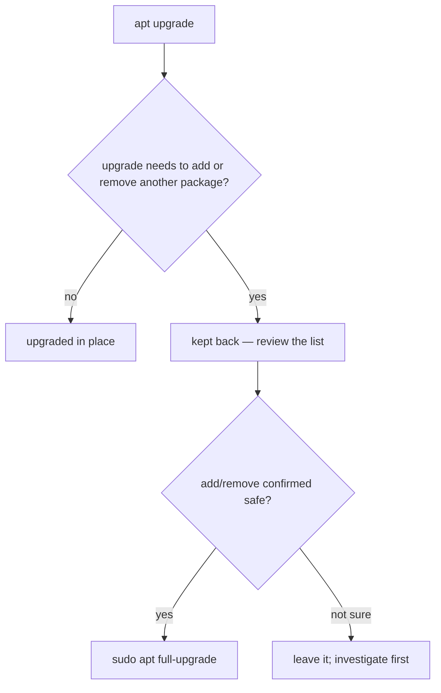

# Part 2 — Applying upgrades, and installing

> Prerequisite: [Part 1 — `apt update` is not `apt upgrade`](./course-01-update-is-not-upgrade.md). Next: [Part 3 — Removing cleanly](./course-03-removing-cleanly.md).

`apt upgrade` deliberately refuses to change the *set* of installed packages — only versions within it. That restriction is what produces the "kept back" list, and knowing why a package was kept back is the difference between reaching for `full-upgrade` deliberately and reaching for it recklessly.

## `apt upgrade` — versions only, never the set

```bash
# shell: host, root
sudo apt upgrade
```

`apt upgrade` installs the newer version of every currently-installed package **that can be upgraded without installing or removing any other package**. It will not add a new dependency, and it will not drop an obsolete one. That restriction keeps its behaviour predictable — the installed package *set* is unchanged; only versions move.

## The "kept back" list

```text
The following packages have been kept back:
  linux-generic linux-headers-generic
```

A package is "kept back" when upgrading it would require **adding** a new package (a new dependency, a new kernel ABI package) or **removing** an obsolete one — something plain `upgrade` refuses. The kernel meta-packages are the usual example: a new kernel version means a new `linux-image-*` package, which is a set change.



Once you have reviewed the list and confirmed the add/remove is expected:

```bash
sudo apt full-upgrade      # == apt-get dist-upgrade
```

`apt full-upgrade` is explicitly willing to add or remove packages to complete upgrades that plain `upgrade` would not attempt. Reach for it **deliberately**, after understanding why something was kept back — not reflexively as a first move on a system you do not know.

## Installing something new

```bash
sudo apt install fail2ban
```

Resolves `fail2ban`'s dependencies against the index from Part 1 and installs everything needed in one transaction. For a single routine addition, no flags are required. Several at once → one call with all the names (Module 5).

> [!WARNING]
> - **`apt full-upgrade` as a habit** → it will add and remove packages to satisfy upgrades. Use it only after reading and approving the kept-back list.
> - **Treating "kept back" as a failure** → it is `apt upgrade` correctly declining a set change. Investigate, then decide.
> - **Skipping the review and running `full-upgrade`** → on an unfamiliar system it can pull in or drop packages you did not expect.

> *`apt upgrade` moves versions but never adds or removes a package, which is why kernel and other set-changing upgrades appear "kept back"; `apt full-upgrade` (== `apt-get dist-upgrade`) will make those add/removes — use it only after reviewing the kept-back list.*

## Reference

- `man apt` — `upgrade` vs `full-upgrade`; the "kept back" wording.
- `man apt-get` — `dist-upgrade` (the stable-interface equivalent of `full-upgrade`), `--with-new-pkgs`.
- `man apt` — `install`, and pinning a version with `pkg=version` (Module 1, Part 3).
