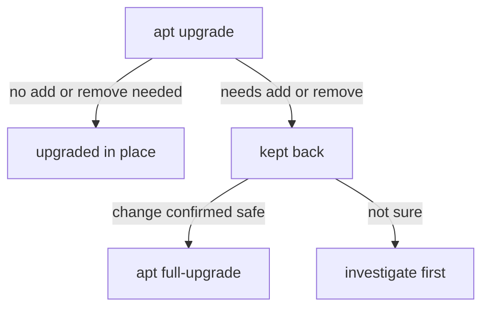

# Applying Upgrades And Installing

`apt upgrade` refuses on purpose to change the *set* of installed packages. It only changes versions inside that set. That rule is what produces the "kept back" list. Knowing why a package was kept back is the difference between using `full-upgrade` on purpose and using it recklessly.

## `apt upgrade`: versions only, never the set

Apply the available upgrades:

```bash
# shell: host, root
sudo apt upgrade
```

`apt upgrade` installs the newer version of every installed package **that can be upgraded without installing or removing any other package**. It will not add a new dependency, and it will not drop an old one. That rule keeps it predictable: the list of crates on board stays the same, and only their versions move.

## The "kept back" list

Sometimes `apt upgrade` ends with a list like this:

```text
The following packages have been kept back:
  linux-generic linux-headers-generic
```

A package is "kept back" when upgrading it would mean **adding** a new package (a new dependency, or a new kernel package) or **removing** an old one. Plain `upgrade` refuses to do that. The kernel metapackages are the usual example. A **metapackage** is an empty crate whose only job is to pull in other crates. A new kernel version means a new `linux-image-*` package, and adding it changes the set.


```mermaid
flowchart TB
    U["apt upgrade"] -->|"no add or remove needed"| A["upgraded in place"]
    U -->|"needs add or remove"| K["kept back"]
    K -->|"change confirmed safe"| FU["apt full-upgrade"]
    K -->|"not sure"| STOP["investigate first"]
```

The diagram shows how `apt upgrade` sorts each package: upgraded in place, or kept back for you to review before you choose `apt full-upgrade`.

Once you have read the list and confirmed the add or remove is expected:

```bash
sudo apt full-upgrade      # == apt-get dist-upgrade
```

`apt full-upgrade` is willing to add or remove packages to finish upgrades that plain `upgrade` would not try. Use it **on purpose**, after you understand why something was kept back. Do not reach for it out of habit as the first move on a system you do not know.

## Installing something new

Bringing a new crate on board is one command:

```bash
sudo apt install fail2ban
```

`apt` works out `fail2ban`'s dependencies from the catalogue you downloaded with `apt update` and installs everything needed in one **transaction**. A transaction is one planned change that either completes as a whole or not at all. For one routine addition you need no options. To add several packages at once, give all their names to one `apt install` call.

## Common pitfalls

> [!WARNING]
> - **Using `apt full-upgrade` out of habit.** It adds and removes packages to complete upgrades. Use it only after reading and approving the kept-back list.
> - **Treating "kept back" as a failure.** It is `apt upgrade` correctly refusing to change the package set. Investigate, then decide.
> - **Skipping the review and running `full-upgrade` anyway.** On an unfamiliar system it can pull in or drop packages you did not expect.
