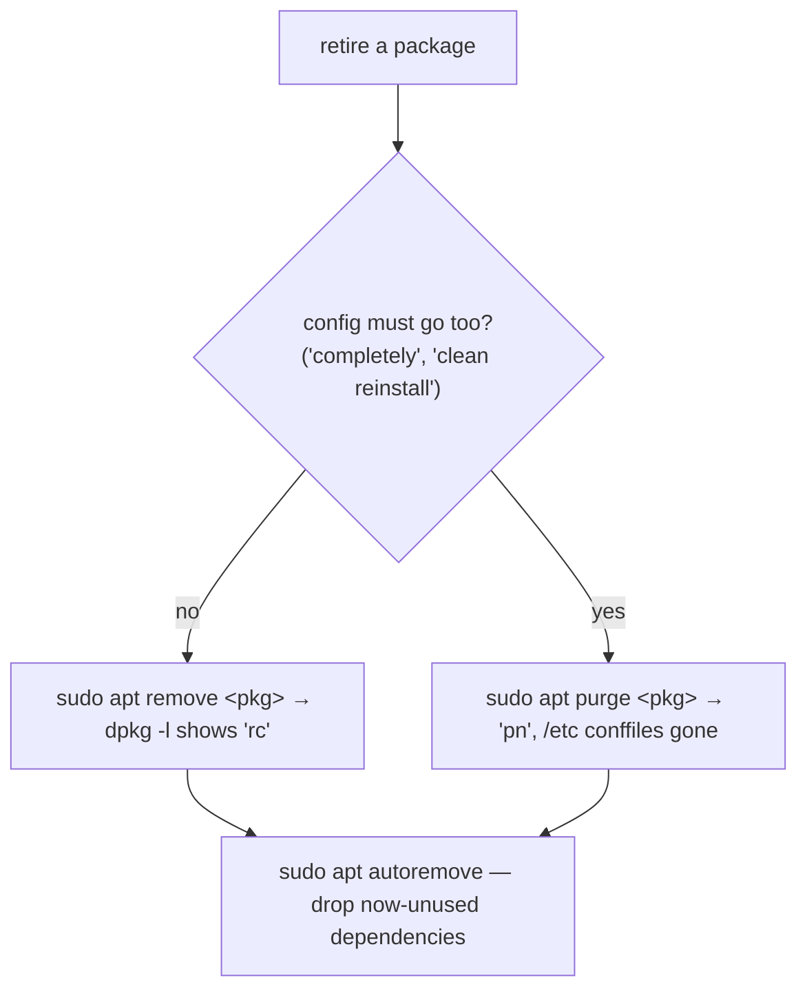

# Part 3 — Removing cleanly

> Prerequisite: [Part 2 — Applying upgrades, and installing](./course-02-applying-upgrades-and-installing.md). Next: [Section 050 quiz](../quiz.md).

"Remove the package" hides two decisions: keep its config or not, and clean up the dependencies it dragged in or not. This part is `remove` vs `purge`, `autoremove`, and the one place `apt` and `apt-get`/`apt-cache` genuinely differ.

## `remove` keeps config; `purge` deletes it

```bash
# shell: host, root
sudo apt remove ftp
```

Removes the package's binaries. Files under `/etc` the package marked as **configuration** ("conffiles") are **left behind** — the idea being a later reinstall should pick the same config back up.

```bash
sudo apt purge ftp
```

Everything `remove` does, **plus** deleting those conffiles. The difference only shows later: after `remove`, a future reinstall silently inherits old config nobody remembers; after `purge`, a reinstall starts from the package's shipped defaults.

A removed-but-not-purged package shows in `dpkg -l` as **`rc`** — **r**emoved, **c**onfig-files remain. Recognise it on sight; `apt purge <pkg>` clears it to `pn`.

**Task wording is the cue:** "completely remove", "including configuration", "so a reinstall starts clean" → `purge`, not `remove`.

## Orphans do not clean themselves up

Removing `ftp` does not touch any dependency package that `ftp` alone pulled in. If nothing else needs it, it sits there installed and unused:

```bash
sudo apt autoremove
```

`apt autoremove` removes every package that (a) was installed automatically as a dependency and (b) nothing currently installed still depends on. It is a **separate, deliberate step** — `remove`/`purge` never cascades to orphans on its own. A cleanup task that does not end with `autoremove` is incomplete. (`apt autoremove --purge` also drops the orphans' conffiles.)



## `apt` vs `apt-get` / `apt-cache`

```bash
man apt      # note: CLI and output are NOT guaranteed stable across releases
```

`apt` is the friendly combined front-end — progress bar, colour, built for a human at a keyboard, and explicitly free to change its output between versions. `apt-get` and `apt-cache` (the older split tools) carry **no such warning**: stable, long-standing behaviour and output, which is why scripts, Ansible, and CI still use them. Neither is deprecated.

**Use `apt` interactively; use `apt-get` / `apt-cache` in anything you are not there to watch.**

> [!WARNING]
> - **`remove` when the task says "completely" / "including config"** → conffiles stay under `/etc` (`rc` state) and a reinstall inherits them. Use `purge`.
> - **Assuming `remove`/`purge` cleans orphaned dependencies** → it does not. Run `apt autoremove` as a distinct step.
> - **Parsing `apt` output in a script** → its format can change between releases. Use `apt-get` / `apt-cache`.
> - **`rc` read as "still installed"** → binaries are gone; only config remains.

> *`apt remove` keeps a package's `/etc` conffiles (`rc` state), `apt purge` deletes them; neither removes orphaned dependencies — that is a separate `apt autoremove` — and scripts should use the stable `apt-get`/`apt-cache`, not `apt`.*

## Reference

- `man apt` / `man apt-get` — `remove`, `purge`, `autoremove`, `--purge`; the stability caveat in `man apt`.
- `man dpkg` — the `rc` / `pn` status codes for removed vs purged.
- `man apt.conf` — `APT::Get::AutomaticRemove` and how "automatically installed" is tracked (`apt-mark showauto`).
