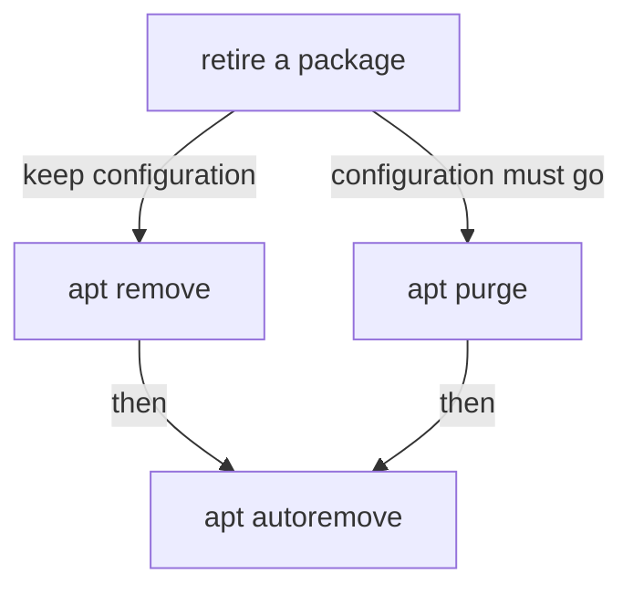

# Removing Cleanly

"Remove the package" hides two decisions: keep its configuration or not, and clean up the dependencies it brought along or not. This part covers `remove` versus `purge`, `autoremove`, and the one place where `apt` and `apt-get` or `apt-cache` really differ.

## `remove` keeps configuration, `purge` deletes it

The two commands differ only in what they leave under `/etc`. Start with `remove`:

```bash
# shell: host, root
sudo apt remove ftp
```

This removes the package's programs. Files under `/etc` that the package marked as configuration are **left behind**. `dpkg` calls these **conffiles**: configuration files it tracks for a package and protects from being overwritten. The idea is that a later reinstall picks the same settings up again.

```bash
sudo apt purge ftp
```

`purge` does everything `remove` does, **plus** it deletes those conffiles. The difference only shows later. After `remove`, a future reinstall silently inherits old settings nobody remembers. After `purge`, a reinstall starts from the package's shipped defaults.

A removed-but-not-purged package shows in `dpkg -l` as **`rc`**: **r**emoved, **c**onfiguration files remain. Learn to recognise it on sight. `apt purge <package>` clears it to `pn`.

**The task's wording is the cue.** "Completely remove", "including configuration" and "so a reinstall starts clean" all mean `purge`, not `remove`.

## Orphans do not clean themselves up

Removing a package does not touch the dependencies it pulled in. If nothing else needs one of them any more, it stays installed and unused. Such a package is called an **orphan**. Clean orphans up with:

```bash
sudo apt autoremove
```

`apt autoremove` removes every package that (a) was installed automatically as a dependency and (b) is no longer needed by anything installed. It is a **separate, deliberate step**: `remove` and `purge` never cascade to orphans on their own. A cleanup task that does not end with `autoremove` is not finished. `apt autoremove --purge` also deletes the orphans' conffiles.


```mermaid
flowchart TB
    T["retire a package"] -->|"keep configuration"| RM["apt remove"]
    T -->|"configuration must go"| PG["apt purge"]
    RM -->|"then"| AR["apt autoremove"]
    PG -->|"then"| AR
```

The diagram shows the choice between `remove` (the package ends in the `rc` state) and `purge` (it ends in `pn` with its `/etc` conffiles gone), and that both are followed by `apt autoremove` to drop dependencies nobody needs any more.

## `apt` versus `apt-get` and `apt-cache`

`apt` is not the only front door to the quartermaster. Its own manual page warns about one thing:

```bash
man apt      # note: CLI and output are NOT guaranteed stable across releases
```

`apt` is the friendly combined tool: progress bar, colour, made for a person at a keyboard. It is openly allowed to change its output between versions. `apt-get` and `apt-cache` are the older, separate tools, and they carry **no such warning**. Their behaviour and output stay stable for a long time, which is why scripts, Ansible and CI (continuous integration) pipelines still use them. Neither is deprecated.

**Use `apt` at the keyboard; use `apt-get` and `apt-cache` in anything you are not there to watch.**

## Common pitfalls

> [!WARNING]
> - **Using `remove` when the task says "completely" or "including configuration".** The conffiles stay under `/etc` (`rc` state), and a reinstall inherits them. Use `purge`.
> - **Assuming `remove` or `purge` cleans up orphaned dependencies.** It does not. Run `apt autoremove` as its own step.
> - **Parsing `apt` output in a script.** Its format can change between releases. Use `apt-get` or `apt-cache`.
> - **Reading `rc` as "still installed".** The programs are gone; only the configuration remains.

## Your mission: APT Basic Package Operations Lab

You can now refresh the catalogue, preview and apply upgrades, install a package, and retire one completely. The mission asks you to run that whole maintenance loop on one ship, ending with a package purged and its orphans cleaned up.

The mission runs on its own training ship. Start it and open a terminal on it:

```sh
astrona run --git git@github.com:astrona-io/ATS002.git -c sections/section-050/module-03/labs/lab-01
astrona ssh ats-002-lab-053
```

Read the task in [`question.md`](./labs/lab-01/question.md) and solve it on your own first. When you think you are done, send it for grading:

```sh
astrona submit -c sections/section-050/module-03/labs/lab-01
```

When the mission is done, remove it:

```sh
astrona destroy ats-002-lab-053
```
