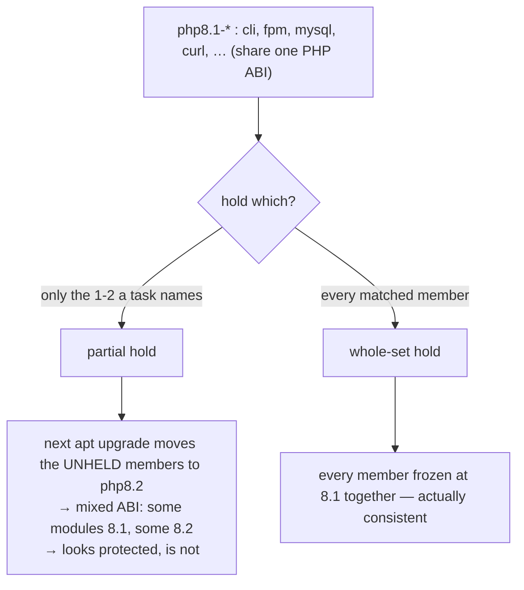

# Part 2 — Bulk actions across a matched set

> Prerequisite: [Part 1 — One transaction, and finding a family by pattern](./course-01-one-transaction-and-finding-a-family.md). Next: [Section 050 quiz](../quiz.md).

With clean names from Part 1, one more command applies an action to all of them. This part is `xargs` into `apt-mark hold`, why a partial hold on an interdependent set is worse than no hold, and auditing the result instead of trusting the pipeline.

## `xargs` into one `apt-mark hold`

```bash
# shell: host, root
apt list --installed 2>/dev/null | grep -E '^php8\.1-' | cut -d/ -f1 | xargs sudo apt-mark hold
```

`apt-mark hold` accepts any number of names in a single call. `xargs` collects every matched name from the pipeline into **one** `apt-mark hold pkg1 pkg2 pkg3 …` invocation — not a loop calling `apt-mark hold` once per package. One consolidated, auditable operation.

## Why the *whole* family, not just the named members



If the family shares real interdependencies — built against the same PHP ABI, the same minor release — holding only some members means a future `apt upgrade` / `full-upgrade` is free to move the **unheld** ones to a newer PHP release while the held ones stay behind. The result is a mixed installation: some modules compiled against one minor version, others against another. **A partial hold on a genuinely interdependent set is often worse than no hold** — it looks protected without being protected.

## Audit the result

```bash
apt-mark showhold
```

A pipeline can silently hold **fewer** packages than intended — a pattern typo, an empty result `xargs` quietly did nothing with, an unexpected extra match. "The command did not error" is not proof.

`apt-mark showhold` prints every held package system-wide, unfiltered. Compare it **line for line** against the list your pattern match produced (`grep -E '^php8\.1-' | cut -d/ -f1`). This is the difference between an entire interdependent set genuinely held and a partial hold that only looks complete.

> [!WARNING]
> - **Looping `apt-mark hold` per package** → slower and easy to abort half-done. `xargs` builds one call.
> - **`xargs` on an empty pipeline** → with GNU `xargs` it may still run `apt-mark hold` with no args (a no-op that "succeeds"). Add `xargs -r` to skip on empty, and check the count.
> - **Holding only the members a task names** → the rest drift to an incompatible version. Hold the whole matched set.
> - **Trusting the pipeline exit code** → run `apt-mark showhold` and diff it against your intended list.

> *Pipe clean names into one `xargs sudo apt-mark hold`, hold the entire interdependent family (a partial hold lets the unheld members drift to an incompatible version), and verify with `apt-mark showhold` compared line-for-line against your match.*

## Reference

- `man apt-mark` — `hold` / `unhold` / `showhold` accepting multiple names.
- `man 1 xargs` — `-r` / `--no-run-if-empty`, `-n`, `-t` (echo the built command before running).
- `man apt_preferences` — the pinning alternative when you need a whole family targeted at a specific version rather than frozen.
