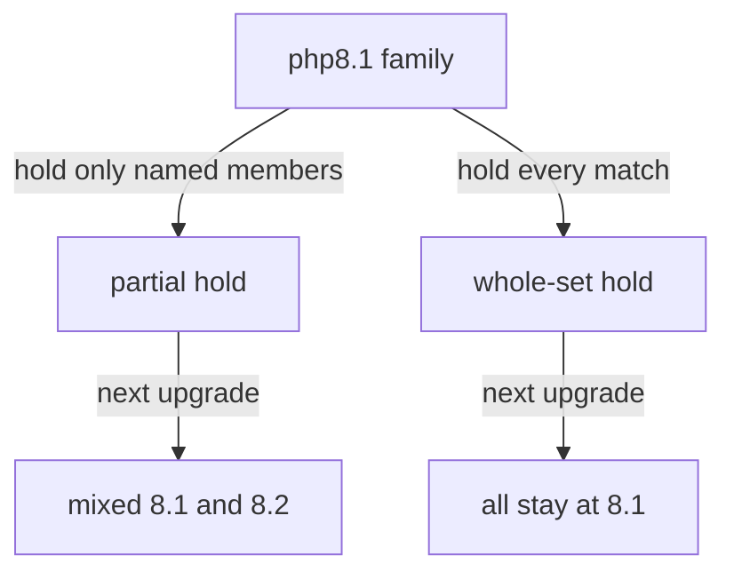

# Bulk Actions Across A Matched Set

Once you have a clean list of package names, one more command applies an action to all of them. This part covers piping the names through `xargs` into `apt-mark hold`, why a partial hold on a family that depends on itself is worse than no hold, and checking the result instead of trusting the pipeline.

## `xargs` into one `apt-mark hold`

Add one more stage to the pipeline that produced the clean names:

```bash
# shell: host, root
apt list --installed 2>/dev/null | grep -E '^php8\.1-' | cut -d/ -f1 | xargs sudo apt-mark hold
```

`apt-mark hold` accepts any number of names in one call. `xargs` collects every name from the pipeline and builds **one** `apt-mark hold pkg1 pkg2 pkg3 ...` command from them. It is not a loop that calls `apt-mark hold` once per package. The result is one combined action you can check afterwards.

## Why the *whole* family, not just the named members

Packages in a family like `php8.1-*` are built to work together. They share one **ABI** (application binary interface): the exact way compiled pieces of software connect to each other, which changes between PHP releases. Think of crates whose parts only fit together if they all come from the same production run.


```mermaid
flowchart TB
    F["php8.1 family"] -->|"hold only named members"| PART["partial hold"]
    F -->|"hold every match"| ALL["whole-set hold"]
    PART -->|"next upgrade"| BAD["mixed 8.1 and 8.2"]
    ALL -->|"next upgrade"| GOOD["all stay at 8.1"]
```

The diagram shows what the next upgrade does in each case: with a partial hold, the unheld members move to a newer PHP release while the held ones stay behind; with a whole-set hold, every member stays at 8.1 together.

If the members really depend on each other, holding only some of them lets a future `apt upgrade` or `full-upgrade` move the **unheld** ones to a newer release. The result is a mixed installation: some modules built against one minor version, others against another. **A partial hold on a family that depends on itself is often worse than no hold**, because it looks protected without being protected.

## Check the result

Never trust that the pipeline did what you meant. List every hold on the system:

```bash
apt-mark showhold
```

A pipeline can quietly hold **fewer** packages than intended: a typo in the pattern, an empty result that `xargs` did nothing with, or an unexpected extra match. "The command did not error" is not proof.

`apt-mark showhold` prints every held package on the system, unfiltered. Compare it **line for line** with the list your pattern produced (`grep -E '^php8\.1-' | cut -d/ -f1`). That comparison is the difference between a whole family that is really held and a partial hold that only looks complete.

## Common pitfalls

> [!WARNING]
> - **Looping `apt-mark hold` once per package.** It is slower and easy to stop half-way. `xargs` builds one call.
> - **`xargs` on an empty pipeline.** GNU `xargs` may still run `apt-mark hold` with no names, which does nothing and "succeeds". Add `xargs -r` to skip the command when the input is empty, and check the count.
> - **Holding only the members a task names.** The rest drift to a version that no longer fits. Hold the whole matched set.
> - **Trusting the pipeline's exit code.** Run `apt-mark showhold` and compare it with your intended list.

## Your mission: APT Package Groups & Bulk Operations Lab

You can now install related packages in one transaction, find a family by pattern and hold the whole family in one checked step. The mission asks you to install a build toolchain in one call and hold an entire installed package family ahead of a risky upgrade.

The mission runs on its own training ship. Start it and open a terminal on it:

```sh
astrona run --git git@github.com:astrona-io/ATS002.git -c sections/section-050/module-05/labs/lab-01
astrona ssh ats-002-lab-055
```

Read the task in [`question.md`](./labs/lab-01/question.md) and solve it on your own first. When you think you are done, send it for grading:

```sh
astrona submit -c sections/section-050/module-05/labs/lab-01
```

When the mission is done, remove it:

```sh
astrona destroy ats-002-lab-055
```
