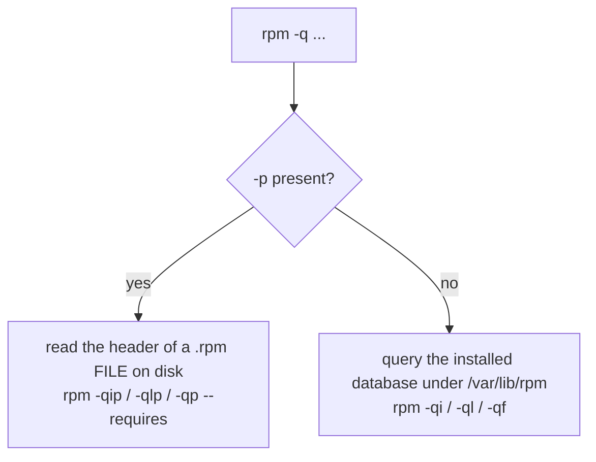

# Part 1 — What `rpm` knows, and inspecting a `.rpm` before you trust it

> Prerequisite: [module landing page](./course.md). Next: [Part 2 — Installing directly, and ownership queries](./course-02-installing-and-ownership.md).

`dnf` resolves dependencies and fetches over the network; `rpm` does the actual installing, one file at a time, with no idea a repository exists. This part is the scope of `rpm`, the read-only commands that tell you what a `.rpm` is, and the one flag — `-p` — that decides whether `rpm` reads a file or looks in the installed database.

## `rpm` knows exactly one thing at a time

Hold this for the whole module: **`rpm` operates on exactly one thing in front of it** — a `.rpm` file on disk, or the name of something already recorded as installed in the local database under `/var/lib/rpm`. No repositories, no dependency fetching, no automatic anything.

Every `rpm` query is one of two kinds, and the switch between them is the **`-p`** modifier:



Drop `-p` when you meant to inspect a file and `rpm` looks for an *installed* package named after the file path — "package ... is not installed", a confusing error for a missing flag.

## `rpm -qip` — the package header

A colleague hands you `/home/candidate/downloads/logship-agent-2.1.0-1.x86_64.rpm`:

```bash
# shell: inside the rpmbox container, unprivileged
rpm -qip /home/candidate/downloads/logship-agent-2.1.0-1.x86_64.rpm
```

`-q` query + `-i` info + `-p` "the argument is a file path". Reads the **header** embedded in the archive (a `.rpm` is a cpio payload plus a metadata header) and prints name, version, release, arch, vendor, install size, build date, description. Touches nothing about the installed database.

## `rpm -qlp` and `rpm -qp --requires` — contents and needs

```bash
rpm -qlp /home/candidate/downloads/logship-agent-2.1.0-1.x86_64.rpm     # every path it would install
rpm -qp --requires /home/candidate/downloads/logship-agent-2.1.0-1.x86_64.rpm   # what it declares it needs
```

`-qlp` lists every file the payload would place — the chance to spot something writing where it should not. `-qp --requires` tells you in advance whether a plain `rpm -ivh` will succeed or refuse over an unmet dependency (Part 2).

> [!WARNING]
> - **Omitting `-p` on a file query** → `rpm` searches the installed DB for a package literally named `./thing.rpm` and reports "not installed". Add `-p`.
> - **`rpm -qi thing.rpm` vs `rpm -qip thing.rpm`** → the first is an installed-name query (fails), the second reads the file. One flag.
> - **Installing a `.rpm` without `-qlp` first** → you skip the cheap look at where it writes.

> *`rpm` acts on one `.rpm` file or one installed package name — never a repository — and the `-p` modifier is the switch: with `-p` (`-qip`, `-qlp`, `-qp --requires`) it reads a file's header; without it, the installed database.*

## Reference

- `man rpm` — the `-q` query modes; `-p`, `-i`, `-l`, `--requires`, `--provides`, `--scripts`.
- `man rpm2cpio` / `man rpm2archive` — extracting a `.rpm` payload without installing it.
- `rpm --querytags` — every field name usable in `--queryformat` for scripted inspection.
