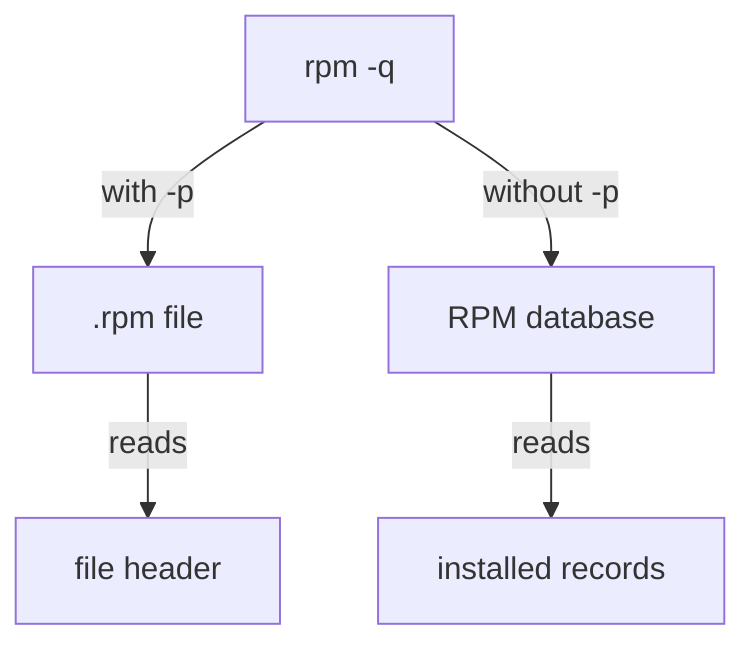

# What rpm Knows and Inspecting a .rpm File

Astronaut, a supply crate has just been pushed through your airlock with no paperwork. Before you open it, you want to know what is inside, where it will put things, and what other crates it needs. This part shows the read-only `rpm` commands that answer those questions, and the one flag, `-p`, that decides whether `rpm` reads a file or looks in its own records.

## rpm knows one thing at a time

`dnf` is the quartermaster: it works out dependencies and fetches crates from supply depots (**repositories**) over the network. `rpm` is the loading crew: it does the actual installing, one crate at a time, and has no idea a repository exists.

So `rpm` always works on exactly one thing in front of it. That thing is either a `.rpm` file on disk, or the name of a package already recorded as installed. The record of installed packages is the **RPM database** under `/var/lib/rpm`, the quartermaster's ledger of every crate on board. There are no repositories, no dependency fetching and nothing automatic.

## Reading the header of a .rpm file

A `.rpm` file has two halves: the payload (the files themselves, packed as a cpio archive) and a **header** (the label on the crate: name, version, what it needs). `rpm` can read the header without unpacking anything.

### rpm -qip: the package details

A colleague hands you `/home/candidate/downloads/logship-agent-2.1.0-1.x86_64.rpm`. You want to know what it is before you trust it:

```bash
# shell: inside the rpmbox container, unprivileged
rpm -qip /home/candidate/downloads/logship-agent-2.1.0-1.x86_64.rpm
```

Read the flags one by one: `-q` means query, `-i` means info, and `-p` means "the argument is a file path". `rpm` reads the header inside the file and prints the name, version, release, architecture, vendor, install size, build date and description. It does not touch the RPM database.

### rpm -qlp and rpm -qp --requires: contents and needs

Two more read-only questions are worth asking before any install: where will it write, and what does it need?

```bash
rpm -qlp /home/candidate/downloads/logship-agent-2.1.0-1.x86_64.rpm     # every path it would install
rpm -qp --requires /home/candidate/downloads/logship-agent-2.1.0-1.x86_64.rpm   # what it declares it needs
```

`-qlp` lists every file the payload would place. This is your chance to spot a package that writes somewhere it should not. `-qp --requires` lists what the package says it needs. It tells you in advance whether a plain `rpm -ivh` install will succeed or refuse because something is missing.

If you only want to look at the files and never install the package, the `rpm2cpio` tool can unpack the payload into the current directory. The `rpm --querytags` command lists every header field name you can print in a script with `--queryformat`.

## The -p switch

You have now seen the rule at work. Every `rpm` query is one of two kinds, and the `-p` modifier picks which:


```mermaid
flowchart TB
    Q["rpm -q"] -->|"with -p"| F[".rpm file"]
    Q -->|"without -p"| DB["RPM database"]
    F -->|"reads"| H["file header"]
    DB -->|"reads"| R["installed records"]
```

The diagram shows that with `-p` (`rpm -qip`, `-qlp`, `-qp --requires`) `rpm` reads the header of a file on disk, and without it (`rpm -qi`, `-ql`, `-qf`) it looks in the installed database under `/var/lib/rpm`.

If you leave out `-p` when you meant to inspect a file, `rpm` looks for an *installed* package named after the file path. It then reports that the package is not installed, which is a confusing error for one missing letter.

## Common pitfalls

> [!WARNING]
> - **Leaving out `-p` on a file query.** `rpm` searches the installed database for a package literally named `./thing.rpm` and reports "not installed". Add `-p`.
> - **Mixing up `rpm -qi thing.rpm` and `rpm -qip thing.rpm`.** The first is a query by installed name and fails. The second reads the file. One letter makes the difference.
> - **Installing a `.rpm` without running `-qlp` first.** You skip the cheap look at where it writes.
