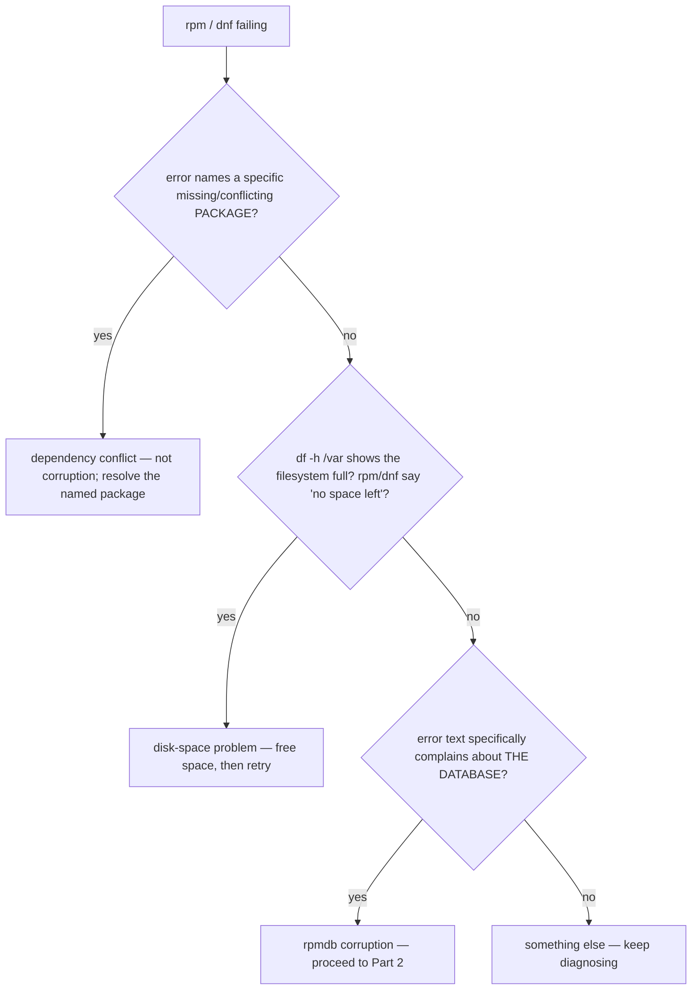

# Part 1 — Recognising the symptom, and not assuming the backend

> Prerequisite: [module landing page](./course.md). Next: [Part 2 — Back up, rebuild, verify](./course-02-backup-rebuild-verify.md).

RPM database corruption presents as `rpm` and `dnf` failing on operations that have nothing to do with the packages you are trying to install. Before you rebuild anything you have to be sure it is *database* corruption and not one of two look-alikes — and you have to know which database backend this system actually uses.

## The fingerprint: a database-layer error

The RPM database lives under `/var/lib/rpm` and is what `rpm -qa`, `rpm -qi`, and every `dnf` transaction check consult first. It is ordinary local state, as vulnerable as any to an interrupted write — a killed process mid-transaction, a hard power-off, a full disk during a package operation. When it breaks, the **files on disk from already-installed packages are almost always fine**; it is the database's own internal consistency that is broken.

```bash
# shell: inside the rpmbox container
rpm -qa | tail -5
```

```text
error: rpmdbNextIterator: skipping h#191
error: rpmdb: damaged header instead of key
```

On a `sqlite`-backed database you may instead see `error: rpmdb: BDB0113 ...unable to lock...` or a raw `sqlite3` "disk image is malformed" surfacing through `rpm`. Either way the fingerprint is a **database-layer** message — it complains about *the database*, not a package.

## Rule out the two look-alikes first



- **A dependency conflict** names a specific package clearly — nothing vague about "the database".
- **A disk-space problem** is confirmed or ruled out in one command, `df -h /var`, and `rpm`/`dnf` usually say "No space left on device" outright.

If neither matches and the error is about the database itself, it is corruption.

## Do not assume the backend

Older tutorials assume `/var/lib/rpm` holds Berkeley DB files — `Packages`, `__db.001`, `__db.002`. **That is stale on RHEL 9 / Rocky 9 / recent Fedora**, which moved to a `sqlite` store: a file `rpmdb.sqlite`, with `-wal` / `-shm` sidecars while a connection is open.

```bash
ls -la /var/lib/rpm
```

- `Packages`, `__db.*` → Berkeley DB (older systems).
- `rpmdb.sqlite` (+ `.sqlite-wal`, `.sqlite-shm`) → sqlite backend (Rocky 9, the one in `rpmbox`).

The rebuild in Part 2 works the same either way — `rpm --rebuilddb` detects and operates on whichever exists — but confirming upfront stops you chasing backend-specific advice that does not apply.

> [!WARNING]
> - **Treating a dependency-conflict message as corruption** → the fix is the named package, not a rebuild. Read whether the error names a package or "the database".
> - **Skipping `df -h /var`** → a full `/var` produces database-ish errors that a rebuild will not fix (and may worsen). Rule out disk space first.
> - **Following Berkeley-DB instructions on a sqlite system** → deleting `__db.*` files that do not exist, or expecting `Packages`. Run `ls -la /var/lib/rpm` first.
> - **Running a rebuild before confirming the symptom** → if it is not corruption, a rebuild wastes time and the real fault remains.

> *rpmdb corruption shows as database-layer errors from `rpm`/`dnf` (not a named-package failure and not "no space left"); rule out a dependency conflict and a full `/var` first, then check `ls -la /var/lib/rpm` for `rpmdb.sqlite` (RHEL/Rocky 9) vs `Packages`/`__db.*`.*

## Reference

- `man rpm` "DB" notes / `man rpmdb` — the database location and the supported backends.
- `dnf(8)` — how `dnf check` / `dnf check-update` exercise the database (used to verify in Part 2).
- `man df` — `df -h /var` to rule out the disk-space look-alike.
