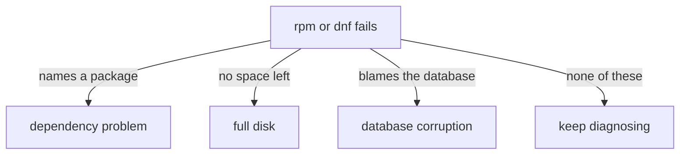

# Recognising a Broken RPM Database

Astronaut, when the quartermaster's ledger is damaged, `rpm` and `dnf` start failing on tasks that have nothing to do with the crates you are loading. Before you rebuild anything, you must be sure the ledger is really the problem and not one of two look-alikes. You must also know which kind of ledger this ship keeps.

## The fingerprint: a database-layer error

The **RPM database** lives under `/var/lib/rpm`. `rpm -qa`, `rpm -qi` and every `dnf` transaction check read it first. It is ordinary local data, so an interrupted write can damage it: a process killed in the middle of a transaction, a hard power-off, or a full disk during a package operation. The files of packages that are already installed are almost always fine. It is the database's own internal order that is broken.

### What it looks like

Ask `rpm` for the installed packages:

```bash
# shell: inside the rpmbox container
rpm -qa | tail -5
```

```text
error: rpmdbNextIterator: skipping h#191
error: rpmdb: damaged header instead of key
```

The exact words depend on the backend. On an older Berkeley DB system you may see a line such as `error: rpmdb: BDB0113 ...unable to lock...`. On a `sqlite` system the `sqlite` library's own message, "disk image is malformed", can come through `rpm`. Either way the fingerprint is the same: the message complains about **the database**, not about a package.

## Rule out the two look-alikes first

Two other problems also make `rpm` and `dnf` print alarming errors. Neither one is fixed by a rebuild, so check for them first.

### The decision


```mermaid
flowchart TB
    E["rpm or dnf fails"] -->|"names a package"| DEP["dependency problem"]
    E -->|"no space left"| DISK["full disk"]
    E -->|"blames the database"| CORR["database corruption"]
    E -->|"none of these"| OTHER["keep diagnosing"]
```

The diagram shows the order of questions: an error that names a missing or conflicting package is a dependency problem, a "No space left on device" error or a full `df -h /var` is a disk problem, and only an error about the database itself means corruption.

### The two look-alikes

- **A dependency problem** names a specific package clearly, for example "package A requires B, but none of the providers can be installed". Nothing in it talks about the database. The fix is to install the missing package with `dnf install`, or to remove the package that needs it. A rebuild changes nothing.
- **A disk-space problem** is confirmed or ruled out with one command, `df -h /var`. `rpm` and `dnf` usually say "No space left on device" outright. The fix is to free space, then try again.

A quick extra test: if `rpm -qa` still lists every package cleanly, the database can be read from start to end, so it is not corrupt.

If neither look-alike matches and the error is about the database itself, it is corruption.

## Do not assume the backend

Older guides assume `/var/lib/rpm` holds Berkeley DB files: `Packages`, `__db.001`, `__db.002`. **That is out of date on RHEL 9, Rocky Linux 9 and recent Fedora.** They moved to a `sqlite` store: one file, `rpmdb.sqlite`, plus `-wal` and `-shm` side files while a connection is open.

### Check before you follow any advice

```bash
ls -la /var/lib/rpm
```

- `Packages` and `__db.*` mean Berkeley DB (older systems).
- `rpmdb.sqlite` (plus `.sqlite-wal` and `.sqlite-shm`) means the `sqlite` backend. This is what Rocky Linux 9, and so `rpmbox`, uses.

The rebuild works the same either way, because `rpm --rebuilddb` finds and works on whichever backend exists. Checking first stops you from following advice for the other backend, such as deleting `__db.*` files that do not exist.

## Common pitfalls

> [!WARNING]
> - **Treating a dependency message as corruption.** The fix is the named package, not a rebuild. Read whether the error names a package or "the database".
> - **Skipping `df -h /var`.** A full `/var` gives errors that look like database errors. A rebuild will not fix them, and may make things worse. Rule out disk space first.
> - **Following Berkeley DB instructions on a `sqlite` system.** You end up deleting `__db.*` files that do not exist, or looking for `Packages`. Run `ls -la /var/lib/rpm` first.
> - **Rebuilding before you confirm the symptom.** If it is not corruption, a rebuild wastes time and the real fault stays.

## Your mission: RPM Database: Corruption Look-Alike Lab

You can now read an `rpm` or `dnf` error and decide whether it is database corruption, a dependency problem or a full disk. The mission gives you a ship where `dnf check` fails loudly and a colleague is sure the database is corrupt: check that claim and fix the real problem.

Start the mission and open a terminal on it:

```sh
astrona run --git git@github.com:astrona-io/ATS002.git -c sections/section-060/module-02/labs/lab-02
astrona ssh ats-002-lab-066
```

On the lab machine, open a shell inside the `rpmbox` container with `docker exec -it rpmbox bash`. Read the task in [`question.md`](./labs/lab-02/question.md) and solve it on your own first. When you think you are done, send it for grading:

```sh
astrona submit -c sections/section-060/module-02/labs/lab-02
```

When the mission is done, remove it:

```sh
astrona destroy ats-002-lab-066
```
