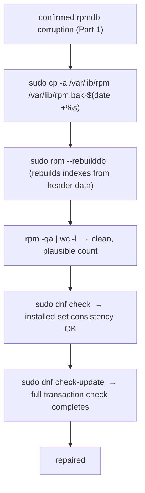

# Part 2 — Back up, rebuild, verify

> Prerequisite: [Part 1 — Recognising the symptom, and not assuming the backend](./course-01-recognising-the-symptom.md). Next: [Section 060 quiz](../quiz.md).

Confirmed corruption. The repair is three steps and the first one is non-negotiable: back up the database, rebuild it, then verify with `dnf`'s own transaction-check machinery — the thing that was failing in the first place.

## Back up `/var/lib/rpm` first

```bash
# shell: inside rpmbox, root
sudo cp -a /var/lib/rpm /var/lib/rpm.bak-$(date +%s)
ls -d /var/lib/rpm.bak-*
```

`-a` (archive) preserves permissions, ownership, timestamps, and symlinks exactly. This database is the **single authoritative record of what is installed**. If the rebuild makes things worse, or the diagnosis was wrong, this backup is the only way back to the current broken-but-known state without a full system restore. It costs seconds; skipping it risks a system with *no* usable record of its own installed packages.

## Rebuild

```bash
sudo rpm --rebuilddb
```

`--rebuilddb` reconstructs the database's **index and lookup structures from the header data already in the existing database**, discarding the corrupted indexing and building it fresh. It repairs **database consistency** — not package files. If a package's actual installed files were deleted or damaged, `--rebuilddb` does nothing for that; that is a `dnf reinstall <pkg>` (or `rpm -ivh --replacepkgs`) problem, a different fix for a different failure.

Some RPM releases split database maintenance into a separate binary:

```bash
command -v rpmdb && sudo rpmdb --rebuilddb
```

Either performs the same underlying repair.



## Verify — end to end

```bash
rpm -qa | wc -l
```

Should complete with **no interleaved error lines** and a plausible package count.

```bash
sudo dnf check
```

Validates the installed-package set for internal consistency using the rebuilt database — confirming not just that `rpm -qa` works but that `dnf`'s transaction-check machinery (the thing originally failing) is healthy.

```bash
sudo dnf check-update
```

A full transaction-check pass that completes normally, rather than failing at a database stage, is your independent end-to-end confirmation.

Once verified and stable for a while, the `*.bak-*` copy can be removed — but not before.

> [!WARNING]
> - **Skipping the backup "because the rebuild will obviously work"** → if it does not, or the diagnosis was wrong, there is no rollback. `cp -a` costs seconds.
> - **`cp` without `-a`** → loses modes/ownership/timestamps; the backup may not be restorable as-is.
> - **Expecting `--rebuilddb` to restore missing package files** → it only rebuilds indexing from headers. Deleted files need `dnf reinstall`.
> - **Calling it fixed after `rpm -qa` alone** → run `dnf check` and `dnf check-update` too; `dnf`'s check machinery was the original failure point.

> *Back up with `cp -a` to `/var/lib/rpm.bak-<ts>`, run `rpm --rebuilddb` (rebuilds indexes from existing header data — not package files), then verify with `rpm -qa | wc -l`, `dnf check`, and `dnf check-update` completing cleanly.*

## Reference

- `man rpm` — `--rebuilddb`, `--initdb`; what is reconstructed and what is not.
- `man dnf` — `check`, `check-update`; the installed-set and transaction consistency checks.
- `man cp` — `-a` / `--archive` for a faithful copy of the database directory.
