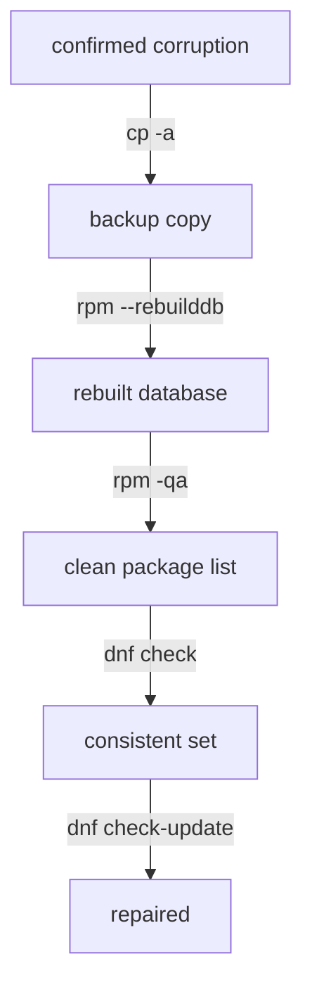

# Back Up, Rebuild, Verify

Astronaut, you have confirmed that the ledger itself is damaged. The repair has three steps, and the first one is never optional: copy the ledger, rebuild it, then prove it works with the same `dnf` checks that were failing before.

## The repair at a glance

Here is the whole repair in order, before the details:


```mermaid
flowchart TB
    S["confirmed corruption"] -->|"cp -a"| B["backup copy"]
    B -->|"rpm --rebuilddb"| R["rebuilt database"]
    R -->|"rpm -qa"| V1["clean package list"]
    V1 -->|"dnf check"| V2["consistent set"]
    V2 -->|"dnf check-update"| OK["repaired"]
```

The diagram shows the order: copy `/var/lib/rpm` to a dated backup folder, rebuild with `rpm --rebuilddb`, then check with `rpm -qa`, `dnf check` and `dnf check-update`, each one testing a little more of the system.

## Back up /var/lib/rpm first

The RPM database is the **only record of what is installed**. If the rebuild makes things worse, or your diagnosis was wrong, the backup is your one way back to the current broken-but-known state without a full system restore.

### Make the copy

```bash
# shell: inside rpmbox, root
sudo cp -a /var/lib/rpm /var/lib/rpm.bak-$(date +%s)
ls -d /var/lib/rpm.bak-*
```

`-a` (archive) keeps permissions, ownership, timestamps and links exactly as they are. `$(date +%s)` adds the current time in seconds, so every backup gets its own name. The copy costs seconds. Skipping it risks a ship with *no* usable record of its own crates.

Inside `rpmbox` you are already the root user. If the container answers `sudo: command not found`, run the same command without `sudo`.

## Rebuild

`rpm` itself does the repair. It reads the package headers still stored in the database and builds fresh lookup structures from them.

### Run the rebuild

```bash
sudo rpm --rebuilddb
```

`--rebuilddb` throws away the damaged indexes and builds them again from the header data in the existing database. It repairs **the database's consistency**, not package files. If a package's installed files were deleted or damaged, `--rebuilddb` does nothing for that. That is a job for `dnf reinstall <pkg>` (or `rpm -ivh --replacepkgs`): a different fix for a different failure.

### The rpmdb command

Some RPM releases move database maintenance into a separate program called `rpmdb`:

```bash
command -v rpmdb && sudo rpmdb --rebuilddb
```

`command -v rpmdb` checks whether the program exists, and only then runs it. Either command does the same repair.

## Verify end to end

One clean command is not proof. Check from three angles, from the simplest read to a full `dnf` pass.

### rpm -qa

```bash
rpm -qa | wc -l
```

This must finish with **no error lines mixed in** and a believable package count.

### dnf check

```bash
sudo dnf check
```

`dnf check` tests the installed package set for internal consistency, using the rebuilt database. It proves more than `rpm -qa` does: `dnf`'s own checking code, which was failing in the first place, now works.

### dnf check-update

```bash
sudo dnf check-update
```

This runs a full pass against the repositories. If it completes normally instead of failing at a database step, you have an independent end-to-end confirmation.

Once the system has been stable for a while, you can delete the `*.bak-*` copy, but not before.

## Common pitfalls

> [!WARNING]
> - **Skipping the backup "because the rebuild will obviously work".** If it does not, or the diagnosis was wrong, there is no way back. `cp -a` costs seconds.
> - **Using `cp` without `-a`.** The copy loses permissions, owners and timestamps, and may not work as a restore.
> - **Expecting `--rebuilddb` to bring back missing package files.** It only rebuilds the indexes from the headers. Deleted files need `dnf reinstall`.
> - **Calling it fixed after `rpm -qa` alone.** Run `dnf check` and `dnf check-update` too. `dnf`'s checks were the original point of failure.

## Your mission: Rebuilding a Corrupted RPM Database Lab

You can now back up the RPM database, rebuild it and prove the repair with `rpm` and `dnf`. The mission gives you a container whose real `sqlite` database file was damaged overnight: confirm the damage, back it up, rebuild it and leave both `rpm -qa` and `dnf check` clean.

Start the mission and open a terminal on it:

```sh
astrona run --git git@github.com:astrona-io/ATS002.git -c sections/section-060/module-02/labs/lab-01
astrona ssh ats-002-lab-062
```

On the lab machine, open a shell inside the `rpmbox` container with `docker exec -it rpmbox bash`. Read the task in [`question.md`](./labs/lab-01/question.md) and solve it on your own first. When you think you are done, send it for grading:

```sh
astrona submit -c sections/section-060/module-02/labs/lab-01
```

When the mission is done, remove it:

```sh
astrona destroy ats-002-lab-062
```
