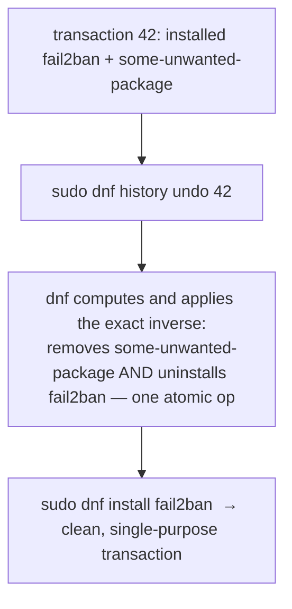

# Part 2 — Removing, and transactional history

> Prerequisite: [Part 1 — The everyday `dnf` loop](./course-01-the-dnf-loop.md). Next: [Section 060 quiz](../quiz.md).

RPM handles config files on removal per-file and automatically — no `remove` / `purge` choice like Debian. And `dnf` has a capability APT has no real equivalent for: a transaction log that can undo an entire past operation as one unit.

## Removing, and `%config` files

```bash
# shell: inside rpmbox
dnf list installed | grep telnet
sudo dnf remove telnet
```

Confirm a package is installed and note its exact name first.

The mechanism that differs from Debian: RPM marks certain shipped files `%config`. On removal, RPM decides **per file, automatically**:

- `%config` file **unchanged** since install → deleted with the rest of the package.
- `%config` file **modified** → **renamed to `<file>.rpmsave`** instead of deleted.

There is no top-level "keep config / delete config" command to choose; it is a per-file decision based on whether the file was actually touched. (The mirror case, `.rpmnew`, appears on *upgrade* when a package ships a new default for a config file you had edited.)

## Orphans do not self-clean

```bash
sudo dnf autoremove
```

Removing `telnet` never cascades to dependency packages it alone pulled in. `dnf autoremove` is the separate, deliberate step that removes packages installed as dependencies that nothing installed still needs. A cleanup that skips it is an easy, gradeable miss.

## Transactional history — the standout feature

```bash
dnf history
```

Lists every transaction `dnf` has performed, newest first, each with an ID, a description, and a package count.

```bash
dnf history info <id>
```

Expands one transaction — exactly which packages it installed, upgraded, or removed.

Now the capability APT cannot match. Say an install accidentally bundled in something unrelated — `sudo dnf install fail2ban some-unwanted-package` in one command:



```bash
sudo dnf history undo <id>
```

`history undo` computes and applies the exact inverse of everything that transaction did, atomically — from `dnf`'s own recorded transaction data. Hand-reconstructing "what changed, did I re-remove everything that got installed" package by package cannot match it for reliability beyond a single-package transaction.

`dnf history redo <id>` reapplies a transaction — including one you just undid, if the undo was the wrong call.

> [!WARNING]
> - **Expecting a `remove` vs `purge` choice** → RPM does not have one; a modified `%config` file becomes `<file>.rpmsave` automatically, an unmodified one is deleted.
> - **`.rpmsave` / `.rpmnew` files left unnoticed** → after a removal or upgrade, check `/etc` for them; they hold your old or the new default config.
> - **Assuming `dnf remove` cleans orphaned dependencies** → run `dnf autoremove` as a separate step.
> - **Hand-undoing a multi-package transaction** → use `dnf history undo <id>`; manual reconstruction is error-prone.

> *RPM renames a modified `%config` file to `.rpmsave` on removal (deletes it if unchanged) with no `purge`-style choice; `dnf autoremove` clears orphans separately; and `dnf history undo <id>` atomically reverses an entire past transaction from `dnf`'s own log.*

## Reference

- `man dnf` — `remove`, `autoremove`, `history` (`info`, `undo`, `redo`, `rollback`).
- `man rpm` / packaging docs — `%config`, `%config(noreplace)`, and the `.rpmsave` / `.rpmnew` conventions.
- `dnf history userinstalled` — which packages `dnf` considers explicitly (not dependency) installed, the input to `autoremove`.
